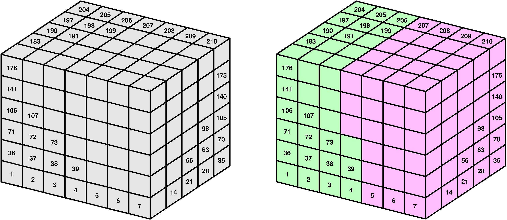
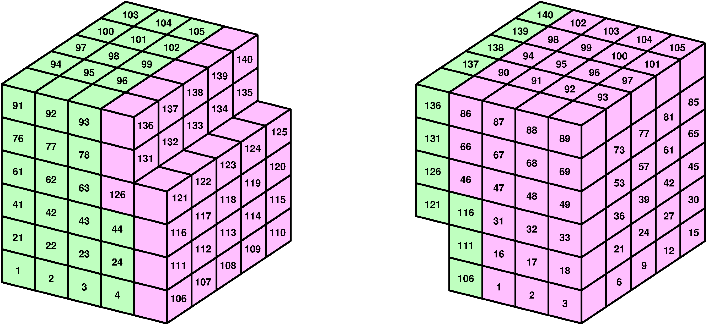
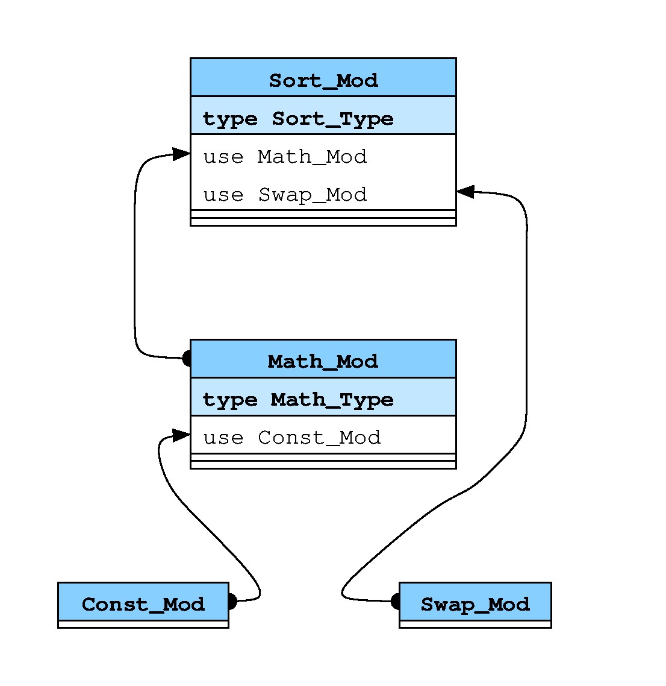
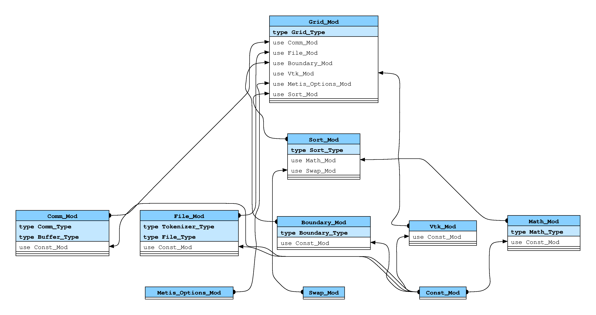

# T-Flows Development Manual

1. [Coding standards](#coding)
    1. [Line length](#coding_line_length)
    2. [Naming of code constructs](#coding_naming)
    3. [Commenting](#coding_commenting)
        1. [Trailing comments](#coding_commenting_trail)
        2. [Line comments](#coding_commenting_line)
        3. [Block comments](#coding_commenting_block)
        4. [Big block comments](#coding_commenting_big_block)
    4. [Headers](#coding_headers)
        1. [Procedures](#coding_headers_proc)
        2. [Modules](#coding_headers_mod)
2. [Description of modules](#modules)
    1. [First level modules](#modules_first_level)
        1. [```Const_Mod```](#modules_first_level_const)
        2. [```Swap_Mod```](#modules_first_level_swap)
            1. [Member procedures](#modules_first_level_swap_proc)
        3. [```Metis_Options_Mod```](#modules_first_level_metis)
    2. [Second level modules](#modules_second_level)
        1. [```Math_Mod```](#modules_second_level_math)
            1. [New types](#modules_second_level_math_type)
            2. [Data members](#modules_second_level_math_data)
            3. [Member procedures](#modules_second_level_math_proc)
        2. [```File_Mod```](#modules_second_level_file)
            1. [New types](#modules_second_level_file_type)
            2. [Data members](#modules_second_level_file_data)
            3. [Member procedures](#modules_second_level_file_proc)
        3. [```Comm_Mod```](#modules_second_level_comm)
            1. [New types](#modules_second_level_comm_type)
            2. [Data members](#modules_second_level_comm_data)
            3. [Member procedures belonging to class](#modules_second_level_comm_proc_class)
            4. [Other module procedures](#modules_second_level_comm_proc_mod)
        4. [```Boundary_Mod```](#modules_second_level_boundary)
            1. [New type](#modules_second_level_boundary_type)
            2. [Data members](#modules_second_level_boundary_data)
        5. [```Vtk_Mod```](#modules_second_level_vtk)
            1. [Data members](#modules_second_level_vtk_data)
            1. [Member procedure](#modules_second_level_vtk_proc)
    3. [Third level modules](#modules_third_level)
        1. [```Control_Mod```](#modules_third_level_control)
            1. [Data members](#modules_third_level_control_data)
            2. [Member procedures](#modules_third_level_control_proc)
        2. [```Sort_Mod```](#modules_third_level_sort)
            1. [Member procedures](#modules_third_level_sort_proc)
    4. [Fourth level modules](#modules_fourth_level)
        1. [```Grid_Mod```](#modules_fourth_level_grid)
            1. [New types](#modules_fourth_level_grid_type)
            2. [Data members](#modules_fourth_level_grid_data)
            3. [Member procedures](#modules_fourth_level_grid_proc)
    5. [Fifth level modules](#modules_fifth_level)
        1. [```Matrix_Mod```](#modules_fifth_level_matrix)
            1. [New type](#modules_fifth_level_matrix_type)
            2. [Member procedure](#modules_fifth_level_matrix_proc)
        2. [```Vector_Mod```](#modules_fifth_level_vector)
            1. [New type](#modules_fifth_level_vector_type)
            2. [Member procedure](#modules_fifth_level_vector_proc)
    6. [Sixth level modules](#modules_sixth_level)
        1. [```Native_Mod```](#modules_sixth_level_native)
            1. [New types](#modules_sixth_level_native_type)
            2. [Data members](#modules_sixth_level_native_data)
            3. [Member procedures](#modules_fourth_level_native_proc)
3. [Global procedures](#global)
    1. [```Compute_Energy```](#global_compute_energy)
    2. [```Compute_Momentum```](#global_compute_momentum)
    3. [```Compute_Momentum_Explicit```](#global_compute_momentum_explicit)
    4. [```Compute_Pressure```](#global_compute_pressure)
    5. [```Compute_Scalar```](#global_compute_energy)
    6. [```Main_Pro```](#global_main_pro)
    7. [```Piso_Algorithm```](#global_piso_algorithm)

4. [Python tool for Fortran Analysis - PyFA](#pyfa)


# Coding standards <a name="coding"> </a>

The importance of coding standard doesn’t have to be outlined here, but in case
of modular Fortran it is even more important to enforce it, since subroutines
names imply to which module they belong. The list of coding standards for
T-Flows now follow.

## Line length <a name="coding_line_length"> </a>

No programming line in the code should be longer than 80 columns. Adherence to
this rule makes the code easy to read when printed and, let’s face it, you print
the code mostly when you look for a bug and you are already nervous and upset,
and you don’t want additional distraction by broken lines in code printout.

## Naming of code constructs <a name="coding_naming"> </a>

- all Fortran keywords and built-in functions are written in lower case letters.
Some examples: ```program```, ```end```, ```do```, ```subroutine```, ```type```,
```contains```, ```sin```, ```cos```, ```sqrt``` and so forth.

- All variables are written in lower case letters. This also applies to variables
named after personal names and acronyms. Therefore, not ```low_Re``` but
```low_re```, not ```CFL_number```, but ```cfl_number``` and so forth.
Variables names build up from more than one word are separated by an underscore,
as clear for above examples above.

- Constants, defined with Fortran keyword ```parameter```, are written in all
upper case letters. For example ```PI``` is the Archimedes’ real constant,
```INFLOW``` is an integer constant denoting boundary condition of inflow
type.  Like with variables, if a constant’s name is made up of more than one word
they are separated by an underscore. Earth’s gravitational constant, for example
is called ```EARTH_G```.

- Module names are written with each word in capital, with compulsory extension
```_Mod```. For example: ```Const_Mod```, ```Math_Mod```, ```Control_Mod```.
If module name contains more than one word, they are separated by an underscore.
Like with variables, this rule does not change if name contains acronyms. For
example, correct would be ```Compute_Cfl``` and not ```Compute_CFL```.

- Type names follow the same rule as modules’ names, except the extension which
is in this case ```_Type```.  Some examples: ```Grid_Type```, ```Turb_Type```,
```Particle_Type```.

- All procedures (subroutines and functions) are written with each word written
in capital letters. If subroutine or function name contains more than one word,
they are separated by an underscore. For example: ```Compute_Momentum```,
```Correct_Velocity```.

- If a subroutine or a function belongs to a certain module, its names starts
with module name. For example: ```Math_Mod_Area```, ```Turb_Mod_Ebf_Scalar```,
```Vof_Mod_Compute_Vof```. Note that in last two examples, acronyms ```EBF```
and ```VOF``` are following coding standards, not the way one would write them
in scientific papers and reports.

## Commenting <a name="coding_commenting"> </a>

Comments are an important component of code documentation. In T-Flows , comments
are standardized, and defined at several levels.

### Trailing comments <a name="coding_commenting_trail"> </a>

First level (or trailing) comments are written at the end of programming lines,
like in this example:
```
 1  do s = 1, Grid % n_faces
 2    c1 = Grid % faces_c(1,s)  ! take face ’s first cell
 3    c2 = Grid % faces_c(2,s)  ! take face ’s second cell
 4    ...
 5    ..
 6  end do
```

Trailing comments start in lower case letters, and are written in lower case
letters throughout. They are supposed to be short, incomplete sentences and
pieces of information useful to understand the code. Examples of trailing
comments in the code snippet above are given in lines 2 and 3.  We also try to
leave two spaces after the end of the program line and the exclamation mark
which is the beginning of the trailing comment.

### Line comments <a name="coding_commenting_line"> </a>

Line comments are written in single lines where no other piece of the code is
present. The above example with a line comment added on its top would look like:
```
 1  ! In this loop we will browse through faces
 2  do s = 1, Grid % n_faces
 3    c1 = Grid % faces_c(1,s) ! take face ’s first cell
 4    c2 = Grid % faces_c(2,s) ! take face ’s second cell
 5    ...
 6    ..
 7  end do
```
Line comments start with upper case letters, and are written in sentence case.
They are supposed to look and read like full sentences, describing pieces of
the code. They are aligned with the code which follows them, and there is one
space in between exclamation mark (```!```) and the beginning of the text. In
the above code snippet, a line comment is in line 1. A line comment, if too long,
can be written over more than one line, with ```...``` used as a sign of
continuation. This is useful if a line comment becomes too long, like in
lines 1 and 2 here:
```
 1  ! I would really like to write a comment longer than eighty lines here so ...
 2  ! ... I will write it in two lines. And yeah , we will browse through faces here.
 3  do s = 1, Grid % n_faces
 4    c1 = Grid % faces_c(1,s) ! take face ’s first cell
 5    c2 = Grid % faces_c(2,s) ! take face ’s second cell
 6    ...
 7    ..
 8  end do
```

### Block comments <a name="coding_commenting_block"> </a>

If a particular code segment has to be emphasized for its importance, one could
start it with a block comment, which looks as follows:
```
 1  !---------------------------------------------------!
 2  !   Now we will compute fluxes through cell faces   !
 3  !---------------------------------------------------!
 4
 5  ! In this loop we will browse through faces
 6  do s = 1, Grid % n_faces
 7    c1 = Grid % faces_c(1,s) ! take face ’s first cell
 8    c2 = Grid % faces_c(2,s) ! take face ’s second cell
 9    ...
10    ..
11   end do
```
A block comment is written like a sentence, like a line comment. There should
be three spaces between the exclamation mark and the beginning of the sentence,
and also three spaces after the end of the sentence (line 2 in the above code
snippet). Block comment should be aligned with the code construct to which it refers.

### Big block comments <a name="coding_commenting_big_block"> </a>

When bigger and more important coding constructs begin, which may involve
several algorithms in smaller coding constructs, a big block comment can be
introduced as follows:
```
 1   !-------------------------------------------------------------------------!
 2   !                                                                         !
 3   !   In the following , we enforce mass conservation in individual cells   !
 4   !                                                                         !
 5   !-------------------------------------------------------------------------!
 6
 7   !---------------------------------------------------!
 8   !   Now we will compute fluxes through cell faces   !
 9   !---------------------------------------------------!
10
11   ! In this loop we will browse through faces
12   do s = 1, Grid % n_faces
13     c1 = Grid % faces_c(1,s) ! take face ’s first cell
14     c2 = Grid % faces_c(2,s) ! take face ’s second cell
15     ...
16     ..
17   end do
```
The same rules introduced for block comments are also valid for big block
comments, except that they contain two empty lines, one above and one below
the sentence (lines 2 and 4 in the above code snippet).

## Headers <a name="coding_headers"> </a>

### Procedures (subroutines and functions) <a name="coding_headers_proc"> </a>

Each procedure header contains the following sections, in exactly this order:
- ```subroutine``` or ```function``` declaration,
- all modules used with Fortran’s ```use``` statement,
- ```implicit none``` statement,
- list of arguments (not to be intermixed with local variables below),
- list of interfaces,
- declaration of functions called from the procedure,
- declaration of local variables (not to be intermixed with arguments),
- declaration of local constants.

Not all procedures will have all these elements. There are procedures which do
not use any modules (see section 4). Interfaces and declaration of called
functions are rarely used and are needed only for functions defined outside of
modules. In T-Flows, we do our utmost to include subroutines and functions in
modules, and interfaces and function declarations are therefore rarely used.

Very few procedures will have local constants, as another example. In any case,
a header in T-Flows with all of the above sections is shown here:
```
  1 !==============================================================================!
  2   subroutine Template_Subroutine(<arguments>)
  3 !------------------------------------------------------------------------------!
  4 !   Template for a subroutine/function.                                        !
  5 !------------------------------------------------------------------------------!
  6 !----------------------------------[Modules]-----------------------------------!
  7   ...
  8   ..
  9 !------------------------------------------------------------------------------!
 10   implicit none
 11 !---------------------------------[Arguments]----------------------------------!
 12   ...
 13   ..
 14 !----------------------------------[Calling]-----------------------------------!
 15   ...
 16   ..
 17 !-----------------------------------[Locals]-----------------------------------!
 18   integer              :: i, j, k
 19   character(len=SL)    :: name_in
 20   real, dimension(5,5) :: small_matrix
 21 !------------------------------[Local parameters]------------------------------!
 22   integer, parameter :: BIG = 1000
 23 !==============================================================================!
 24
 25   !--------------------------------------------!
 26   !                                            !
 27   !   Big block comments are framed with one   !
 28   !    extra empty row above and below text    !
 29   !                                            !
 30   !--------------------------------------------!
 31
 32   !-----------------------------------------------------!
 33   !                                                     !
 34   !   Big block comments are written like sentences,    !
 35   !   first word capital, and can spread over several   !
 36   !   lines like this very comment.                     !
 37   !                                                     !
 38   !-----------------------------------------------------!
 39
 52   !--------------------!
 53   !   Block comments   !
 54   !--------------------!
 55
 56   !-----------------------------------------------------!
 57   !   Both big block and block comments have frames     !
 58   !   three spaces thick to the left and to the right   !
 59   !-----------------------------------------------------!
 60                                                     !123! <- see thickness
 61
 62   ! Line comments follow sentence rules, starting with upper-case letter
 63
 64   ! If a line comment is too long for a line ...
 65   ! ... it can spread over several lines with ...
 66   ! ... dots denoting  continuation.
 67
 68   do s = 1, Grid % n_faces     ! trailing comments start with small letters
 69
 70     c1 = Grid % faces_c(1, s)  ! they are too small to qualify as sentences
 71     c2 = Grid % faces_c(1, s)  ! keep them two columns apart from the last ...
 72                                ! column with the code
 73
 74   end do
 75
 76   end subroutine
```
A header starts and ends with a double-dashed comment line (lines 1 and 23 in
the above listing). Each of the above sections starts with a single-dashed
comment line, with its description in square brackets and centered (lines 6, 9,
11, 14, 17 and 21 in the listing above).  Procedure description (lines 3 – 5)
is essentially a block comment expanded over eighty columns. It is left-centered
meaning there are two columns in between the exclamation sign and the beginning
of the sentence (line 4).

### Modules <a name="coding_headers_mod"> </a>

Module header looks very similar to a procedure header, but it has fewer
components since it has no arguments, interfaces, calling functions or local
variables. To be more precise, a module header contains:

- module name,
- all modules used with Fortran’s ```use``` statement, and
- ```implicit``` none statement.

In T-Flows , a module segment looks like this:
```
  1 !==============================================================================!
  2   module Template_Mod
  3 !------------------------------------------------------------------------------!
  4 !   Template for a module                                                      !
  5 !------------------------------------------------------------------------------!
  6 !----------------------------------[Modules]-----------------------------------!
  7   use This_Mod
  8   use That_Mod
  9   ...
 10   ..
 11 !------------------------------------------------------------------------------!
 12   implicit none
 13 !==============================================================================!
 14
 15   !-------------------!
 16   !   Template type   !
 17   !-------------------!
 18   type Template_Type
 19
 20   ! Declaration of member data
 21   ...
 22   ..
 23
 24   ! Declaration of member procedures
 25   contains
 26     procedure          :: Allocate
 27     procedure          :: Deploy
 28     procedure          :: Destroy
 29     procedure, private :: Use_Only_From_Here
 30
 31   end type
 32
 33   ! Inclusion of member procedures
 34   contains
 35
 36   include ’Template_Mod/Allocate.f90’
 37   ...
 38   ..
 39
 40   end module
```

Module header starts and ends with a double dashed comment (lines 1 and 11
above). It is followed by a module description, which is, like in the case of
subroutine and function, a block comment which is eighty lines long and is
left-justified (lines 3 – 5 above). Description of the module is followed by
modules included with the Fortran’s use statement (lines 7 – 8 above), and
finally the implicit none statement. Following the header, many modules will
have declaration of the type with the same name as the module. (This type,
together with module’s member subroutines and functions represents a _class_).
Definition of the type is preceded by a block comment (lines 13 – 15). Modules
containing member subroutines or functions will have Fortran’s contain statement
next, followed by include statements to include the member functions

# Description of modules <a name="modules"></a>

Modules are used to organize similar data into same structures, but also to add
procedures (subroutines and functions) which operate on these data.

> **_Note:_** Not all modules contain data _and_ procedures. Some modules have
only data, some have only procedures.

By organizing data and procedures in modules, T-Flows practically has an
object-oriented architecture to the level at which Fortran 2008 standard
allows.  In this manual, we introduce the notion of modules' _levels_.
The level of a module in T-Flows, is defined by the ```use``` statements.
If a module does not use any other modules, it is of the lowest (first) level.
If a module uses other modules, its level is determined to be one higher than
the highest module level it uses.  We hope this will become clearer as we
continue with description of modules.

## First level modules <a name="modules_first_level"> </a>

### ```Const_Mod``` <a name="modules_first_level_const"> </a>

Without hesitation, ```Const_Mod``` is the most essential module in the code as
it defines constants used throughout all the T-Flows' sub-programs.  It resides
in ```[root]/Sources/Shared/``` directory.  

> **_Note:_** The notion of ```[root]``` is described in [User Manual](#readme.md)

```Const_Mod``` does not use any other module, which leaves it on the first
level. It also doesn't contain any procedures, since these constants are
supposed to be used globally, by most other modules and subroutines.
Currently, the following constants are defined:

- ```VL``` set to be 4, and is used for maximum variables names.  Some names
include ```U```, ```V``` and ```W``` for velocity components, ```P``` and
```PP``` for pressure and pressure correction, ```kin```, ```eps```, ```zeta```,
```f22``` for turbulent quantities, ```VOF``` for VOF, ```C_01```, ```C_02```,
```C_03``` and so forth for scalars.
- ```SL``` standard string length, set to 80
- ```DL``` double string length, set to 160
- ```QL``` quadruple string length, set to 320
- ```MSI``` maximum number of strings (tokens) in a line
- ```DP``` length of double precision numbers in bytes, hence 8
- ```SP``` length of single precision numbers in bytes, hence 4
- ```IP``` integer precision defined on the run, based on compiler options
- ```LP``` precision of logicals, set to be equal to ```IP``` since that what
Fortran standard prescribes
- ```RP``` floating point (real) number precision, defined on the run and is
based on compiler options.
- ```HUGE``` and ```TINY``` a very big an a very small number, currently set to 1.0e-30 and 1.0e+30
- ```HUGE_INT``` a very big integer number, currently set to 2147483647 since it
is the largest integer which can be represented in single precision (4 bytes)
- ```PETA```, ```TERA```, ```GIGA```, ```MEGA```, ```KILO```, ```MILI```,
```MICRO```, ```NANO```, ```PICO```, ```FEMTO``` are corresponding to prefixes
in the metric system and range from 1.0e+15 down to 1.0e-15 in factors of 1000
- ```PI``` is Archimedes’ constant, equal to 3.14159265359.
- ```ONE_THIRD```, ```TWO_THIRDS``` and ```ONE_SIXTH``` are constants frequently
used in turbulence models, but could be of use for any other physical models to
avoid frequent division by three. As their names imply, they are equal to 1/3,
2/3 and 1/6
- ```MD``` maximum number of domains which can be solved concurrently
- ```MAX_VARS_INTERFACE``` maximum number of variables which can be exchanged
at the interface

> **_Note:_** Constants from ```HUGE``` to ```FEMTO``` above are introduced to
avoid insertion of _ghost numbers_ in the code and their use is strongly
encouraged.  For example, if want to set tolerance within a certain
procedure to 1.0e-6, you use ```MICRO``` to set it.  For if you don't, you will
have difficulties to find and/or change it in the code later.  Maybe you wrote
it as 1.0e-6, maybe as 1.0E-6, maybe just 1e-6 or even 0.000001.  With
```MICRO```, you have no doubts and you will find it very fast.

### ```Swap_Mod``` <a name="modules_first_level_swap"> </a>

This is a very small module containing only two procedures and, since it is used
from all sub-programs, it resides in ```[root]/Sources/Shared/```.  This is the
first module which introduces member procedures, so it is possible a good point
to introduce how modules are stored within T-Flows.  Modules' definitions, with
new types and data members are in the file ```Some_Name_Mod.f90```, hence with
compulsory suffix ```_Mod``` and member procedures are residing in the directory
with the same name, but without ```.f90``` extension, thus ```Some_Name```.
In this case, module definition is in file ```[root]/Sources/Shared/Swap_Mod.f90```
and its member procedures in ```[root]/Sources/Shared/Swap_Mod/```
```Swap_Mod``` doesn't introduce neither new data nor new types, but only two
procedures belonging to the module.  It doesn't use any other modules, thus it
is on the first level.

#### Member procedures <a name="modules_first_level_swap_proc"> </a>

- ```Swap_Int``` swaps two integer numbers
- ```Swap_Real``` swaps two floating point numbers

### ```Metis_Options_Mod``` <a name="modules_first_level_metis"> </a>

The only purpose of the ```Metis_Options_Mod``` is to hold a number of integer
constants (parameters in Fortran) for passing options to
[METIS](http://glaros.dtc.umn.edu/gkhome/metis/metis/overview) library.
It is included in ```Grid_Mod``` for grid division and used inside _Divisor_.
Explaining each parameter goes beyond the scope of this manual, if you are
interested, please consult the METIS’ documentation.

## Second level modules <a name="modules_second_level"> </a>

### ```Math_Mod``` <a name="modules_second_level_math"> </a>

Except for one constant, ```Math_Mod``` contains only useful mathematical
functions which could be used throughout the code.  As such, it is shared by
all sub-programs and therefore resides in ```[root]/Sources/Shared/```.

#### New types <a name="modules_second_level_math_type"> </a>

```Math_Mod``` introduces one new type, ```Math_Type```, which is a Fortran
class and contains all mathematical procedures to be available throughout the
code.

#### Data members <a name="modules_second_level_math_data"> </a>

- ```DEFAULT_TOLERANCE``` is precision for ```Approx_Real``` and
```Smaller_Real``` functions discussed in the following section.

#### Member procedures <a name="modules_second_level_math_proc"> </a>

- ```Approx_Real``` Is a logical function which returns true if two real arguments
sent to it are approximately the same. Approximately the same for this function
means that arguments differ less than ```NANO``` although this default behavior
can be changed if the third and optional argument ```tol``` is sent to set the
tolerance explicitly.  
Example 1:
```
1   ! Use Math % Approx_Real with default tolerance
2   if( Math % Approx_Real(a, b) ) then
3     print *, ’# Numbers a and b differ less than 1e-9’
4   end if
```
Example 2:
```
1   ! Use Math % Approx with tolerance set to 1.0e-3
2   if( Math % Approx_Real(a, b, tol = MILI) ) then
3     print *, ’# Numbers a and b differ less than 1e-3’
4   end if
```

- ```Approx_String``` It is similar to the above, but used for approximate
comparison of strings. Thus, it is a logical function, and it will return true
if two strings which are sent as arguments differ in less than three characters
by default, or a different number of characters if optional argument ```tol```
is sent.  
Example:
```
1   a = ’MAX_ITERATIONS_FOR_PRESSURE_SOLVER ’
2   b = ’MAX_ITERATONS_FOR_PRESSURE_SOLVER ’
3
4   if( Math % Approx_String(a, b) ) then
5     print *, ’# Strings a and b differ in less than three characters ’
6   end if
```

> **_Note 1:_** Although this is a string comparison function, it resides in the
```Math_Mod``` since it is base on the mathematical algorithm developed by
Vladimir Levenstein in 1965.

> **_Note 2:_** ```Approx_String``` is used inside the ```Control_Mod``` to check
user input and warn for possible typing errors.

- ```Cross_Product``` is a function which returns a vector (cross) product of
two vectors of length three, that is of two three-dimensional vectors. It is
often used in ```Surf_Mod``` when manipulating surface triangles inside cells.
> **_Warning:_** Although this function stores three-dimensional vectors in
Fortran arrays of length three, such a practice is not encouraged in T-Flows.
Rather, we almost invariantly store three-dimensional vectors in three separate
variables, such as ```x```, ```y``` and ```z``` for coordinates or ```u```,
```v``` and ```w``` for velocities. The
rationale behind is that storing three-dimensional vectors in Fortran arrays of
length three significantly reduces the readability of the code, while leading
to only marginal savings in code length and questionable performance gains.

- ```Distance``` function returns distance between two points (1 and 2) in
three-dimensional space. The function accepts six arguments: ```x1```, ```y1```,
```z1```, ```x2```, ```y2``` and ```z2``` for _x_, _y_ and _z_ coordinates of
points 1 and 2.  This function uses square root and is therefore slow. Consider
using ```Distance_Squared``` instead.

- ```Distance_Squared``` function does the same as ```Distance```, but returns
squared distance.  The advantage is that no square root is computed in this
function, and is therefore much faster. For just comparing distances (looking
for the closest cell or node, for example), ```Distance_Squared``` is a much
better choice. Arguments sent to this function are the same as for
```Distance```.

- ```Gaussian_Elimination``` as the name implies, the procedure performs
Gaussian elimination with partial pivoting.  Its main use is for the solution
of small systems, say up to 6 × 6.  The procedure is sequential and performed
locally inside a sub-domain.  Don't get tempted to use it for solution of, for
example, pressure correction equation, because it will just hang or crash.
The code implemented in this procedure is heavily based on the code distributed
with the book by Kincaid and Cheney, [Numerical Analysis: Mathematics of
Scientific Computing](https://web.ma.utexas.edu/CNA/NMC7/sample.html).

- ```Harmonic_Mean``` is a function returning a harmonic mean from two real
parameters passed to it

- ```Invert_3x3_Matrix``` inverts a small (3 × 3) matrix.

- ```Rotate_Vector``` rotates a vector around the prescribed axis for a
prescribed angle, using [Rodrigues' formula](https://en.wikipedia.org/wiki/Rodrigues%27_rotation_formula)

- ```Smaller_Real``` is a logical function similar to ```Approx_Real```, but it
returns true if first argument is smaller that the second, within a certain
tolerance.  Like in ```Approx_Real```, the default tolerance is set to ```NANO```
with parameter the ```DEFAULT_TOLERANCE``` from this module, which can be
changed with optional argument.

- ```Tet_Volume``` function returns the volume of a tetrahedron defined with
four points (1 to 4). The function accepts 12 arguments with _x_, _y_ and _z_
coordinates of the four defining points in order: ```x1```, ```y1```, ```z1```,
```x2```, ... ```z3```, ```x4```, ```y4``` and ```z4```.  It is used when
computing volumes of cells of all shapes from their coordinates.

### ```File_Mod``` <a name="modules_second_level_file"> </a>

As the name implies, ```File_Mod```'s main purpose is file manipulation, and
to an extent manipulation with input lines from ASCII files.  It uses
```Const_Mod```, making it a second level module.

#### New types <a name="modules_second_level_file_type"> </a>

The ```Tokenizer_Type```, introduced here, reads:
```
  type Tokenizer_Type
    character(QL) :: whole               ! whole string
    character(SL) :: tokens(MAX_TOKENS)  ! tokens
    integer       :: n_tokens            ! number of tokens
    integer       :: s(MAX_TOKENS),  &   ! tokens starts ...
                     e(MAX_TOKENS)       ! ... and ends
    character(1)  :: first, last         ! first and last characters in whole
  end type
```
and holds only data members which help manipulation of input from ASCII files.
Here:
- ```whole``` holds the entire line read from input ASCII file
- ```tokens(MAX_TOKENS)``` is an array of strings which holds individual tokens
from the ```whole```, line which is being read from an ASCII file
- ```n_tokens``` holds the number of tokens (individual strings) from the input
line
- ```s(MAX_TOKENS)``` and ```n(MAX_TOKENS)``` are arrays holding starts and ends
of individual tokens in the line ```whole```
- ```first``` and ```last``` are the first and last line from the input line.

> **_Note:_** The ```Tokenizer_Type``` is heavily used when parsing input from
external grid files, or commands from the ```control``` file.  The maximum line
length for the ```whole``` is ```QL``` (defined as 320 in ```Const_Mod```) to
accommodate very long lines which are sometimes read from GMSH grid files.

Another type being introduced here is ```File_Type```, which forms an object
holding only its member procedures.

#### Data members <a name="modules_second_level_file_data"> </a>

The ```File_Mod``` introduces two new parameters, which are used only locally.
- ```MAX_TOKENS``` is maximum number of tokens (individual strings) we can read
from a line, and
- ```MAX_ITEMS``` which is a maximum number of items (integer and real numbers
of different precision in this context) we can read from binary files.

Based on the two types introduced above, two additional data members are
introduced:
- ```type(Tokenizer_Type) :: line``` holding all data members for lines and
string manipulation and

- ```type(File_Type) :: File``` holding all member procedures to ```File_Type```

- ```character(SL) :: problem_name(MD)``` Each simulation is identified with
its _problem name_, and it is stored in this array of strings. It is read from
```control``` file at the beginning of simulation, and used for file name
formation throughout. Problem name is invariantly written in small case letters,
holds no file extensions and if it is formed from more than one word they are
separated by underscores. Typical examples are: ```channel_flow```,
```impinging_jet```, ```rising bubble```, etc.  Dimension of the
```problem_name``` array is ```MD``` defined in ```Const_Mod``` as maximum number
of problem domains which can be solved simultaneously.

> **_Note 1:_** since for simulations in multiple domains, each grid is stored
in a separate file, it should be no wonder why there are ```problem name```
is an array of strings with dimension ```MD```.

> **_Note 2:_** The ```Grid_Type``` defined below, also has a data member called
```name```, which is the upper case version of the ```problem_name``` defined
here and is _not_ used for file formation at all.  It is used to print info on
particular grid on the terminal (hence, upper case is more visible), but also
to interact between domains for multi-domain simulations (in the upper case it
resembles unchangeable parameters).

#### Member procedures <a name="modules_second_level_file_proc"> </a>

Class ```File_Type``` contains the following procedures:

- ```Append_For_Writing_Ascii``` appends to an ASCII file with a specified name
in the first available file unit. As arguments it expects the file name, file
unit (which is changed at the exit) and optional processor number which reduces
number of printed messages during a parallel run.

- ```Delete```

- ```Open_For_Reading_Ascii``` opens an ASCII file for reading with a specified
name in the first available file unit. Arguments are the same as in
```Append_For_Writing_Ascii```. If the file is not found, stops the execution
of the program

- ```Open_For_Reading_Binary``` opens a binary file for reading with a specified
name in the first available file unit. Arguments are the same as in
```Append_For_Writing_Ascii```. If the file is not found, stops the execution
of the program

- ```Open_For_Writing_Ascii``` opens an ASCII file for writing with a specified
name in the first available file unit. Arguments are the same as in
```Append_For_Writing_Ascii```.  The procedure doesn't have any error trapping.

- ```Open_For_Writing_Binary``` opens an ASCII file for writing with a specified
name in the first available file unit. Arguments are the same as in
```Append_For_Writing_Ascii```.  The procedure doesn't have any error trapping.

- ```Read_Binary_Int4_Array``` reads an array of single precision (4 bytes)
integer numbers from a binary file.

- ```Read_Binary_Int8_Array``` reads an array of double precision (8 bytes)
integer numbers from a binary file.

- ```Read_Binary_Real4_Array``` reads an array of single precision (4 bytes)
real numbers from a binary file.

- ```Read_Binary_Real8_Array``` reads an array of double precision (8 bytes)
real numbers from a binary file.

- ```Read_Line``` reads a line from an ASCII file defined by its unit and,
with the help of the ```File % line``` (which is of ```Tokenizer Type```),
chops it in individual strings. It also skips comment lines which are defined
by a leading ```#```, ```!``` or ```%``` characters.  
Example:
If a file in unit ```fu``` has the following two lines:
```
! This is a comment
This line contains 5 tokens
```
invoking:
```
call File % Read_Line(fu)
```
will result in the following changes in line’s data records:
```
line % n_tokens .eq. 5
line % tokens (1) .eq. ’This’
line % tokens (2) .eq. ’line’
line % tokens (3) .eq. ’contains ’
line % tokens (4) .eq. ’5’
line % tokens (5) .eq. ’tokens ’
```
There are two additional parameters which may optionally be sent to ```Read_Line```;
```reached_end``` which is set to ```.true.``` if the end of the file has been
reached and ```remove``` which can be used as a filter for input files.

- ```Set_Name```  is used for unified and centralized file name setting
throughout all the sub-programs.  Naming files with this procedure ensures that
T-Flows' sub-programs can easily exchange files with one another.  The ```file_name```, which is sent as the first argument to the subroutine, is
composed from the ```problem_name``` data member of ```File Mod```,
```time_step``` (if present), ```processor_number``` (if present),
```appendix``` to the name (if present), compulsory ```extension```, and
eventually ```domain``` (if present).  
> **_Note:_** The number combinations of options
sent to ```Set_Name``` is too big for a meaningful example, but if you want
to see it _in action_, simply observe the names of the files created by
T-Flows sub-programs, they all use this procedure to set file names.

### ```Comm_Mod``` <a name="modules_second_level_comm"> </a>

The name of this module is abbreviation for _communication_ and it contains data
and procedures which ease and unify parallel programming with message passing
interface (MPI). (Message passing between processors is sought as a mean of
communication between processors. T-Flows is parallelized using the single
instruction multiple data (SIMD) approach: all processors run the same procedures,
but each on its own portion of data. In a grid-based CFD approach, that means
that grid is divided in as many sub-grids as there are processors.

This brief introduction was needed to explain that communication between
processors is strongly coupled to grid and sub-grid topologies. For this reason,
```Comm_Mod``` has to serve at least two purposes: provide an interface to MPI
functionality (to avoid MPI intrinsic functions to be spread around the rest of
the code) and to hold data needed for communication between sub-grids. Basic MPI
functionality also includes MPI specific input/output (I/O) functions.

n order to describe certain data members in ```Comm_Mod``` in a clearer way, it
is handy to introduce a very simple, orthogonal computational grid with 210
cells (7 × 5 × 6 in each coordinate direction) as shown in this figure:



The figure above shows a single processor representation of an orthogonal grid
with 210 cells before (left) and after (right) grid division. Cells numbers
in some cells are also shown. The cells are numbered in a _structured_ way for
simplicity: numbers rise from left to right, then in depth, and eventually in
height.  After dividing it for execution on two processors, partitions may look
like the ones colored in light green (say in processor 1) and pink (processor 2)
in the following, as show above.  In this figure, the cells are still numbered
_globally_, like they would be for a sequential run.

The internal
representation inside each processor is different and internal cells are
numbered from 1 to the number of cells in this particular processor, as
illustrated here for both processors



In the two figures above, it is important to note that each processor has its
_inside_ cells (green in processor 1 and pink in processor 2), and the _buffer_
cells (pink in processor 1 and green in processor 2).  _Process_, which conducts
same program in multiple processors, computes inside cells in its processor,
whereas the _buffer_ cells hold information from other processors.  For a
parallel simulation to be successful, the data in the buffer cells should be
_fresh_, that is, buffers have to be _refresshed_ in a timely manner.  We will
come to that later.  Note that _structured_ numbering is completely lost in
individual sub-domains.

#### New types <a name="modules_second_level_comm_type"> </a>

Module ```Comm_Mod``` introduces two new types; the ```Buffer_Type```, which
holds data fields to facilitate communication between processors, and
```Comm_Type```, a class holding communicator's member functions.

```Buffer_Type``` is short enough that we can give it in full:
```
  type Buffer_Type
    integer              :: n_items
    integer, allocatable :: map(:)     ! map to local items
    integer, allocatable :: i_buff(:)  ! integer values stored in buffers
    logical, allocatable :: l_buff(:)  ! logical values stored in buffers
    real,    allocatable :: r_buff(:)  ! real values stored in buffers
    real,    allocatable :: o_buff(:)  ! old real values stored in buffers
  end type
```
Field ```n_items``` holds the number of item to be exchanged between processors,
```map(:)``` is an array which holds mapping from local cells to buffer cells,
```_ibuff(:)```, ```l_buff(:)``` and ```r_buff(:)``` are memory location where
buffer values are stored before exchanging them between processors.  To see
their usage, please see ```[root]/Shared/Grid_Mod/Exchange_Cells_Real.f90```.
The final field, ```o_buff(:)``` can be used to check if a call to function
which exchanges real values was needed.  This was implemented to avoid too
frequent calls to buffer refreshment.   If you are interested in this
functionality, please check ```[root]/Shared/Grid_Mod/Exchange_Cells_Real.f90```
to see more details.

If we take a look at the above figure with an example of simple domain (grid)
decomposition in two, we can work out some of the values data fields from
```Buffer_Type``` would have.  Number of buffer cells (pink cells on the left
and green cells on the right) would be 35 for both processors.

To figure out
which values would be stored in ```map(S)``` ... **TOO EARLY FOR THAT**

The ```Comm_Type``` which is also introduce with ```Comm_Mod``` is more focal
to the ```Comm_Mod```, since it is essentially a class holding all parallel
functionality.  In addition to functions, it does introduce a few data members:

- ```n_buff_cells``` holds the number of buffer cells.  For the figure with two
domains shown above, ```n_buff_cells``` will be 35 in both processors. (Count
pink cells on the left and green cells on the right to make sure.)

- ```cell_proc(:)``` an integer array holding processor number for each cell.
If you take a look at the above sub-grids again, you can notice that each
sub-grid has 140 cells.  However, 105 cells are _inside_ cells, computed in
current processor and 35 cells are _buffer_ cells.  Array ```cell_proc(:)```
will in this case read:
```
cell_proc(  1:105) .eq. 1
cell_proc(106:140) .eq. 2
```
in processor one, and:
```
cell_proc(  1:105) .eq. 2
cell_proc(106:140) .eq. 1
```
In this simple case, it may sound redundant.  But it becomes useful when domains
are decomposed in more than two sub-domains and communication patterns are more
complex.

- ```cell_glo(:)``` and ```node_glo(:)``` are arrays holding _global_ (meaning
before decomposition) cell and node numbers.  In the figure introduced above,
selected portions of ```cell_glo(:)``` in processor 1 would read:
```
cell_glo(  1:  4) = (/  1,  2,  3,  4/)
cell_glo( 21: 24) = (/ 36, 37, 38, 39/)
cell_glo(103:105)=  (/204,205,206/)
```
We skip example for processor 2 for the sake of brevity.

> **_Note:_** Since T-Flows uses SPMD parallel programming paradigm, and
since MD, multiple data, boils down to different sub-domains (each with
its own sub-grid), the ```Comm_Mod``` and ```Grid_Mod``` are linked on a
very intricate level.  The question: "Should ```Buffer_Type``` be part of
```Grid_Mod``` or ```Comm_Mod``` is legitimate, and each option has merits
and drawbacks.  Since ```Grid_Mod``` is already one of the largest modules
in T-Flows, we decided to pull all what concerns parallel execution (like
the _buffers_) in ```Comm_Mod```.

- ```nc_sub```, ```nb_sub```, ```nb_f```, ```nb_l```, ```nc_tot``` and
  ```nb_tot``` are all used to determine new types for MPI I/O (saving into
  a single ```.backup```) file, and are used in ```Grid % Form_Maps```,
  but also in basic MPI I/O procedures such as ```Comm % Read/Write_Cell_Real```
  and ```Comm % Read/Write_Bnd_Real```.
- ```cell_map(:)```, ```bnd_cell_map(:)``` are used for the same purpose and in
  the same procedures as above.
- ```cell_map_type``` and ```bnd_cell_map_type``` are the new types used
  in MPI I/O procedures.

#### Data members <a name="modules_second_level_comm_data"> </a>

#### Member procedures belonging to class <a name="modules_second_level_comm_proc_class"> </a>

The ```Comm_Type```, contains a large number of its member routines, which are
listed below.  We can divide them into procedures for MPI I/O and
messaging between processors.

Procedures for MPI I/O are:

- ```Close_File``` closes a file in parallel.
(Interface to ```Mpi_File_Open```).

- ```Open_File_Read``` and ```Open_File_Write``` open a file to read or write in
parallel. (Interfaces to ```Mpi_File_Open```)

- ```Read_Int```, ```Read_Log``` and ```Read_Real``` read an integer, logical or
real number from a file in parallel.
(Interfaces to ```Mpi_File_Set_View``` and ```Mpi_File_Read```.)

- ```Read_Int_Array```, ```Read_Log_Array``` and ```Read_Real_Array``` read an
integer, logical or real array from a file in parallel.
(Interfaces to ```Mpi_File_Set_View``` and ```Mpi_File_Read```.)

- ```Read_Bnd_Real``` and ```Read_Cell_Real``` read a real boundary-cell-based,
or cell-based array from a file in parallel.
(Interfaces to ```Mpi_File_Set_View``` and ```Mpi_File_Read```
with ```bnd_cell_map_type``` and ```cell_map_type```.)

- ```Read_Text``` reads a string (character array) from a file in parallel.
(Interfaces to ```Mpi_File_Set_View``` and ```Mpi_File_Read```.)

- ```Write_Int```, ```Write_Log``` and ```Write_Real``` write an integer,
logical or real number to a file in parallel.
(Interfaces to ```Mpi_File_Set_View``` and ```Mpi_File_Write```.)

- ```Write_Int_Array```, ```Write_Log_Array``` and ```Write_Real_Array``` write
an integer, logical or real array to a file in parallel.
(Interfaces to ```Mpi_File_Set_View``` and ```Mpi_File_Write```.)

- ```Write_Bnd_Real``` and ```Write_Cell_Real``` write a real boundary-cell-based
or cell-based array to a file in parallel.
(Interfaces to ```Mpi_File_Set_View``` and ```Mpi_File_Write```
with ```bnd_cell_map_type``` and ```cell_map_type```.)

- ```Write_Text``` writes a string (character array) to a file in parallel.
(Interfaces to ```Mpi_File_Set_View``` and ```Mpi_File_Write```.)

Messaging (exchanging data between processors) procedures are:

- ```Create_New_Types``` creates ```cell_map_type``` and ```bnd_cell_map_type```.

- ```Exchange_Int_Array```, ```Exchange_Log_Array``` and
```Exchange_Real_Array``` exchange integer, logical or real array with specified
size with another processor. They are used to refresh buffers of different types.
(In essence it is an interface to ```Mpi_Sendrecv_Replace```.)

- ```Sendrecv_Int_Arrays```, ```Sendrecv_Log_Arrays``` and
```Sendrecv_Real_Arrays``` do the same as above, but don't replace buffers,
just send and receive them.  (Interfaces to ```Mpi_Sendrecv```.)

#### Other module procedures <a name="modules_second_level_comm_proc_mod"> </a>

For some procedures, it didn't make sense to make them members of the
```Comm_Type``` for a simple reason they neither use nor operate on
```Comm_Type```'s member data, but on other data in parallel environment.
These functions include:

- ```Comm_Mod_Global_Lor_Log_Array``` performs logical _or_ over all processor
on a logical array with specified size.
(It is essentially an interface to ```Mpi_Allreduce```.)

- ```Comm_Mod_Global_Max_Int``` and ```Comm_Mod_Global_Max_Real``` find global
(over all processors) maximum of an integer or real argument.
(They are both another interfaces to ```Mpi_Allreduce```.)

- ```Comm_Mod_Global_Min_Int``` and ```Comm_Mod_Global_Min_Real``` find global
minimum of an integer or real argument. (Also interfaces to ```Mpi_Allreduce```.)

- ```Comm_Mod_Global_Sum_Int``` and ```Comm_Mod_Global_Sum_Real``` compute global
sum of an integer or real argument. (Interfaces to ```Mpi_Allreduce```.)

- ```Comm_Mod_Global_Sum_Int_Array``` and ```Comm_Mod_Global_Sum_Real_Array```
compute global sum of all members of an integer or real array with specified
size. (Interfaces to ```Mpi_Allreduce```.)

### ```Boundary_Mod``` <a name="modules_second_level_boundary"> </a>

The purpose is to help manipulating with boundary conditions inside the module
```Grid_Mod``` introduced below. The module has no member procedures, only
a number of parameters for identification of boundary condition types and a new
type for boundary conditions called ```Boundary_Type```.

#### New type <a name="modules_second_level_boundary_type"> </a>

The only new type declared in ```Boundary_Mod``` is ```Boundary_Type```. Its
data record contain data pertinent to each boundary condition number (here
called _color_) in a grid. The data records in ```Boundary_Type``` include:

- ```name(:)``` is an allocatable array of strings, holding names of all
boundary conditions defined for a grid. These names are assigned during the mesh
generation process, be it in _Convert_ or _Generate_.

- ```type(:)``` is an allocatable integer array holding boundary condition type
(one of the constants defined in this same module.

- ```color(:)``` is an allocatable integer arrays holding each boundary
condition ordinal number.

- ```color_s_cell(:)``` and ```color_e_cell(:)``` are starting and ending
boundary cell for each boundary condition.

The size of all data records in ```Boundary_Type``` is equal to the number of
defined boundary conditions.

```Boundary_Mod``` is directly used only by ```Grid_Mod``` as a record inside
```Grid Type```. All procedures regarding boundary conditions are inside
```Grid Mod```.

#### Data members <a name="modules_second_level_boundary_data"> </a>

Data members in Boundary_Mod contains only constants (```parameters``` in
Fortran) to distinguish between different boundary condition types. The following
constants are defined:

- ```INFLOW``` identifies inflow boundary condition.
- ```WALL``` identifies wall with specified values of dependent variables
(Dirichlet) boundary condition.

- ```OUTFLOW``` stands for outflow, zero gradient, boundary condition.

- ```SYMMETRY``` identifies symmetry boundary condition.

- ```CONVECT``` stands for convective outflow boundary condition introduced by
[Bottaro](https://www.tandfonline.com/doi/abs/10.1080/10407799008944952)

- ```WALLFL``` identifies wall with specified flux of dependent variables
(Neumann) boundary condition.

> **_Note_** Whether a wall becomes ```WALL``` or ```WALLFL``` is determined
in the _Process_, depending on what is specified in ```control``` file.  If
```control``` file specifies heat flux (```q```) for a given wall, the wall
will be of type ```WALLFL```.  If temperature is specified, the wall will be
simply ```WALL'.  
For example, a portion of ```control``` file in
```[root]/Tests/Manual/Thermally_Driven/``` reads:
```
BOUNDARY_CONDITION     TOP
   TYPE                wall
   VARIABLES            u     v     w         q
   VALUES              0.0   0.0   0.0        0
...
BOUNDARY_CONDITION     RIGHT
   TYPE                wall
   VARIABLES            u     v     w         t
   VALUES              0.0   0.0   0.0       30
```
The first one, ```TOP```, will become ```WALLFL``` in _Process_.  The latter
one, ```RIGHT``` will be ```WALL```.

- ```PRESSURE``` another type of outflow condition; zero gradient for all
variables except pressure, whose value is assumed to be zero in the linear
solver.  After the solution for pressure (pressure correction to be exact)
the pressure correction and pressure are normalized in a way that average
value is zero.  Hence, you won't see pressure equal to zero in ```.vtu```
files.

The values of these constants are irrelevant for code functionality, but are
formed from prime numbers starting from 10’000. These numbers are chosen to
discourage programmers to identify boundary conditions by small integers
like 1, 2, 3 . . . Similar approach has been taken to give values to many other
constants in T-Flows' modules.

### ```Vtk_Mod``` <a name="modules_second_level_vtk"> </a>

The module ```Vtk_Mod``` is similar in its scope to
```Metis_Options_Mod```](#modules_first_level_metis) in the sense that all of
its data members are parameters used while creating ```.vtu``` files, and the
only procedure it has, is to change one or two variables depending on the
precision of the numbers we are saving.


#### Data members <a name="modules_second_level_vtk_data"> </a>

Parameters introduced in ```Vtk_Mod``` are used either to describe cell shapes
we are passing to the file, such as:
- ```VTK_LINE       =  3```
- ```VTK_TRIANGLE   =  5```
- ```VTK_POLYGON    =  7```
- ```VTK_QUAD       =  9```
- ```VTK_TETRA      = 10```
- ```VTK_HEXAHEDRON = 12```
- ```VTK_WEDGE      = 13```
- ```VTK_PYRAMID    = 14```
- ```VTK_POLYHEDRON = 42```

whose purpose should be clear to you.  The values these parameters take are
stipulated in [VTK File Format](../Literature/VTK_File_Format.pdf).

When creating ```.vtu``` files, we like to keep a neat indentation.  For
example, some portions of a neatly indented ```.vtu``` file could read:
```
<?xml version="1.0"?>
<VTKFile type="UnstructuredGrid" version="0.1" byte_order="LittleEndian">
  <UnstructuredGrid>
    <Piece NumberOfPoints="11942" NumberOfCells ="354">
      <Points>
        <DataArray type="Float64" NumberOfComponents="3" format="appended" offset="0">
        </DataArray>
      </Points>
      <Cells>
        <DataArray type="Int32" Name="connectivity" format="appended" offset="286612">
        </DataArray>
        ...
      </Cells>
      <CellData Scalars="scalars" vectors="velocity">
        <DataArray type="Int32" Name="Processor [1]" format="appended" offset="295120">
        </DataArray>
        ...
      </CellData>
    </Piece>
  </UnstructuredGrid>
<AppendedData encoding="raw">
...
</AppendedData>
</VTKFile>
```

In order to achieve that in an easier way from procedures in upper level modules
which create ```.vtu``` files, we introduce character parameters for indentation:
- ``` IN_0``` which is an empty string
- ``` IN_1``` which is a string with one space character
- ``` IN_2``` a string with two spaces
- ``` IN_3``` with three spaces
- ``` IN_4``` four spaces
- ``` IN_5``` a string with five spaces

and one character for _line feed_ (also know as _new line_, _carriage return_)
- ``` LF   = char(10)```

Finally, two strings are introduced which hold the precision written to
```.vtu``` files:
- ```intp``` for integer precision in ```.vtu``` files
-``` floatp``` for floating point precision in ```.vtu``` files

#### Member procedure <a name="modules_second_level_vtk_proc"> </a>

There is only procedure introduced with ```Vtk_Mod``` and it is:

- ```Vtk_Mod_Set_Precision```

which, based on the precision of integer and floating point numbers used in
T-Flows, set module's variables ```intp``` and ```floatp``` to ```"Int32"``` or
```"Int64"``` for the former and ```"Float32"``` or ```"Float64"``` for the
latter. If you glance through the example portion of ```.vtu``` file above, you
can see that these identifiers are used inside a ```.vtu``` file.

## Third level modules <a name="modules_third_level"> </a>

### ```Control_Mod``` <a name="modules_third_level_control"> </a>

```Control_Mod``` contains all the functionality to read the ```control```
files, which are essential for controlling a simulation with T-Flows and its
definition resides in directory ```[root]/Sources/Shared```.  Just as
a reminder, if simulation is performed on one domain only, only one
```control``` file is used.  If there are more domains, there is one central
(root) control file, and a separate control file for each of the domain which
are named ```control.1```, ```control.2``` and so forth.  The simulations over
multiple domains are described in [User Manual](#readme.md).
Since ```Control_Mod``` uses [```Math_Mod```](#modules_second_level_math),
[```File_Mod```](#modules_second_level_file) and [```Comm_Mod```](#modules_second_level_comm),
all of which are second level modules, ```Comm_Mod``` is a third level module.

> **_Note:_** Don't mix up multiple _domains_ with multiple _sub-domains_ used
in parallel runs.  Multiple domains are used for problems with conjugate heat
transfer or precursor domains for generating inflow, for example.

#### Data members <a name="modules_third_level_control_data"> </a>

- ```control_file_unit``` holds the current control file unit (handle) and
can point (be equal to) either ```root_control_file_unit``` or any of the
```dom_control_file_unit(MD)```s.
- ```root_control_file_unit``` holds root control file unit (handle)
- ```dom_control_file_unit(MD)``` holds control units for each of the domains
involved in simulation, for cases when a simulation is performed over multiple
domains.

In addition to the above, there are three other data members introduced with
```Control_Mod``` and they are:
- ```n_similar```
- ```similar(128)```
and are used in string comparisons.

All data members from ```Control_Mod``` are used only inside its member
procedures and are therefore declared as ```private```.

#### Member procedures <a name="modules_third_level_control_proc"> </a>

```Control_Mod``` holds a rather big number of procedures; at the time of
writing this manual the number stands at 152.  Owing to the big number of
procedures, they are classified in different groups, and consequently stored
in different sub-directories of the ```Control_Mod```:

- ```Basic_Functions``` holds procedures which serve for basic functionality of
the control file manipulation and browsing.

Procedures in all the remaining sub-directories, serve to read _one particular_
keyword from the ```control``` file.  These sub-directories are:
- ```Input_Output``` procedures used in performing I/O from T-Flows, such as
reading of problem name, backup name, saving frequency and alike;
- ```Native``` holds procedures for reading control parameters for _native_
linear solvers such as solver tolerances, maximum number of iterations and
so forth;
- ```Numerics``` with procedures for reading parameters related to numerical
discretization schemes such as advection schemes, gradient methods,
under-relaxation factors; and finally:
- ```Physics``` holding procedures which read parameters related to physical
models.

The naming of procedures in the last four directory closely follows the names
of the keywords.  For example, procedure ```Control_Mod_Problem_Name``` reads
keyword ```PROBLEM_NAME```; procedure ```Control_Mod_Turbulence_Model``` reads
keyword ```TURBULENCE_MODEL```, and so forth.  All control keywords are listed
in the file ```[root]/Documents/all_control_keywords``` which holds several
sections corresponding exactly to the sub-directory names within
```Control_Mod``` directory.  Given that there are more than 150 procedures
within the ```Control_Mod``` and given that their description is outlined in
the ```[root]/Documents/all_control_keywords```, we are not going to describe
them in more details here.

If you ever decide you have to introduce new keywords into T-Flows, you should
a dedicated procedure for reading it inside the ```Control_Mod``` and you should
also update the file ```[root]/Documents/all_control_keywords```.

### ```Sort_Mod``` <a name="modules_third_level_sort"> </a>

As the name implies, ```Sort_Mod``` contains sorting procedures.  It introduces
a new data type ```Sort_Type``` which has all the member procedures.  This
module is defined in ```[root]/Sources/Shared/``` directory.  It uses the
[```Swap_Mod```](#modules_first_level_swap), which is a first level module;
the [```Math_Mod```](#modules_second_level_math), which is a second level
module, making ```Sort_Mod``` a module of the _third level_.  Its dependency
on other module is depicted in this diagram:



> **_Note:_** This diagram was created almost automatically with utility
_PyFA_ (Python Fortran Analyzer) which you can use to analyze any portion
of the T-Flows code.  _PyFA_ resides in directory
```[root]Sources/Utilities/PyFA/``` and in its most basic usage, it analyzes
a number of Fortran sources you provide to it in a list, and creates a
diagram in [Xfig](http://mcj.sourceforge.net/) format.  For the graph above,
we had the file called ```sort.src``` with the list of sources we want
to analyze:  
```
../../../../Sources/Shared/Const_Mod.f90
../../../../Sources/Shared/Sort_Mod.f90
../../../../Sources/Shared/Swap_Mod.f90
../../../../Sources/Shared/Math_Mod.f90
```
and invoked _PyFA_ from ```[root]/Documentation/Manual/Figures/Diagrams/``` with
```
./PyFA.py -s sort.src
```
which created the file ```diagram.fig```.  _PyFA_ comes with a number of
command line options which you can use to customize the look and the layout
of your diagrams.  If you think it is useful, feel free to explore different
options yourself.

> **_Hint:_** Creation of diagrams with _PyFA_ should be sought as an iterative
process.  You first run just with a list of Fortran sources and see what you
get (file ```diagram.fig```).  From that point on, you can fine-tune by editing
the files ```diagram.ij```, ```diagram.xy``` and ```diagram.d``` whose purpose
is to to change logical positions (```ij```) of modules, change their absolute
positions (```xy```) or level of details (```d```) you want for each module. For
the diagram you see above, we used the command:
```
./PyFA.py -s sort.src -xy sort.xy
```
where ```sort.xy``` was created from initial ```diagram.xy``` by changing two
_x_ coordinates only.

#### Member procedures <a name="modules_third_level_sort_proc"> </a>

- ```Int_Array``` and ```Real_Sort``` sort an integer (or a real) array whose
size is not specified, but deduced from the array itself with the Fortran’s
```size``` function.

- ```Int_By_Index``` and ```Real_By_Index``` sort an integer (or a real) array
with specified size by a supplied index array.

- ```Int_Carry_Int``` sorts one integer array and make the same changes in
another integer array which is supplied. Size of arrays is not specified, but
deduced from first array itself with the Fortran’s ```size``` function.  
Example:
```
1   a = (/ 6, 3, 4, 8, 9, 2, 1, 7, 5/)
2   b = (/40, 78, 32, 17, 81, 10, 17, 24, 36/)
3
4   call Sort % Int_Carry_Int(a, b)
5
6   a .eq. (/ 1, 2, 3, 4, 5, 6, 7, 8, 9/)
7   b .eq. (/17, 10, 78, 32, 36, 40, 24, 17, 81/)
```

- ```Int_Carry_Real``` sorts one integer array and makes the same changes in
the supplied real array.  Size of arrays is not specified by an argument, but
deduced from first array itself with the Fortran’s ```size``` function.

- ```Real_Carry_Int``` sorts one real array and make the same changes in the
supplied integer array.  Size of arrays is not specified by an argument, but
deduced from first array itself.

- ```Real_Carry_Two_Int``` sorts one real array and make the same changes in the
two supplied integer array.  Size of arrays is not specified by an argument, but
deduced from first array itself.

- ```Reverse_Order_Int``` and ```Reverse_Order_Real``` sort an integer (or real)
array in reverse order

- ```Two_Int``` sorts two integer arrays, with first having higher weight. Size
of arrays is not specified by an argument.  
Example:
```
1   a = (/ 6, 3, 4, 4, 6, 3, 1, 1, 5/)
2   b = (/40, 78, 32, 17, 81, 10, 17, 24, 36/)
3
4   call Sort % Two_Int(a, b)
5
6   a .eq. (/ 1, 1, 3, 3, 4, 4, 5, 6, 6/)
7   b .eq. (/17, 24, 10, 78, 17, 32, 36, 40, 81/
```

- ```Two_Int_Carry_Int``` and ```Two_Int_Carry_Two_Int``` does the same as
```Two_Int```, but carries one (or two) integer arrays along.

- ```Two_Real``` does the same as ```Two_Int```, but for two real arrays.

- ```Two_Real_Carry_Int``` and ```Two_Real_Carry_Two_Int``` do the same as
```Two_Real``` but carry one (or two) integer arrays along.

- ```Three_Int``` does the same as ```Two_Int``` but for three integer arrays.

- ```Three_Int_Carry_Int```, ```Three_Int_Carry_Two_Int``` and
```Three_Int_Carry_Three_Int``` do the same as ```Three_Int```, but carry one,
two or three integer arrays along.  
Example:
```
 1   a = (/ 5,  6,  6,  6,  5,  5,  6,  5,  5/)
 2   b = (/ 3,  2,  1,  3,  1,  2,  3,  2,  1/)
 3   c = (/ 6,  3,  4,  4,  6,  3,  1,  1,  5/)
 4   d = (/40, 78, 32, 17, 81, 10, 17, 24, 36/)
 5
 6   call Sort % Three_Int_Carry_Int(a, b, c, d)
 7
 8   a .eq. (/ 5,  5,  5,  5,  5,  6,  6,  6,  6/)
 9   b .eq. (/ 1,  1,  2,  2,  3,  1,  2,  3,  3/)
10   c .eq. (/ 5,  6,  1,  3,  6,  4,  3,  1,  4/)
11   d .eq. (/36, 81, 24, 10, 40, 32, 78, 17, 17/)
```

- ```Three_Real_Carry_Int```, ```Three_Real_Carry_Two_Int``` and
```Three_Real_Carry_Three_Int``` do the same as above functions, but sorting
is based on three real arrays.

- ```Unique_Int``` sorts and integer array without repetition, i.e. compresses
it if some entries are repeated. The size of array is passed as input parameter,
and at the exit, it holds the size of the compressed array.  
Example:
```
1   n = 9
2   a = (/6, 3, 4, 4, 6, 3, 1, 1, 6/)
3
4   call Sort % Unique_Int(n, a)
5
6   n .eq. 4
7   a .eq. (/1, 3, 4, 6/)
```

> **_Note:_** It should be noted at this point that the procedures which sort
by more than one real array (all starting with ```Two_Real_``` and
```Three_Real_```) are prone to round off errors from the outset.
In order to make their outcomes more predictable, we heavily use
```Math % Approx_Real``` and ```Math % Smaller_Real``` inside them, which
improves their behavior quite a bit.

Most of the procedures in ```Sort_Mod``` are derived from the
[Quicksort](https://dl.acm.org/doi/10.1145/366622.366644) algorithm shared by
[Reznikova](https://gist.github.com/1AdAstra1/6f7785373efe5bb6c254d2e20c78ccc4)
and the inspiration to carry additional arrays along comes from subroutines
shared by [Jones et al.](https://www.netlib.org/slatec/src/isort.f) on
[Netlib](http://www.netlib.org/).

# Fourth level modules  <a name="modules_fourth_level">  </a>

## ```Grid_Mod```  <a name="modules_fourth_level_grid">  </a>

Without doubt, ```Grid_Mod``` is one of the most important modules in T-Flows
as it holds data which describes numerical grid and contains all procedures for
accessing grid properties.  ```Grid_Mod``` is a fourth level module, and
depends on the following first level modules:
- ```Const Mod```
- ```Math Mod```
- ```Sort Mod```
- ```File Mod```
- ```Comm Mod ```
- ```Boundary Mod```
- ```Metis Options Mod

This dependency is graphically represented in the following figure:



It shows a rather neat, symmetrical structure, and clearly shows ```Grid_Mod```
to be on level four (it is in the fourth row from the bottom).

Another reason why ```Grid_Mod``` is so important is also becuase it is the
most sophisticated module for three programs for grid manipulation: _Generate_,
_Convert_ and _Divide_.  In _Process_, ```Grid_Mod``` acts as a bridge between
more numerical oriented modules (such as ```Matrix_Mod```, ```Solver_Mod```,
```Numerics_Mod```, ...) and lower level functionality (almost utility-like)
modules (such as ```Const_Mod```, ```Math_Mod``` and ```Sort_Mod```).  It is,
as if all the modules from the first three levels came together to form
```Grid_Mod```, which then spreads above towards discretization, numerical
solution, physical models and algorithms.  Owing to its close ties with
```Comm_Mod```, ```Grid_Mod``` also brings important parallel functionality
(buffer refreshment in particular) to the modules on levels above it.

### New types  <a name="modules_fourth_level_grid_type">  </a>

### Data members  <a name="modules_fourth_level_grid_data">  </a>

### Member procedures  <a name="modules_fourth_level_grid_proc">  </a>

# Fifth level modules <a name="modules_fifth_level"> </a>

## ```Matrix_Mod``` <a name="modules_fifth_level_matrix">  </a>

Matrices from systems of linear algebraic equations stemming from discretization
of conservation equation over a given computational grid are stored in module
```Matrix Mod```.  Clearly enough, since discretization takes place over a
computational grid, ```Matrix_Mod``` is using ```Grid_Mod``` and, consequently,
all modules used by ```Grid_Mod```.
It is used by [```Native_Mod```](#modules_sixth_level_native) and other modules
related to solution of discretized systems of equations such as ```Petsc_Mod```
and ```Solver_Mod```.
```Matrix_Mod``` is defined in ```[root]/Sources/Process/Vector_Mod.f90``` and
its member procedures in ```[root]/Sources/Process/Vector_Mod```.

### New type  <a name="modules_fifth_level_matrix_type">  </a>

The module ```Matrix_Mod``` introduces one new type, the ```Matrix_Type```,
which facilitates storage of matrices in compressed row format.
```Matrix_Type``` has the following data records:

- ```pnt_grid``` pointer to the grid for which the matrix is defined

- ```nonzero``` number of non-zero entries in the matrix

- ```val(:)``` array of size nonzero which stores matrix entries

- ```fc(:)``` storage of _bare_ non-zero matrix entries, that means matrix
coefficients based only on geometrical characteristics of the grid.
(Previous entry, ```val(:)``` contains ```fc(:)``` multiplied with physical
properties.)

- ```sav(:)``` array of saved entries from momentum conservation discretization.
It is needed for discretization of pressure equation with cell-centered finite
volume method.

- ```row(:)``` index of the beginning of each row

- ```col(:)``` column positions

- ```dia(:)``` diagonal entries for each row

- ```pos(:,:)``` for each cell-face, (row,column) position in the matrix.
(Keep in mind that non-zero matrix entries come from faces).

The meaning of data records in Matrix Type might be supplemented with an
example. If we were storing this matrix:
```
 A = [ 10   0   4   5 ]
     [  2  12  -1   0 ]
     [  0   1  99   7 ]
     [ -3  11   0  53 ]
```
in T-Flows' ```Matrix_Type```, some entries would read:
```
  type(Matrix_Type) :: A  ! matrix would be declared like this
                          ! Matrix_Type is a class, therefore upper case
  A % nonzero .eq. 12
  A % val(:) .eq. (/10, 4, 5, 2, 12, -1, 1, 99, 7, -3, 11, 53/)
  A % col(:) .eq. (/ 1, 3 4, 1, 2, 3, 2, 3, 4, 1, 2, 4/)
  A % row(:) .eq. (/ 1, 4, 7, 10/)
  A % dia(:) .eq. (/ 1, 5, 8, 12/)
```

### Member procedure  <a name="modules_fifth_level_matrix_proc">  </a>

- ```Create``` is the only member procedure defined for ```Matrix_Type```.
It take one object of type ```Grid_Type``` as argument, allocates memory for
the matrix, determines connectivity (records in ```Matrix_Type```) and bare
matrix coefficients (```fc(:)```). It also stores pointer to the grid it was
created. It acts pretty much as a _constructor_ for ```Matrix_Type```.

## ```Vector_Mod```  <a name="modules_fifth_level_vector">  </a>

Just like ```Matrix_Mod```, ```Vector_Mod``` was introduced to assist solution
of linear algebraic equations stemming from discretization of conservation
equation over a given computational grid.  It is used by
[```Native_Mod```](#modules_sixth_level_native) and other modules related to
solution of discretized systems of equations such as ```Petsc_Mod``` and
```Solver_Mod```.
```Vector_Mod``` is defined in ```[root]/Sources/Process/Vector_Mod.f90``` and
its member procedure in ```[root]/Sources/Process/Vector_Mod```.

### New type  <a name="modules_fifth_level_vector_type">  </a>

The module ```Vector_Mod``` introduces one new type, the ```Vector_Type```,
which facilitates storage of matrices in compressed row format.  It is small
enough to be introduced in full:
```
  type Vector_Type

    type(Grid_Type), pointer :: pnt_grid

    real, allocatable :: val(:)    ! value
  end type
```
It has following two records:
- ```pnt_grid``` pointer to the grid for which the vector is defined

- ```val(:)``` array of size nonzero which stores vector entries

### Member procedure  <a name="modules_fifth_level_vector_proc">  </a>

- ```Vector_Mod_Allocate``` is the only member procedure defined for
```Vector_Type```.  It take one object of type ```Vector_Type``` and one
of ```Grid_Type``` as arguments, allocates memory for the vector based on
the number of cells in the grid.  It also stores pointer to the grid it was
created.

> **_Note:_** Such a practice, to have a module (or type) procedure with
```Allocate``` or ```Create``` in the name, which takes its own type to
allocate memory for it while storing pointer to an object from which it was
derived, is very similar to what was used in ```Matrix_Mod```, and in many
other modules which follow.

# Global procedures <a name="global"> </a>

## ```Compute_Energy``` <a name="global_compute_energy"> </a>

## ```Compute_Momentum``` <a name="global_compute_momentum"> </a>

## ```Compute_Momentum_Explicit``` <a name="global_compute_momentum_explicit"> </a>

## ```Compute_Pressure``` <a name="global_compute_pressure"> </a>

## ```Compute_Scalar``` <a name="global_compute_scalar"> </a>

## ```Main_Pro``` <a name="global_main_pro"> </a>

## ```Piso_Algorithm``` <a name="global_piso_algorithm"> </a>

# Python tool for Fortran Analysis - PyFA <a name="pyfa"> </a>
