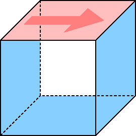

# T-Flows 

1. [Introduction](#intro)
2. [Software requirements](#soft_req)
    1. [Minimum](#soft_req_min)
    2. [Higlhy desirable](#soft_req_des)
    3. [Optional](#soft_req_opt)
3. [User requirements](#user_req)
    1. [Minimum](#user_req_min)
    2. [Desirable](#user_req_des)
4. [Obtaining the code](#obtaining)
5. [Compiling the code](#compiling)
    1. [Directory structure](#compiling_dir_struct)
    2. [Sub-programs](#compiling_sub_progs)
6. [Test cases](#test_cases)
    1. [Lid-driven cavity flow](#test_cases_lid_driven_cavity)
    2. [Thermally-driven cavity flow](#test_cases_lid_driven_cavity)
7. [Parallel processing](#parallel_proc)


# Introduction <a name="intro"></a>

T-Flows is a computational fluid dynamics (CFD) program for simulation of turbulent, single and multiphase flows.  Numerical method is based on collocated finite volume method on unstructured arbitrary grids and turbulence models include a range of Reynolds-averaged Navier-Stokes (RANS) models, large eddy simulations (LES), as well as hybrid RANS-LES approach.  A more comprehensive list of turbulence models is [here](https://github.com/DelNov/T-Flows/blob/bojan_petsc_solvers_almost_alpha/Documentation/Manual/turbulence_models.md).

Multiphase models include an algebraic volume of fluid (VOF) method and Lagrangian particle tracking model.  Three-phase flows situations (two fluid phases with VOF and one solid phase as particles) are also supported.

> **_Note:_** In T-Flows, the Navier-Stokes equations are discretized in their _incompressible_ form, meaning _only_ that pressure and temperatures are _not_ linked through an equation of state.  All physical properties in T-Flows can be variable, but you should keep in mind that variable density does not mean compressibility.

# Software requirements <a name="soft_req"></a>

## Minimum software requirements <a name="soft_req_min"></a>

The bare minimum to get T-Flows running entails:

- make utility
- Fortran 2008 compiler
- standard C compiler

T-Flows is almost entirely written in Fortran 2008 (only one function is written in C) and the compilation is controlled by makefiles.  So, the the requirements listed above are a bare minimum for you to start using the code.  
t
Although there is, in principle, no restriction on the operating system on which you can use T-Flows, its natural habitat is Linux, as we develop test it on Linux, and Linux meets the minimum software requirements either _out of the box_, or with minimum installation effort.

> **_Note:_** We do not specify the minimum version for any of the required or recommended software.  We believe that if you are reading these pages, you do have access to a relatively recent hardware which also implies an up to date operating system and the associated tools.  

## Highly desirable software requirements <a name="soft_req_des"></a>

Although without meeting the minimum software requirements listed above you will not get anywhere, they alone will not get you very far either.  To make a practical use of T-Flows, it is highly desirable that you also have the following:

- [GMSH](https://gmsh.info)
- any other free or commercial mesh generator exporting ANSYS' .msh format
- visualization software which can read .vtu file format such as [Paraview](https://www.paraview.org/) or [VisIt](https://wci.llnl.gov/simulation/computer-codes/visit), or any tool which can read .vtu file format
- [OpenMPI](https://www.open-mpi.org/) installation (mpif90 for compilation and mpirun for parallel processing)

T-Flows is, in essence, the flow solver without any graphical user interface (GUI).  Although it comes with its own mesh generator, it is very rudimentary and an external software, either free or commercial, would be highly desirable for meshing of complex computational domains.  We regularly use GMSH and would highly recommend it for its inherent scipting ability, but if you have access to any commercial mesh generator which can export meshes in ANSYS' .msh (and .cas, this should be checked) format, that would just fine.  Having no GUI, T-Flows relies on external tools for visualisation of results.  The results are saved in .vtu, Paraview's unstructured data format, and any visualisation software which can read that format is highly desirable for post-processing of results.

From its beginnings, T-Flows was developed for parallel execution with Message Passing Interface (MPI).  If you inted to run it on parallel computational platforms, you will also need an installation of OpenMPI on your system.


## Optional software packages <a name="soft_req_opt"></a>

The following packages are not essential to T-Flows, but could prove to be very useful if you become and experienced user, or even developer:

- [git](https://git-scm.com/)
- [PETSc](https://petsc.org/release/)
- [grace](https://plasma-gate.weizmann.ac.il/Grace/)

T-Flows resides on [GitHub](www.github.com) platform, and its development is controled by git commands.  Although you can download T-Flows from GitHub as a tarball and use it locally from there on, the connection to GitHub repository gives you the possibility to _pull_ updates, report issues, _track_ your own developments, and even share with them rest of community by pushing your changes.

Although T-Flows comes with its own suite of linear solvers based on Krylov sub-space family of methods (Incomplete Cholesky and Jacobi preonditioned CG, BiCG and  CGS), to have a better scaling with problem size, you may want to have more choice or even use algebraic multigrid preconditioners available through PETSc.  If PETSc is available on your system, T-Flows' makefiles will link with them and you will have all PETSc solvers at your disposal.

Visualization tools such as ParaView and VisIt are powerful, self-contained and sufficient for all sorts of post-processings, occasionally you might want to extract profiles from your solution fields and compare them agains experiments or direct numerical simulation (DNS) results, so a two-dimensional plotting software might come handy.  We find grace light particularly suitable for that purpose and many test cases which come with T-Flows, already have benchmark cases compared in xmgrace's format.

# User requirements <a name="user_req"></a>

There is no point in denying that successful use of a software package depends on the quality, robustness and intitivity of the software itself, but also on the level of user's experience.  This is even more true for open source software, particularly open source scientific software such as T-Flows.  So, in this section we list some background knowledge required from you in order to successfuly use T-Flows.

## Minimum user requirements <a name="user_req_min"></a>

The bare minimum you need to get T-Flows running is:

- you are able to download T-Flows sources as a .zip file from [GitHub](https://github.com/DelNov/T-Flows)
- you can find your way through your operating system from a terminal, you can find your path to downloaded sources and decompress them
- you know that your operating system has ```make``` command, Fortran and C compiler, and if not, you know who to ask to install them for you

If you are not even on this level, T-Flows is not for you and you are just wasting your time with it.  You are better of venturing into CFD with some commercial package featuring fully fledged GUI.

## Desirable user requirements <a name="user_req_des"></a>

Just like in software requirements section, the minimum will only get you so far.  In order to take a better advantage of T-Flows, your background knowledge should also entail:

- prudence in using Linux operating system from a terminal
- understanding of the ```make``` command
- ability to install third-party software on your computer, such as GMSH and Paraview
- one of the high-level programming languages such as C/C++, Fortran 2003+, Python, Julia or alike
- understanding of fluid mechanics
- essence of finite volume method and how conservation equations are numerically solved and linked
- the basic approaches in turbulence modelling, relative merits of RANS and LES and reasons why hybrid RANS/LES are being used
- approaches to multiphase flows descriptions, in particular VOF for flows with resolved interfaces and Lagrangian particle tracking for flows laden with particles

Ideally, when opting for open-source CFD code such as T-Flows, you should also be:

- eager to see how all components of a CFD program, hence the numerical methods, physical models and linear solvers, are implemented in an unstructured finite volume solver
- able to understand the essence of object-oriented code architecture
- familiar with single-program multiple-data (SPMD) programming paradigm and MPI commands
- version control system with git command
- drive to modify the sources of the program you are using, either in an attempt to improve it or to implement new features be it physical models or numerical methods and algorithms
- ready to adhere to coding standards laid down by T-Flows core development
- willing to share your developments with the rest of the scientific community through GitHub platform

This set of desirable user background knowledge is a bit on the exhaustive side and all the items should not met.  In full openess, not all members of T-Flows core development team are experts in all of these fields, but through organized team work we are covering them all.  Last, but maybe the most import, we hope that the usage of T-Flows will broaden your knowledge in as many of these fields as possible.

# Obtaining the code <a name="obtaining"></a>

The code resides on Github, more preciselly here [T-Flows@Github](https://github.com/DelNov/T-Flows).  You can either download just the zipped sources (from the "Code" dropdown menu, or use git in your terminal to retrive the sources under the git version control system:

    git clone https://github.com/DelNov/T-Flows

> **_Tip 1:_** We strongly recommend the latter approach as git will track all the changes you do to the code and give you access to all possibilities offered by git suite of commands.

If you are using the git command, you might even specify the name of the local directory where you want all the sources to be retrived, for example:

    git clone https://github.com/DelNov/T-Flows  T-Flows-Let-Me-Check-If-It-Works

In any case, the local directory to which all the sources have been retrieved, will be referred to as _root_ from this point in the manual on.

# Compiling the code <a name="compiling"></a>

## Directory structure <a name="compiling_dir_struct"></a>

To cover this section, we assume that you have an open terminal and that you have retreived the sources with one of the two options described in [section above](#obtaining).  The _root_ directory has the following structure:
```
[root]/
├── Binaries
├── Documentation
├── license
├── readme.md
├── Sources
└── Tests
```
> **_Note:_** Remember, [root] is the name of the directory to which you cloned or unzipped the sources.  

The sub-folders have self-explanatory names and we believe that it is only worth mentioning that directory ```Binaries``` will contain executable files.  If you check the contents of the ```Sources``` sub-folder, it will reveal the following structure:
```
[root]/Sources/
├── Convert
├── Divide
├── Generate
├── Libraries
├── Process
├── Shared
└── Utilities
```
which needs a bit more attention.  T-Flows entails four sub-programs called: _Generate_, _Convert_, _Divide_ and _Process_, whose sources lie in corresponding sub-directory names.  Directory ```Shared``` contains sources (by end large Fortran 2008 classes) which are shared by all the programs mentioned above.  Directory ```Libraries``` contains third party libraries and, at the time of writing this manual, contains only [METIS](http://glaros.dtc.umn.edu/gkhome/metis/metis/overview) libraries for domain decomposition with _Divide_.  Folder ```Utilities``` contains small utilities and prototype procedures used to test some basic concepts and we will epxlain some of them when the need occurs.

## Sub-programs: _Generate_, _Convert_, _Divide_ and _Process_  <a name="compiling_sub_programs"></a>

_Process_, as the name implies, has all the functionality needed to process (discretize and solve) flow equations on a given numerical grid, but it is not a mesh generator on its own.  To provide a mesh to _Process_, you can either use the built-in program _Generate_, which is quite rudimentary and useful for very simple geometries only, or convert a mesh from an external mesh generator (we would recommend [GMSH](https://gmsh.info), but any other software producing the files in Fluent's .msh format will do) using the program _Convert_.  So, as a bare minimum, you have to compile:

1. _Generate_ or _Convert_ and
2. _Process_

Should you want to run your simulations in parallel, you will have to decompose the meshes obtained from _Generate_ or _Convert_ with the program _Divide_.  The parallel processing is not covered here, we dedicate a separate section for it [below](#parallel_proc).  Here, we will only compile the program.

The compilation of each of the sub-programs is performed in their directories (```[root]/Sources/Generate```, ```[root]/Sources/Convert```, ```[root]/Sources/Divide``` and ```[root]/Sources/Process``` by simply issuing command ```make``` in each of them.  When compiling _Convert_, for example, command ```make``` in its directory prints the following on the terminal:
```
#=======================================================================
# Compiling Convert with compiler gnu
#-----------------------------------------------------------------------
# Usage:                                                                
#   make <FORTRAN=gnu/intel/nvidia> <DEBUG=no/yes> OPENMP=<no/yes>      
#        <REAL=double/single>                                           
#                                                                       
# Note: The first item, for each of the options above, is the default.  
#                                                                       
# Examples:                                                             
#   make              - compile with gnu compiler                       
#   make FORTAN=intel - compile with intel compiler                     
#   make DEBUG=yes    - compile with gnu compiler in debug mode         
#   make OPENMP=yes   - compile with gnu compiler for parallel Convert  
#-----------------------------------------------------------------------
gfortran ../Shared/Const_Mod.f90
gfortran ../Shared/Comm_Mod_Seq.f90
gfortran ../Shared/Math_Mod.f90
gfortran ../Shared/File_Mod.f90
...
...
gfortran Load_Fluent.f90
gfortran Load_Gmsh.f90
...
...
gfortran Main_Con.f90
Linking  ../Libraries/Metis_5.1.0_Linux_64/libmetis_i32_r64.a ../../Binaries/Convert 
```
At each invokation of the command ```make``` for any of the four programs` folders, makefile will print a header with possible options which can be passed to ```make```.  In the above you can see that you can specify which compiler you want to use (we use almost exclusivelly gnu), wheather you want debugging information in the executable and, probably most important of all, the precision of the floating point numbers.  If you specify ```make REAL=single```, ```make``` will compile the program with 32-bit representation of floating point numbers and if you define ```make REAL=double```, it will use the 64-bit representation.  

The command ```make clean``` will clean all object and module files from the local directory.

> **_Note 1:_** You don't really have to specify ```REAL=double``` or ```FORTRAN=gnu``` since these are the default options, as described in the header written by the makefile above.

> **_Note 2:_** Although the provided ```makefiles``` take care of the dependency of the sources, if you change precision in-between two compilations, you will have to run a ```make clean``` in between to make sure that objects with 32-bit and 64-bit representation of floating points mix up.

> **_Warning:_** All sub-programs should be compiled with the same precision.  At the time of writing these pages, _Process_ compiled with double precision will not be able to read files created by _Convert_ in single precision.  So, decide on a precision and stick with it for all sub-programs.

After you visit all four sub-directories with sources and run the ```make``` command in each, the sub-folder ```[root]/Binaries``` will have the following files:
```
[root]/Binaries/
├── Convert
├── Divide
├── Generate
├── Process
└── readme
```
and you are ready to start your first simulations.

# Test cases <a name="test_cases"></a>

## Lid-driven cavity flow <a name="test_cases_lid_driven_cavity"></a>

It is hard to imagine a problem in CFD simpler than a lid-driven flow in a cavity:



The flow occurs in a cavity with square cross section, in which all the walls are static except the top one which is moving.  The cavity is long enough in the spanwise direction that an assumption of two-dimensionality can be made.  The simplicity of this case is hard to beat as it occurs in one of the simplest possible domain geometries (a cube or a square in two dimensions), the fact that there are no inflow and outflow boundaries, and that there are steady laminar solutions for a range of Reynolds numbers.  Owing to its simplicity, it is well benchmarked and quite often the first test case one ever considers with a new CFD code.

We will use this case to introduce a few new concepts in T-Flows:
- conversion of a grid from GMSH with _Convert_
- specification of periodic boundary conditions
- setting up a control file for _Process_
- running the simulation and adjusting the control file
- visualization of results

### Using orthogonal grids

#### Creating the mesh

We start with a grid build from orthogonal hexahedral cell. In order to run this case, please go to the directory ```[root]/Tests/Manual/Lid_Driven_Cavity/Orthogonal```.  There you will find the following files:
* ```lid_driven_cavity.geo```
* ```lid_driven_cavity.msh```

The first file, with extension ```.geo``` is the script GMSH uses to generate a mesh.  It is beyond the scope of this manual to teach you how to use third party software, but it's probably worth having a look at it:
```
A  =  1.0;  // length and height of the cavity
B  =  0.5;  // width of the cavity
NA = 20;    // resolution in length and height
NB =  3;    // resolution in width (periodic direction)

// Define points
Point(1) = {0, 0, 0};  Point(2) = {A, 0, 0};
Point(3) = {A, 0, A};  Point(4) = {0, 0, A};

// Define lines
Line(1) = {1, 2};  Line(2) = {2, 3};
Line(3) = {3, 4};  Line(4) = {4, 1};

// Define front surface
Curve Loop(1) = {1, 2, 3, 4};  Plane Surface(1) = {1};

// Set lines to transfinite
// (+1 is because GMSH expects number of points here)
Transfinite Curve {1, 2, 3, 4} = NA+1  Using Bump  1.0;

// Set surface to be transfinite and quadrilateral
Transfinite Surface {1} = {1, 2, 3, 4};  Recombine Surface {1};

// Expand in spanwise direction
Extrude {0, B, 0} {Surface{1}; Layers {NB}; Recombine;}

// Define boundary conditions
Physical Surface("moving_wall", 27) = {21};
Physical Surface("static_wall", 28) = {25, 13, 17};
Physical Surface("periodic_y", 29) = {1, 26};

// Define volume condition
Physical Volume("fluid", 30) = {1};
```
to see that it is very readable and intuitive.  Script defines the points, the lines, a surface, extends this surface to create a volume in third dimension and finally prescribes the boundary conditions (called ```Pysical Surface``` and set to ```moving_wall```, ```static_wall``` and ```periodicity_y``` for this case.  The script is wrapped up by specifying a ```Physical Volume```, whose name is simply set to ```fluid```.

> **_Note:_** GMSH comes with a GUI, and you don't have to write a script like that at all - you can create a mesh solely from GUI.  That might seem comfortable at first, but it comes with a big disadvantage, particuarly for scientific work, that it is _not_ reproducable.  However, the main strength of GMSH as we see it is that it automatically creates a script with commands you enter in GUI so that you can use it for reproducing your actions, or tuning the script for more precise adjustments.  We usually create grids in GMSH in an iterative fashion: work in the GUI for a few steps, then exit and examine the script it created or updated and make fine tuning as we please.  Another advantage of GMSH's scripting is the possibility of parametrization.  We introduced variables ```A```, ```B```, ```NA``` and ```NB``` to be able to easily change domain dimensions and resolutions.

> **_Warning:_** It is easy to forget to specify the ```Physical Volume``` in GMSH which is a pitfall, because if you don't do it, it will only export surface mesh blocking T-Flows in discretizing equations through volumes.

Since the script for GMSH is ready, you can run it from command line with this command:

    gmsh -3 lid_driven_cavity.geo

which will, after a few instances, create the file:

    lid_driven_cavity.msh

#### Converting the mesh to T-Flows format

Once you have the mesh in this format, you can use _Convert_ to transform it into T-Flows native file format.  This will take a few minutes and will require your attention, so we don't recommend you going on with _Convert_ unless you are sure you can have 15 minutes of peace and focus ahead of you.  We assume you compiled _Convert_ as it was described in [this section](#compiling_sub_programs).   Given that you are in directory ```[root]/Tests/Manual/Lid_Driven_Cavity/Orthogonal```, you can call _Convert_ with:

    ../../../../Binaries/Convert

which will prompt you with the screen:
```
 #=======================================================================
 #                                                                   
 #    ______________________ ____    ________  __      __  _________ 
 #    \__    ___/\_   _____/|    |   \_____  \/  \    /  \/   _____/ 
 #      |    |    |    __)  |    |    /   |   \   \/\/   /\_____  \  
 #      |    |    |     \   |    |___/    |    \        / /        \ 
 #      |____|    \___  /   |_______ \_______  /\__/\  / /_______  / 
 #                    \/            \/       \/      \/          \/  
 #                     _____                      __                 
 #                    / ___/__  ___ _  _____ ____/ /_                
 #                   / /__/ _ \/ _ \ |/ / -_) __/ __/                
 #                   \___/\___/_//_/___/\__/_/  \__/                 
 #                                                                   
 #                         Double precision mode
 #-----------------------------------------------------------------------
 #================================================================
 # Enter the name of the grid file you are importing (with ext.):
 #----------------------------------------------------------------
```
Here you have to type the name of the grid with extension, hence ```lid_driven_cavity.msh```.  Many messages on the screen will follow outlining the conversion process which we won't cover now, but the _Convert_ will stop with the next question:
```
 #=================================================
 # Would you like to create a dual grid? (yes/no)
 #-------------------------------------------------
```
at which point you type ```no```, dual grids will be covered in the next example.  Next question _Convert_ asks you concerns geometric extents:
```
 #=========================================
 # Geometric extents:                 
 #-----------------------------------------
 # X from:  0.000E+00  to:  1.000E+00
 # Y from:  0.000E+00  to:  5.000E-01
 # Z from:  0.000E+00  to:  1.000E+00
 # Enter scaling factor for geometry: 
 # (or skip to keep as is): 
 #-----------------------------------------
```
You may wish to scale the entire geometry if, for example, you generated it in milimeters but you know that T-Flows' _Process_ works in SI units, or if you want to use scaling to change the nondimensional numbers (such as Reynolds or Rayleigh) that way.  For this case, we are not doing it, so just answer ```skip```.  Next question which _Convert_ will pose you concerns connections of boundary cells to inside cells:
```
 #====================================
 # Position the boundary cell centres:
 #------------------------------------
 # Type 1 for barycentric placement
 # Type 2 for orthogonal placement
 #------------------------------------
```
We noticed that, in some cases, the accuracy of gradient computations is more accurate if these connections are orthogonal, so it is safe to answer with ```2```.

> **_Note:_** For orthogonal grids, these boundary cell centers coincide, so it hardly matters.  It makes a difference on distorted grids.

Next thing _Convert_ wil ask you about is about the periodic boundary conditions:
```
 #======================================================
 # Grid currently has the following boundary conditions:
 #------------------------------------------------------
 #  1. MOVING_WALL                                                                     
 #  2. STATIC_WALL                                                                     
 #  3. PERIODIC_Y                                                                      
 #------------------------------------------------------
 #==============================================================
 # Enter the ordinal number(s) of periodic-boundary condition(s)
 # from the boundary condition list (see above)                 
 # Type skip if there is none !                                 
 #--------------------------------------------------------------
```
It lists all the boundary conditions specified in the ```.msh``` file and asks you which of those you want to set to be periodic.  In this case, you enter ```3```, because the periodicity set in GMSH to be called ```periodic_y``` is third in the list.  Since you can have peroidicity in more than one direction, _Convert_ will prompt you with the same question but with a shorter list of boundary conditions:
```
 #======================================================
 # Grid currently has the following boundary conditions:
 #------------------------------------------------------
 #  1. MOVING_WALL                                                                     
 #  2. STATIC_WALL                                                                     
 #------------------------------------------------------
 #==============================================================
 # Enter the ordinal number(s) of periodic-boundary condition(s)
 # from the boundary condition list (see above)                 
 # Type skip if there is none !                                 
 #--------------------------------------------------------------
```
and this time you answer ```skip```.  Finally, _Convert_ asks you about the distance from the wall calculation:
```
 #==================================================================
 # Calculating distance from the walls                              
 #------------------------------------------------------------------
 # Type ordinal number(s) of wall or wall_flux boundary condition(s)
 # from the boundary condition list (see above) separated by space. 
 # Cells' centers distances to the nearest wall will be calculated 
 # for the listed wall boundary(s).                                 
 #                                                                  
 # This is needed for RANS and HYBRID turbulence models as well as  
 # for proper initialization with potential pressure-like field.    
 #                                                                  
 # Type skip to skip this and set wall distance to one everywhere.  
 #------------------------------------------------------------------
```
Distance to the wall is important for many turbulence models as well as for problems with conjugate heat transfer.  It can be computed in two ways:
- Geometrically from _Convert_, browsing through all inside cells and searching for nearest boundary cells which is accurate but can be time consuming for large grids, or
- From a partial differential equation propoposed by Spalding which is done from _Process_ in cases the above step is skipped in _Convert_.  Wall distance calculation from partial differential equaton is faster for large grids, but less accurate.  However, the errors in the near wall reagions are rather small, invariantly smaller than 1%.

For this case, let's compute them from here so you answer ```1 2``` to the above question to instruct _Convert_ which bounaries can be considered as solid walls.  Before it ends, _Convert_ will ask you one more thing:
```
 #===========================================
 # Creating 1d file with the node 
 # coordinates in non-homogeneous directions 
 #-------------------------------------------
 # Insert non-homogeneous direction 
 # (x, y, z, rx, ry, rz or skip)
 # -------------------------------------------
 
which is important for computation of turbulent flows and described below.  For the time being, feel free to answer with a ```skip```.
 
```
#### Analyzing the results of the _Convert_

During the conversion process, _Convert_ creates the following files:
- ```lid_driven_cavity.cfn```
- ```lid_driven_cavity.dim```
- ```lid_driven_cavity.vtu```
- ```lid_driven_cavity.faces.vtu```
- ```lid_driven_cavity.shadows.vtu```
- ```control_template_for_lid_driven_cavity```

Which will be described in this section.  Files with extension ```.cfn``` and ```.dim``` are binary files in internal T-Flows format, which can be read by _Process_ (or _Divide_ for domain decomposition, which is covered in the separate [section](#parallel_proc) below).  A number of files with extension ```.vtu``` is created too.  You can visualize them with Paraview or Visit for inspection.  The most interesting is the ```lid_driven_cavity.faces.vtu``` because it shows boundary conditions.  Once visualized, the ```lid_driven_cavity.faces.vtu``` shows the following:

[Lid-driven cavity faces front!](Documentation/Manual/Figures/lid_driven_cavity_faces_front.png "Lid driven cavity faces front") 

which reveals boundary conditions for this case, which range from zero (internal cells) through one and two, which are the ordinal numbers which are used to store boundary conditions.

> **_Note:_** Don't worry, you won't have to deal with these numbers later on, just with strings you were using with GMSH to describe boundary conditions.  The reason you see them here is because ParaView can't plot strings as results to the best of our knowledge.

if you rotate the domain in ParaView, you will see something which may surprise you at first:

[Lid-driven cavity faces back!](Documentation/Manual/Figures/lid_driven_cavity_faces_back.png "Lid driven cavity faces back") 

The cells in the back seem to be hollow, as if they are missing the faces on periodic boundary.  This is done on purpose.  Since T-Flows uses face-base data structure (that is each face works on the cells surrounding it) the faces are stored on one side of periodic boundary, but stil have information about cells on each side of periodicity.  It is enough to browse through one copy of the periodic face for all numerical algoritms in T-Flows.

> **_Note:_** The exception is Lagrangian particle tracking which needs the periodic face-pairs not to allow particles escape the computioal domain.  To visualize those period pairs, one can read the file ```lid_driven_cavity.shadows.vtu```.  If plotted together with ```lid_driven_cavity.faces.vtu```, they close the domain/

### Running the simulation.  

In order to run a simulation, you have to compile _Process_ as explained in [this section](#compiling_sub_programs).  In addition to that, you need a special file called ```control``` which controls all the numerical parameters (by _numerical_ we mean discretization), physical models (turbulence, multiphase, multiple domains) and linear solver parameters (either for native or PETSc, if the code was compiled with PETSc) and most importantly sets boundary condition.  Although the amount of options which can be prescribed in ```control``` file is rather big, T-Flows' _Processs_ is very flexible and for all the options which are not specified, it takes default values.  At its bare minimum, ```control``` file needs problem name specified, to know which grids to read (files ```.cfn``` and ```.dim```) and boundary conditions.

In order to facilitate the setup of ``control``` files, _Convert_ and _Generate_ create a templated version of the control file for the given grid.  In this case, the templated control file is called ```control_template_for_lid_driven_cavity``` and it resides in the current directory.  Feel free to open it, because it comes with a lots of useful information:
```
#-----------------------------------------------------------
# This is a minimum control file for T-Flows for the domain
# "lid_driven_cavity"
#
# One can use it as a staring point for defining entries
# in T-Flows' control file.  These files are created at
# the end of each call to Conver or Generate sub-programs.
#
# Each line starting with a # is, obviously, a comment.
# Lines starting with ! or % are also skipped as comments.
#-----------------------------------------------------------

#-----------------------------------------------------------
# Problem name must be specified and corresponds to the
# base name (without extensions) of the grid file used.
#-----------------------------------------------------------
PROBLEM_NAME        lid_driven_cavity

#-----------------------------------------------------------
# Boundary conditions also must be specified and are
# listed here, for this grid, with some dummy values
#
# T-Flows neglects what it doesn't need to read, so in
# the lines below, only "wall" will be read as the type of
# boundary conditions, everything in () braces is skipped.
#
# The same holds for the valuse listed.  If simulation is
# laminar or LES, T-Flows will skip the valies for "k",
# "eps", "zeta" and "f22"
#-----------------------------------------------------------
BOUNDARY_CONDITION moving_wall
  TYPE             wall  (or: inflow / outflow / pressure / convective)
  VARIABLES        u     v     w     t    kin    eps    zeta     f22
  VALUES           0.0   0.0   0.0   10   1e-2   1e-3   6.6e-2   1e-3

BOUNDARY_CONDITION static_wall
  TYPE             wall  (or: inflow / outflow / pressure / convective)
  VARIABLES        u     v     w     t    kin    eps    zeta     f22
  VALUES           0.0   0.0   0.0   10   1e-2   1e-3   6.6e-2   1e-3

#-----------------------------------------------------------
# And, that's it, what is listed above is the bare minimum.
# If nothing else is prescribed, T-Flows will take default
# values as documented in Documents/all_control_keywords.
#
# Clearly, such a simulation wouldn't be very useful, so
# in the following are some of the most essential options
# for the control file. Simply uncomment what you need.
#
# All the entries (except the sub-entries such as: TYPE,
# VARIABLES/VALUES after each of the BOUNDARY_CONDITION
# can be inserted in any order.  T-Flows will take whatever
# it needs, whenever it needs it.  The entire boundary
# section may as well be at he end of the file.
#-----------------------------------------------------------

#-----------------------------------------------------------
# Time stepping
#-----------------------------------------------------------
! TIME_STEP                 0.001
! NUMBER_OF_TIME_STEPS   1200
! RESULTS_SAVE_INTERVAL   300  (how often will it save)

#-----------------------------------------------------------
# Physical properties
#-----------------------------------------------------------
! MASS_DENSITY           1.0
! THERMAL_CONDUCTIVITY   1.4e-4
! DYNAMIC_VISCOSITY      1.0e-4
! HEAT_CAPACITY          1.0

#-----------------------------------------------------------
# Monitoring points
#-----------------------------------------------------------
! NUMBER_OF_MONITORING_POINTS  4
!   MONITORING_POINT_001       0.0  0.0  2.0
!   MONITORING_POINT_002       0.0  0.0  2.5
!   MONITORING_POINT_003       0.0  0.0  3.0
!   MONITORING_POINT_004       0.0  0.0  3.5
! POINT_FOR_MONITORING_PLANES  0.17  0.17  1.51

#-----------------------------------------------------------
# Initial condition
#
# These are very simular to BOUNDARY_CONDITION section above
# and also here sub-entries VARIABLES and VALUES must be
# specified in the given order.
#-----------------------------------------------------------
! INITIAL_CONDITION
!   VARIABLES        u     v     w     t    kin    eps    zeta     f22
!   VALUES           0.0   0.0   0.0   10   1e-2   1e-3   6.6e-2   1e-3

#-----------------------------------------------------------
# For flows with inlets and outlets, initialization by a
# pressure-like potential field could prove to be useful
#-----------------------------------------------------------
!  POTENTIAL_INTIALIZATION      yes

#-----------------------------------------------------------
# For more customizations, check the file:
# Documents/all_control_keywords.
#-----------------------------------------------------------
```
Please read through it, it gives a lots of explanations which are probably not worth repeating here.  We will cover different options in subsequent sections of this manual.  For the sake of shorteness, copy the templated control file to just ```control``` file with:

    cp  control_template_for_lid_driven_cavity  control

remove all non-essential comments and set the velocity of the moving wall to ```1.0``` in the section ```BOUNDARY_CONDITION moving_wall``` until you get this: 
```
# Problem name
PROBLEM_NAME        lid_driven_cavity

# Boundary conditions
BOUNDARY_CONDITION moving_wall
  TYPE             wall  (or: inflow / outflow / pressure / convective)
  VARIABLES        u     v     w     t    kin    eps    zeta     f22
  VALUES           1.0   0.0   0.0   10   1e-2   1e-3   6.6e-2   1e-3

BOUNDARY_CONDITION static_wall
  TYPE             wall  (or: inflow / outflow / pressure / convective)
  VARIABLES        u     v     w     t    kin    eps    zeta     f22
  VALUES           0.0   0.0   0.0   10   1e-2   1e-3   6.6e-2   1e-3

```

At this point, you are ready to run.  Invoke _Process_ by issing command:

    ../../../../Binaries/Process > out  &
    
Since _Process_ writes a lot of information on the screen while it is computing, it is useful to re-direct the output to a log file, here simply called ```out```.  We also send the process in the background with an ampersand ```&``` at the end of the command line.  Next, let's analyze the output from _Process_.  It starts with a header:
``` 
 #=======================================================================        
 #                                                                               
 #    ______________________ ____    ________  __      __  _________             
 #    \__    ___/\_   _____/|    |   \_____  \/  \    /  \/   _____/             
 #      |    |    |    __)  |    |    /   |   \   \/\/   /\_____  \              
 #      |    |    |     \   |    |___/    |    \        / /        \             
 #      |____|    \___  /   |_______ \_______  /\__/\  / /_______  /             
 #                    \/            \/       \/      \/          \/              
 #                      ___                                                      
 #                     / _ \_______  _______ ___ ___                             
 #                    / ___/ __/ _ \/ __/ -_|_-<(_-<                             
 #                   /_/  /_/  \___/\__/\__/___/___/                             
 #                                                                               
 #                        Double precision mode                                  
 #                     Compiled with PETSc solvers                               
 #-----------------------------------------------------------------------
```
which gives two important pieces of information at the end: that the _Process_ was compiled in 64-bit representation of floating point numbers (```Double precision mode```) and that it was linked with PETSc libraries (```Compiled with PETSc solvers```).  What follows is a bunch of parameters it reads from the ```control``` file, and it is generally worth observing the lines such as (some are ommited):
```
 # NOTE! Could not find the keyword: NUMBER_OF_TIME_STEPS. Using the default:      1200
 # ...
 # NOTE! Could not find the keyword: HEAT_TRANSFER. Using the default: no        
 # ...
 # NOTE! Could not find the keyword: TURBULENCE_MODEL. Using the default: none   
 # NOTE! Could not find the keyword: INTERFACE_TRACKING. Using the default: no    
 # NOTE! Could not find the keyword: PARTICLE_TRACKING. Using the default: no    
 # NOTE! Could not find the keyword: TIME_STEP. Using the default: 1.000E-02     
```    
At this point, most important is that, because neither the number of time steps nor the time step is prescribed in ```control``` file, it sets them to default values of ```1200``` and ```1.0E-2``` respectivelly.

Each time step performed by _Process_ prints some information on convergence of solution procedure, and it looks as follows:
```
                                         #===============================================#
                                         #                                               #
                                         #              Time step :    131               #
                                         #                                               #
                                         #    Simulation time : 1.310E+00 [s]            #
                                         #    Wall-clock time : 000:00:02 [hhh:mm:ss]    #
                                         #                                               #
                                         #-----------------------------------------------#
                                                                                 
  #=============================================================================================================================#
  #                                                        Iteration:  1                                                        #
  #--------------------+--------------------+--------------------+--------------------+--------------------+--------------------#
  # U   :  2 2.966E-08 | V   :  0 0.000E+00 | W   :  2 4.583E-09 | PP  : 14 7.786E-07 | MASS:    1.476E-08 |                    #
  #=============================================================================================================================#
  #                                                        Iteration:  2                                                        #
  #--------------------+--------------------+--------------------+--------------------+--------------------+--------------------#
  # U   :  2 1.390E-08 | V   :  0 0.000E+00 | W   :  2 2.981E-09 | PP  : 14 8.401E-07 | MASS:    1.706E-08 |                    #
  #=============================================================================================================================#
  #                                                        Iteration:  3                                                        #
  #--------------------+--------------------+--------------------+--------------------+--------------------+--------------------#
  # U   :  2 6.594E-09 | V   :  0 0.000E+00 | W   :  1 7.434E-07 | PP  : 14 7.609E-07 | MASS:    1.528E-08 |                    #
  #--------------------+=========================================+=========================================+--------------------#
                       #    Maximum Courant number: 1.602E-01    |    Maximum Peclet number: 4.006E+00     #
                       #---------------------------+-------------+-------------+---------------------------#
                       #    Flux x :  0.000E+00    |    Flux y :  -1.49E-10    |    Flux z :   0.00E+00    #
                       #    Pdrop x:  0.000E+00    |    Pdrop y:   0.00E+00    |    Pdrop z:   0.00E+00    #
                       #---------------------------+---------------------------+---------------------------#
```
In the header, it shows the current time step, current simulation (numerical) time and elapsed wall-clock time.  That is followed by information on achieved convergence within each time step.  The equations being solved for this case are three velocity components (```U```, ```V``` and ```W```) and pressure correction (```PP```).  For each of them it shows number of iterations performed in linear solver (the small integer values), as well as the final residual achieved (the number written in exponential form).  The footer shows the maximum Courant and Peclet number at the end of the time step, as well as global fluxes and pressure drops in the current time step.  For this simulation, global fluxes and pressure drops are of no relevance, but maximum Courant number gives us insight about convergence.  If it grows beyond a hundred, we will likely face divergence.  

Since we know that this test case reaches a steady solution in the end, we should expect number of iterations to drop to zero.  In this case, it is not quite like that.  Last performed time step shows:
```
                                         #===============================================#
                                         #                                               #
                                         #              Time step :   1200               #
                                         #                                               #
                                         #    Simulation time : 1.200E+01 [s]            #
                                         #    Wall-clock time : 000:00:19 [hhh:mm:ss]    #
                                         #                                               #
                                         #-----------------------------------------------#
                                                                                 
  #=============================================================================================================================#
  #                                                        Iteration:  1                                                        #
  #--------------------+--------------------+--------------------+--------------------+--------------------+--------------------#
  # U   :  1 2.462E-08 | V   :  0 0.000E+00 | W   :  1 1.886E-08 | PP  :  2 5.501E-07 | MASS:    1.053E-08 |                    #
  #=============================================================================================================================#
  #                                                        Iteration:  2                                                        #
  #--------------------+--------------------+--------------------+--------------------+--------------------+--------------------#
  # U   :  1 1.134E-08 | V   :  0 0.000E+00 | W   :  1 8.567E-09 | PP  :  0 0.000E+00 | MASS:    1.716E-08 |                    #
  #=============================================================================================================================#
  #                                                        Iteration:  3                                                        #
  #--------------------+--------------------+--------------------+--------------------+--------------------+--------------------#
  # U   :  1 5.195E-09 | V   :  0 0.000E+00 | W   :  1 3.848E-09 | PP  :  2 5.312E-07 | MASS:    1.184E-08 |                    #
  #--------------------+=========================================+=========================================+--------------------#
                       #    Maximum Courant number: 1.672E-01    |    Maximum Peclet number: 4.179E+00     #
                       #---------------------------+-------------+-------------+---------------------------#
                       #    Flux x :  0.000E+00    |    Flux y :  -2.07E-11    |    Flux z :   0.00E+00    #
                       #    Pdrop x:  0.000E+00    |    Pdrop y:   0.00E+00    |    Pdrop z:   0.00E+00    #
                       #---------------------------+---------------------------+---------------------------#
```
Number of iteratons are all one or two, but not quite zero yet.  So, if we want to be purists, we can't say we achieved steady state to the tolerance set by T-Flows.  In order to work around it, we could either increase the number of time steps, or the time step itself.  Since CFL is well below unity, let's re-run the simulation with ```control``` file modified as:
```
# Problem name                                                                   
PROBLEM_NAME        lid_driven_cavity                                            
                                                                                 
# Time step                                                                      
TIME_STEP  0.1                                                                   
                                                                                 
# Boundary conditions                                                            
BOUNDARY_CONDITION moving_wall                                                   
  TYPE             wall  (or: inflow / outflow / pressure / convective)          
  VARIABLES        u     v     w     t    kin    eps    zeta     f22             
  VALUES           1.0   0.0   0.0   10   1e-2   1e-3   6.6e-2   1e-3            
                                                                                 
BOUNDARY_CONDITION static_wall                                                   
  TYPE             wall  (or: inflow / outflow / pressure / convective)          
  VARIABLES        u     v     w     t    kin    eps    zeta     f22             
  VALUES           0.0   0.0   0.0   10   1e-2   1e-3   6.6e-2   1e-3
```
With time step set to ```0.1```, convergence is observed after 312 time steps:
```
                                         #===============================================#
                                         #                                               #
                                         #              Time step :    312               #
                                         #                                               #
                                         #    Simulation time : 3.120E+01 [s]            #
                                         #    Wall-clock time : 000:00:05 [hhh:mm:ss]    #
                                         #                                               #
                                         #-----------------------------------------------#
                                                                                 
  #=============================================================================================================================#
  #                                                        Iteration:  1                                                        #
  #--------------------+--------------------+--------------------+--------------------+--------------------+--------------------#
  # U   :  0 9.789E-07 | V   :  0 0.000E+00 | W   :  0 9.640E-07 | PP  :  0 0.000E+00 | MASS:    1.856E-07 |                    #
  #=============================================================================================================================#
  #                                                        Iteration:  2                                                        #
  #--------------------+--------------------+--------------------+--------------------+--------------------+--------------------#
  # U   :  0 9.789E-07 | V   :  0 0.000E+00 | W   :  0 9.640E-07 | PP  :  0 0.000E+00 | MASS:    1.856E-07 |                    #
  #=============================================================================================================================#
  #                                                        Iteration:  3                                                        #
  #--------------------+--------------------+--------------------+--------------------+--------------------+--------------------#
  # U   :  0 9.789E-07 | V   :  0 0.000E+00 | W   :  0 9.640E-07 | PP  :  0 0.000E+00 | MASS:    1.856E-07 |                    #
  #--------------------+=========================================+=========================================+--------------------#
                       #    Maximum Courant number: 1.672E+00    |    Maximum Peclet number: 4.181E+00     #
                       #---------------------------+-------------+-------------+---------------------------#
                       #    Flux x :  0.000E+00    |    Flux y :   8.54E-11    |    Flux z :   0.00E+00    #
                       #    Pdrop x:  0.000E+00    |    Pdrop y:   0.00E+00    |    Pdrop z:   0.00E+00    #
                       #---------------------------+---------------------------+---------------------------#
```


## Thermally-driven cavity flow <a name="test_cases_thermally_driven_cavity"></a>

# Parallel processing  <a name="parallel_proc"></a>

