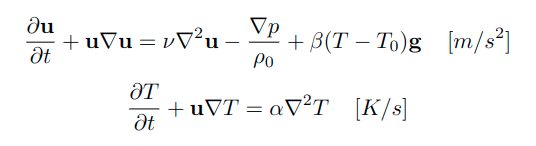
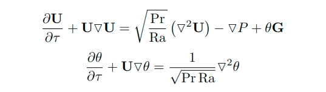
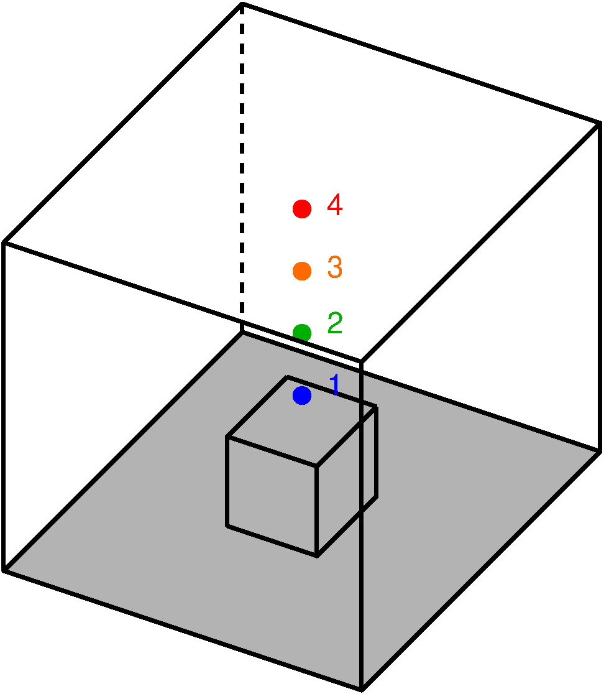
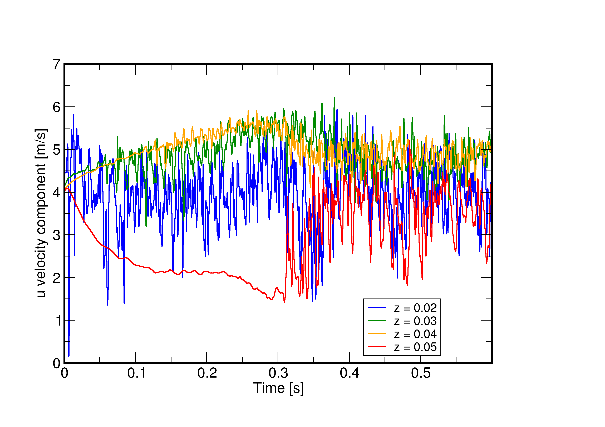
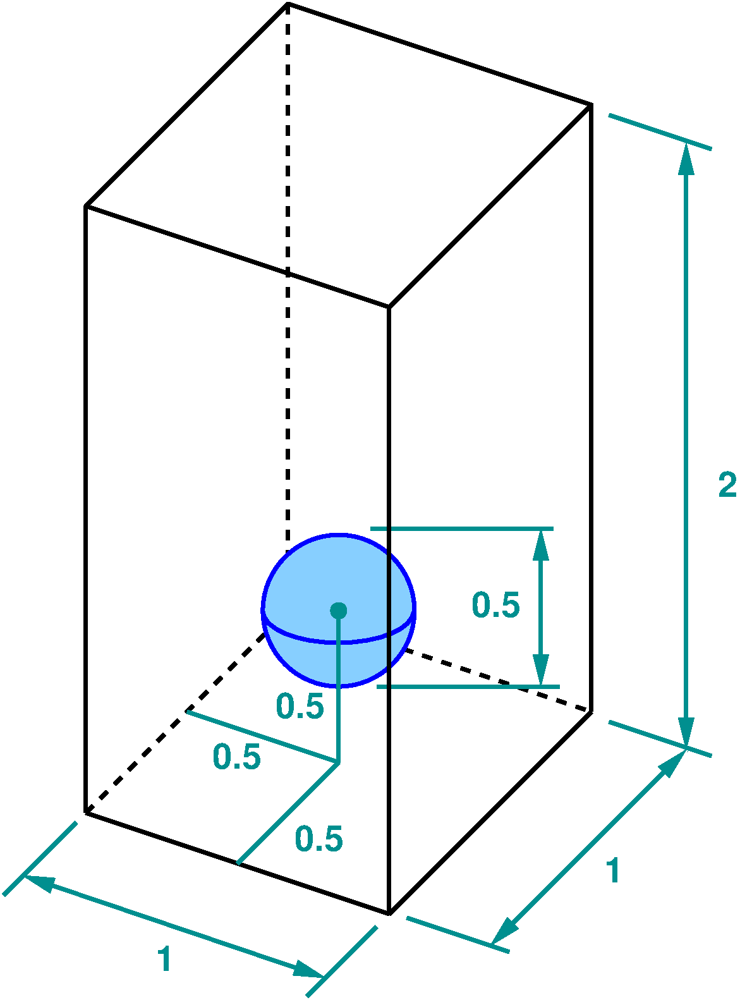
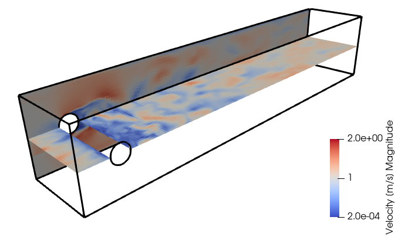
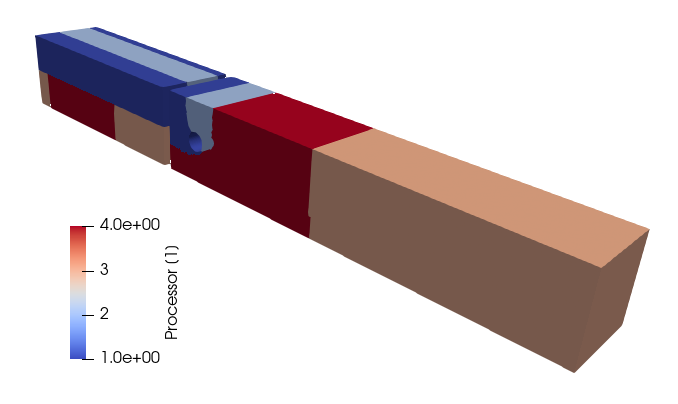

# T-Flows

1. [Introduction](#intro)
2. [Software requirements](#soft_req)
    1. [Minimum](#soft_req_min)
    2. [Highly desirable](#soft_req_des)
    3. [Optional](#soft_req_opt)
3. [User requirements](#user_req)
    1. [Minimum](#user_req_min)
    2. [Desirable](#user_req_des)
4. [Obtaining the code](#obtaining)
5. [Compiling the code](#compiling)
    1. [Directory structure](#compiling_dir_struct)
    2. [Compiling sub-programs](#compiling_sub_programs)
6. [Demonstration cases](#demo_cases)
    1. [Lid-driven cavity flow](#demo_lid_driven)
        1. [Lid-driven cavity on hexahedral grid](#demo_lid_driven_hexa)
            1. [Creating the grid](#demo_lid_driven_hexa_create)
            1. [Converting the grid](#demo_lid_driven_hexa_convert)
        2. [Lid-driven cavity on polyhedral grid](#demo_lid_driven_dual)
    2. [Thermally-driven cavity flow](#demo_thermally_driven)
        1. [With Boussinesq approximation](#demo_thermally_driven_boussinesq)
        2. [With variable physical properties](#demo_thermally_driven_variable)
    3. [Parallel processing](#demo_parallel_proc)
        1. [Compiling for parallel runs](#demo_parallel_proc_compiling)
        2. [Creating and dividing the grid](#demo_parallel_proc_dividing)
        3. [Running the simulation in parallel](#demo_parallel_proc_running)
7. [PETSc solvers](#link_petsc)
    1. [Compiling PETSc](#link_petsc_compiling)
    2. [Linking T-Flows with PETSc](#link_petsc_tflows)
    3. [Using PETSc](#link_petsc_using)
8. [Benchmark cases](#bench_cases)
    1. [Laminar flow over a flat plate](#bench_flat_plate)
        1. [Pre-processing](#bench_flat_plate_pre)
        2. [Processing - running the case](#bench_flat_plate_run)
        3. [Post-processing - visualization of results and plotting profiles](#bench_flat_plate_post)
    2. [Conjugate heat transfer](#bench_conjugate)
        1. [Generating the grids](#bench_conjugate_generating)
        2. [Compiling and running](#bench_conjugate_running)
        3. [Comparison with benchmark solution](#bench_conjugate_compare)
        4. [Thing to try next](#bench_conjugate_next)
    3. [Fully-developed turbulent plane channel flow](#bench_plane_channel)
        1. [RANS computation of a channel flow](#bench_plate_channel_rans)
        2. [LES computation of a channel flow](#bench_plate_channel_les)
    4. [Round impinging jet and heat transfer](#bench_cases_jet)
    5. [Large eddy simulation over a matrix of cubes](#bench_cases_matrix)
        1. [Preparing the grid](#bench_cases_matrix_prep)
        2. [Running the case](#bench_cases_matrix_running)
        3. [Comparing against experiments](#bench_cases_matrix_comparing)
    6. [Volume of fluid simulation of a rising bubble](#bench_cases_bubble)
        1. [Initialization of VOF function](#bench_cases_buble_init)
        2. [Compiling](#bench_cases_buble_compiling)
        3. [Running the case](#bench_cases_buble_running)
        4. [Checking the initial condition](#bench_cases_buble_checking)
        5. [Final solution and benchmarking](#bench_cases_buble_final)
    7. [Lagrangian tracking of particles in an L-bend](#bench_cases_swarm)
9. [Inflows and outflows](#demo_inflows)
    1. [Flat velocity profile](#demo_inflows_flat)
    2. [Prescribed velocity profile](#demo_inflows_parabolic)
    3. [Synthetic eddies](#demo_inflows_eddies)
    4. [Precursor domain](#demo_inflows_precursor)
    5. [Turbulent precursor domain](#demo_inflows_turbulent)

# Introduction <a name="intro"></a>

T-Flows is a computational fluid dynamics (CFD) program for simulation of turbulent,
single and multiphase flows.  Numerical method is based on collocated finite
volume method on unstructured arbitrary grids and turbulence models include a
range of Reynolds-averaged Navier-Stokes (RANS) models, large eddy simulations
(LES), as well as hybrid RANS-LES approach.  A more comprehensive list of
turbulence models is [here](https://github.com/DelNov/T-Flows/blob/bojan_petsc_solvers_almost_alpha/Documentation/Manual/turbulence_models.md).

Multiphase models include an algebraic volume of fluid (VOF) method and
Lagrangian particle tracking model.  Three-phase flows situations (two fluid
phases with VOF and one solid phase as particles) are also supported.

> **_Note:_** In T-Flows, the Navier-Stokes equations are discretized in their
_incompressible_ form, meaning _only_ that pressure and temperatures are _not_
linked through an equation of state.  All physical properties in T-Flows can
be variable, but you should keep in mind that variable density does not mean
compressibility.

# Software requirements <a name="soft_req"></a>

## Minimum software requirements <a name="soft_req_min"></a>

The bare minimum to get T-Flows running entails:

- make utility
- Fortran 2008 compiler
- standard C compiler

T-Flows is almost entirely written in Fortran 2008 (only one function is written
in C) and the compilation is controlled by makefiles.  So, the the requirements
listed above are a bare minimum for you to start using the code.

Although there is, in principle, no restriction on the operating system on
which you can use T-Flows, its natural habitat is Linux.   We develop test T-Flows
on Linux, and Linux meets the minimum software requirements either _out of the box_,
or with small installation effort.

> **_Note:_** We do not specify the minimum version for any of the required or
recommended software.  We believe that if you are reading these pages, you do
have access to a relatively recent hardware which also implies an up to date
operating system and the associated tools.

## Highly desirable software requirements <a name="soft_req_des"></a>

Although without meeting the minimum software requirements listed above you
will not get anywhere, they alone will not get you very far either.  To make a
practical use of T-Flows, it is highly desirable that you also have the following:

- [GMSH](https://gmsh.info)
- any other free or commercial mesh generator exporting ANSYS' ```.msh``` or
  ```.cas``` format (**double-check** for .cas)
- visualization software which can read ```.vtu``` file format such as
  [ParaView](https://www.paraview.org/) or [VisIt](https://wci.llnl.gov/simulation/computer-codes/visit),
  or any tool which can read ```.vtu``` file format
- [OpenMPI](https://www.open-mpi.org/) installation (mpif90 for compilation and
  mpirun for parallel processing)

T-Flows is, in essence, a fluid flow solver without any graphical user interface (GUI).
Although it comes with its own grid generator, it is very rudimentary, and an
external grid generation software would be highly desirable for meshing complex
computational domains.  We regularly use GMSH and would highly recommend it for
its inherent scripting ability, but if you have access to any commercial grid
generator which can export meshes in ANSYS' ```.msh``` (and ```.cas```, **this should
be checked**) format, that would just fine.

Having no GUI, T-Flows relies on
external tools for visualization of results.  The results are saved in ```.vtu```,
ParaView's unstructured data format, and any visualization software which can
read that format is highly desirable for post-processing of results.

From its beginnings, T-Flows was developed for parallel execution with Message
Passing Interface (MPI).  If you intend to run it on parallel computational
platforms, you will also need an installation of OpenMPI on your system.

## Optional software packages <a name="soft_req_opt"></a>

The following packages are not essential to T-Flows, but could prove to be very
useful if you become and experienced user, or even developer:

- [git](https://git-scm.com/)
- [PETSc](https://petsc.org/release/)
- [Grace](https://plasma-gate.weizmann.ac.il/Grace/)

T-Flows resides on [GitHub](www.github.com) platform, and its development is
controlled by ```git``` commands.  Although you can download T-Flows from
GitHub as a ```.zip``` file and use it locally from there on, the connection
to GitHub repository gives you the possibility to _pull_ updates, report issues,
_track_ your own developments, and even share with them rest of community by
pushing your changes.

Even though T-Flows comes with its own suite of linear solvers based on Krylov
sub-space family of methods (Incomplete Cholesky and Jacobi preconditioned
conjugate gradient (CG), bi-conjugate gradient (BiCG) and conjugate gradient
squared (CGS)), you might want to have more choice or even want to use
algebraic multigrid preconditioners for better scaling with problem size.
To that end, we linked T-Flows with PETSc.  If PETSc is installed on your
system, T-Flows' makefiles will recognize, link with PETSc libraries and you
will have all PETSc solvers at your disposal.

Visualization tools such as ParaView and VisIt are powerful, self-contained
and sufficient for all sorts of post-processing, but occasionally you might want
to extract profiles from your solution fields and compare them against
experiments or direct numerical simulation (DNS) results, so a two-dimensional
plotting software might come handy.  We find Grace light particularly suitable
for that purpose and many test cases which come with T-Flows, already have
benchmark cases compared in Grace's format (```.agr``` files).

> **_Note:_** During its lifespan, Grace went through a number of transitions
and is known under different names.  It used to be called _xmgr_, _xmgrace_,
_ace_ and currently _grace_.  It is possible that, with installation of Grace,
its other names become available on your system as aliases.

# User requirements <a name="user_req"></a>

There is no point in denying that successful use of a software package depends
on the quality, robustness and intuitivity of the software itself, but also on
the user's previous experience.  This is even more true for open source
software, particularly open source scientific software such as T-Flows.
In this section we list some background knowledge required from you in

## Minimum user requirements <a name="user_req_min"></a>

The bare minimum you need to get T-Flows running is:

- you are able to download T-Flows sources as a .zip file from [GitHub](https://github.com/DelNov/T-Flows)
- you don't have to click icons in a file manager to reach your files or execute
  commands, because you _can_ use your operating system (OS) from a terminal.
- you know that your operating system has ```make``` command, Fortran and
  C compiler, and if not, you know who to ask to install these facilities for you

If you are not even on this level, T-Flows is not for you and you are just
wasting your time with it.  You are better of venturing into CFD with some
commercial package featuring fully fledged GUI.

## Desirable user requirements <a name="user_req_des"></a>

Just like in software requirements section, the minimum will only get you so far.
In order to take a better advantage of T-Flows, your background knowledge should
also entail as many of the following:

- prudence in using Linux operating system from a terminal
- understanding of the ```make``` command
- ability to install third-party software on your computer, such as GMSH, ParaView
  or maybe even build PETSc from the sources
- one of the high-level programming languages such as C/C++, Fortran 2003+,
  Python, Julia or alike
- understanding of fluid mechanics
- essence of finite volume method and how conservation equations are numerically
  solved and linked
- the basic approaches in turbulence modeling, relative merits of RANS and LES
  and reasons why hybrid RANS/LES are being used
- approaches to multiphase flows description, in particular VOF for flows with
  resolved interfaces and Lagrangian particle tracking for flows laden with particles

Ideally, when opting for open-source CFD code such as T-Flows, you should also be:

- eager to see how all components of a CFD program, hence the numerical methods,
  physical models and linear solvers, are implemented in an unstructured finite
  volume solver
- able to understand the essence of object-oriented code architecture
- familiar with single-program multiple-data (SPMD) programming paradigm and
  related MPI commands
- acquainted with version control system with ```git``` command
- interested to modify the sources of the program you are using, either in an
  attempt to improve it or to implement new features be it physical models or
  numerical methods and algorithms
- ready to adhere to coding standards laid down by T-Flows core development team
- willing to share your developments with the rest of the scientific community
  through GitHub platform

This set of desirable user background knowledge is a bit on the exhaustive side
and all the items must not met.  In full openness, not even all members of
T-Flows core development team are experts in _all_ of these fields, but through
organized team work we are covering them all.  Last, but maybe the most import,
we hope that the usage of T-Flows will broaden your knowledge in as many of these
fields as possible, and that you will find this journey exciting.

# Obtaining the code <a name="obtaining"></a>

The code resides on Github, more precisely here: [T-Flows](https://github.com/DelNov/T-Flows).
You can either download just the zipped sources (from the "Code" drop-down menu,
or use git in your terminal to retrieve the sources under the git version control
system:
```
git clone https://github.com/DelNov/T-Flows
```

> **_Tip 1:_** We strongly recommend the latter approach as ```git``` will track all
the changes you do to the code and give you access to all possibilities offered
by git suite of commands.

> **_Tip 2:_** If you are not familiar with version control system (such as ```.git```,
you are better of learning it soon as possible since it is an indispensable
tool in software development and maintenance.

If you are using the ```git``` command, you might also specify the name of the
local directory where you want all the sources to be retrieved, for example:
```
git clone https://github.com/DelNov/T-Flows  T-Flows-Let-Me-Check-If-It-Works
```

In any case, the local directory to which all the sources have been retrieved,
will be referred to as ```[root]``` from this point in the manual on.

# Compiling the code <a name="compiling"></a>

## Directory structure <a name="compiling_dir_struct"></a>

To cover this section, we assume that you have an open terminal and that you
have retrieved the sources with one of the two options described in section
[Obtaining the code](#obtaining).  The ```[root]``` directory has the following
structure:
```
[root]/
├── Binaries
├── Documentation
├── license
├── readme.md
├── Sources
└── Tests
```

> **_Note:_** Remember, [root] is the name of the directory to which you cloned
or unzipped the sources.  It is not ```/``` in Linux or ```C:\``` on Windows.

The sub-directories have rather self-explanatory names and we believe that it is
only worth mentioning that the directory ```Binaries``` will contain executable
files.  If you check the contents of the ```Sources``` sub-directory, it will reveal
the following structure:
```
[root]/Sources/
├── Convert
├── Divide
├── Generate
├── Libraries
├── Process
├── Shared
└── Utilities
```

which needs a bit more attention.  T-Flows entails four sub-programs called:
_Generate_, _Convert_, _Divide_ and _Process_, whose sources lie in corresponding
sub-directory names.  Directory ```Shared``` contains sources (by end large Fortran
2008 _classes_) which are shared by all the sub-programs mentioned above.
Directory ```Libraries``` contains third party libraries and, at the time of writing
this manual, contains only [METIS](http://glaros.dtc.umn.edu/gkhome/metis/metis/overview)
libraries for domain decomposition with _Divide_.  Directory ```Utilities``` contains
small utilities and prototype procedures used to test some basic concepts or help
with some menial tasks and we will explain some of them when the need occurs.

## Sub-programs: _Generate_, _Convert_, _Divide_ and _Process_  <a name="compiling_sub_programs"></a>

_Process_, as the name implies, has all the functionality needed to process
(discretize and solve) flow equations on a given numerical grid, but it is not
a grid generator on its own.  To provide a grid to _Process_, you can either
use the built-in program _Generate_, which is quite rudimentary and useful for
very simple geometries only, or convert a mesh from an external mesh generator.

> **_Note:_**  As third-party grid generator we would recommend [GMSH](https://gmsh.info),
although any other software producing the files in Fluent's ```.msh``` format will do)

So, as a bare minimum, you have to compile:

1. _Generate_ or _Convert_ and
2. _Process_

Should you want to run your simulations in parallel, you will have to decompose
the grids obtained from _Generate_ or _Convert_ with the program _Divide_.
The parallel processing is not covered here, we dedicate a separate section
[Parallel processing](#demo_parallel_proc) for it.  Here, we will only compile
the program _Divide_.

The compilation of each of the sub-programs is performed in their directories
(```[root]/Sources/Generate```, ```[root]/Sources/Convert```, ```[root]/Sources/Divide```
and ```[root]/Sources/Process``` by simply issuing command ```make``` in each
of them.  When compiling _Convert_, for example, command ```make``` in its
directory prints the following lines on the terminal:
```
#=======================================================================
# Compiling Convert with compiler gnu
#-----------------------------------------------------------------------
# Usage:
#   make <FORTRAN=gnu/intel/nvidia> <DEBUG=no/yes> OPENMP=<no/yes>
#        <REAL=double/single>
#
# Note: The first item, for each of the options above, is the default.
#
# Examples:
#   make              - compile with gnu compiler
#   make FORTAN=intel - compile with intel compiler
#   make DEBUG=yes    - compile with gnu compiler in debug mode
#   make OPENMP=yes   - compile with gnu compiler for parallel Convert
#-----------------------------------------------------------------------
gfortran ../Shared/Const_Mod.f90
gfortran ../Shared/Comm_Mod_Seq.f90
gfortran ../Shared/Math_Mod.f90
gfortran ../Shared/File_Mod.f90
...
...
gfortran Load_Fluent.f90
gfortran Load_Gmsh.f90
...
...
gfortran Main_Con.f90
Linking  ../Libraries/Metis_5.1.0_Linux_64/libmetis_i32_r64.a ../../Binaries/Convert
```
At each invocation of the command ```make``` for any of the four sub-program's
directories, ```makefile``` will print a header with possible options which can be
passed to ```make```.  In the above you can see that you can specify which
compiler you want to use (we use almost exclusively gnu), whether you want
debugging information in the executable and, probably most important of all,
the precision of the floating point numbers.  If you specify ```make REAL=single```,
```make``` will compile the program with 32-bit representation of floating
point numbers and if you define ```make REAL=double```, it will use the 64-bit
representation.

The command ```make clean``` will clean all object and module files from the local directory.

> **_Note 1:_** You don't really have to specify ```REAL=double``` or
```FORTRAN=gnu``` since these are the default options, as described in the header
written by the ```makefile``` above.

> **_Note 2:_** Although the provided ```makefiles``` take care of the dependencies
of the sources, if you change precision in-between two compilations, you will have
to run a ```make clean``` in between to make sure that objects with 32-bit and
64-bit representation of floating points mix up.

> **_Warning:_** All sub-programs should be compiled with the same precision.
At the time of writing these pages, _Process_ compiled with double precision
will not be able to read files created by _Convert_ in single precision.  So,
decide on a precision and stick with it for all sub-programs.

After you visit all four sub-directories with sources and run the ```make```
command in each, the sub-directory ```[root]/Binaries``` will contain the following
files:
```
[root]/Binaries/
├── Convert
├── Divide
├── Generate
├── Process
└── readme
```
and you are ready to start your first simulations.

# Demonstration cases <a name="demo_cases"></a>

The cases presented in this chapter serve only to show the basic usage of T-Flows.
They are by no means adhering to best practice guidelines, nor is their aim to be
used as verification against experiments, DNS or other published results.
The following chapter, [Benchmark cases](#bench_cases), is dedicated to
benchmarking and rigorous CFD practices.

## Lid-driven cavity flow <a name="demo_lid_driven"></a>

It is hard to imagine a problem in CFD simpler than a lid-driven flow in a
cavity:


The flow occurs in a cavity with square cross section, in which all the walls
are static except the top one which is moving.  The cavity is long enough in
the spanwise direction that an assumption of two-dimensionality can be made.
The simplicity of this case is hard to beat as it occurs in one of the simplest
possible domain geometries (a cube or a square in two dimensions), the fact
that there are no inflow and outflow boundaries, and that there are steady
laminar solutions for a range of Reynolds numbers.  Owing to its simplicity,
it is well documented, often used to benchmark CFD codes and quite often the
first test case one ever considers with a new CFD code.

We will use this case to introduce a few new concepts in T-Flows:
- conversion of a grid from GMSH with _Convert_
- specification of periodic boundary conditions
- setting up a control file for _Process_
- running a simulation and adjusting the control file
- visualization of results
- typical workflow in T-Flows

### Lid-driven cavity on hexahedral grid <a name="demo_lid_driven_hexa"></a>

We show how to solve this example with two grids with different topologies; a
hexahedral grid and a polyhedral grid.

#### Creating the mesh <a name="demo_lid_driven_hexa_create"></a>

We start with a grid built from hexahedral cell. In order to run this case,
please go to the directory ```[root]/Tests/Manual/Lid_Driven_Cavity/Hexa/```.
There you will find the following files:
```
[root]/Tests/Manual/Lid_Driven_Cavity/Hexa/
├── lid_driven.geo
└── lid_driven_msh.gz
```

The first file, with the extension ```.geo```, is the script GMSH uses to
generate a mesh, whereas the second file, ```lid_driven.msh.gz```, is in this
directory in the case you don't have GMSH installed on your system.
If that is the  case, skip directly to [Converting the grid](#demo_lid_driven_hexa_convert).

Although it is beyond the scope of this manual to teach you how to use third
party software, we believe it's interesting to have a look at the
```lid_driven.geo``` file:
```
A  =  1.0;  // length and height of the cavity
B  =  0.1;  // width of the cavity
NA = 20;    // resolution in length and height
NB =  3;    // resolution in width (periodic direction)

// Define points
Point(1) = {0, 0, 0};  Point(2) = {A, 0, 0};
Point(3) = {A, 0, A};  Point(4) = {0, 0, A};

// Define lines
Line(1) = {1, 2};  Line(2) = {2, 3};
Line(3) = {3, 4};  Line(4) = {4, 1};

// Define front surface
Curve Loop(1) = {1, 2, 3, 4};  Plane Surface(1) = {1};

// Set lines to transfinite
// (+1 is because GMSH expects number of points here)
Transfinite Curve {1, 2, 3, 4} = NA+1  Using Bump  1.0;

// Set surface to be transfinite and quadrilateral
Transfinite Surface {1} = {1, 2, 3, 4};  Recombine Surface {1};

// Expand in spanwise direction
Extrude {0, B, 0} {Surface{1}; Layers {NB}; Recombine;}

// Define boundary conditions
Physical Surface("upper_wall", 27) = {21};
Physical Surface("side_walls", 28) = {25, 17};
Physical Surface("lower_wall", 29) = {13};
Physical Surface("periodic_y", 30) = {1, 26};

// Define volume condition
Physical Volume("fluid", 31) = {1};
```

to see that it is very readable and intuitive.  Script defines the points,
the lines, a surface, extends that surface to create a volume in third
dimension and finally prescribes the boundary conditions (called ```Pysical Surface```
and set to ```upper_wall```, ```side_walls```, ```lower_wall``` and ```periodicity_y```
for this case.  The script is wrapped up by specifying a ```Physical Volume```,
whose name is simply set to ```fluid```.

> **_Note:_** GMSH comes with a GUI, and you don't _have to_ write a script like
that at all - you can create a mesh solely from GUI.  That might seem comfortable
at first, but it comes with a big disadvantage, particularly for scientific work,
that it is _not_ reproducible.  However, the main strength of GMSH as we see it
is that it automatically creates a script with commands you enter in GUI so that
you can use it for reproducing your actions, or tuning the script for more
precise adjustments.  We usually create grids in GMSH in an iterative fashion:
work in the GUI for a few steps, then exit and examine the script it created or
updated and make fine tuning as we please.  Then we switch back to GUI with
updated script and make more steps there.  Another advantage of GMSH's scripting
is the possibility of parametrization.  We introduced variables ```A```, ```B```,
```NA``` and ```NB``` to be able to easily change domain dimensions and resolutions.

> **_Warning:_** It is easy to forget to specify the ```Physical Volume```
in GMSH which is a pitfall, because if you don't do it, it will only export
surface grid blocking T-Flows in discretizing equations through volumes.

Since the script for GMSH is ready, you can run it from command line with this command:
```
gmsh -3 lid_driven.geo
```
which will, after a few instances, create the file:
```
lid_driven.msh
```

#### Converting the mesh to T-Flows format <a name="demo_lid_driven_hexa_convert"></a>

Once you have the mesh in this format, you can use _Convert_ to convert it
into T-Flows native file format.  This will take some time and will require your
attention, so we don't recommend you continue with this section unless you are
sure you can have 15 minutes of peace and quietness ahead of you.  We assume you
compiled _Convert_ as it was described in the section
[Compiling sub-programs](#compiling_sub_programs).  Given that you are in
directory ```[root]/Tests/Manual/Lid_Driven_Cavity/Hexa```, you can
call _Convert_ with:
```
../../../../Binaries/Convert
```

which will prompt you with the screen:
```
 #=======================================================================
 #
 #    ______________________ ____    ________  __      __  _________
 #    \__    ___/\_   _____/|    |   \_____  \/  \    /  \/   _____/
 #      |    |    |    __)  |    |    /   |   \   \/\/   /\_____  \
 #      |    |    |     \   |    |___/    |    \        / /        \
 #      |____|    \___  /   |_______ \_______  /\__/\  / /_______  /
 #                    \/            \/       \/      \/          \/
 #                     _____                      __
 #                    / ___/__  ___ _  _____ ____/ /_
 #                   / /__/ _ \/ _ \ |/ / -_) __/ __/
 #                   \___/\___/_//_/___/\__/_/  \__/
 #
 #                         Double precision mode
 #-----------------------------------------------------------------------
 #================================================================
 # Enter the name of the grid file you are importing (with ext.):
 #----------------------------------------------------------------
```

Here you have to type the name of the grid _with extension_, hence
```lid_driven.msh```.

> **_Note:_** Both GMSH and Fluent produce grid files with extension ```.msh```,
but the formats are completely different and _Convert_ makes an educated guess which
one it is reading based on its contents.

Many messages on the screen will follow outlining the conversion process which we
won't cover now, but _Convert_ will stop with the following question:
```
 #=================================================
 # Would you like to create a dual grid? (yes/no)
 #-------------------------------------------------
```

at which point you type ```no```.  Dual grids will be covered in the
[Lid-driven cavity on polyhedral grids](#demo_lid_driven_dual).
Next question _Convert_ asks you concerns geometric extents:
```
 #=========================================
 # Geometric extents:
 #-----------------------------------------
 # X from:  0.000E+00  to:  1.000E+00
 # Y from:  0.000E+00  to:  5.000E-01
 # Z from:  0.000E+00  to:  1.000E+00
 # Enter scaling factor for geometry:
 # (or skip to keep as is):
 #-----------------------------------------
```

You may wish to scale the entire geometry if, for example, you generated it in
millimeters but you know that T-Flows' _Process_ works in SI units, or if you
want to use scaling to change the non-dimensional numbers (such as Reynolds or
Rayleigh) that way.  For this case, we are not doing it, so just answer ```skip```.
Next question which _Convert_ will pose you concerns connections of boundary
cells to inside cells:
```
 #====================================
 # Position the boundary cell centres:
 #------------------------------------
 # Type 1 for barycentric placement
 # Type 2 for orthogonal placement
 #------------------------------------
```

We noticed that, in some cases, the accuracy of gradient computations with the
least squares method is more accurate if these connections are orthogonal, so
it is safe to answer with ```2```.

> **_Note:_** For orthogonal grids, these two types of boundary cell center
placements coincide, so it hardly matters.  It makes a difference on distorted
grids.

Next thing _Convert_ will ask you is very important and is about the periodic
boundary conditions:
```
 #======================================================
 # Grid currently has the following boundary conditions:
 #------------------------------------------------------
 #  1. UPPER_WALL
 #  2. SIDE_WALLS
 #  3. LOWER_WALL
 #  4. PERIODIC_Y
 #------------------------------------------------------
 #==============================================================
 # Enter the ordinal number(s) of periodic-boundary condition(s)
 # from the boundary condition list (see above)
 # Type skip if there is none !
 #--------------------------------------------------------------
```

It lists all the boundary conditions specified in the ```.msh``` file and asks
you which of those you want to set to be periodic.  In this case, you enter ```4```
because the periodicity set in GMSH to be called ```periodic_y``` is fourth in
the list.  Since you can have periodicity in more than one direction, _Convert_
will prompt you with the same question again but with a shorter list of boundary
conditions:
```
 #======================================================
 # Grid currently has the following boundary conditions:
 #------------------------------------------------------
 #  1. UPPER_WALL
 #  2. SIDE_WALLS
 #  3. LOWER_WALL
 #------------------------------------------------------
 #==============================================================
 # Enter the ordinal number(s) of periodic-boundary condition(s)
 # from the boundary condition list (see above)
 # Type skip if there is none !
 #--------------------------------------------------------------
```
and this time you answer ```skip```.  Finally, _Convert_ asks you about the
distance from the wall calculation:

```
 #==================================================================
 # Calculating distance from the walls
 #------------------------------------------------------------------
 # Type ordinal number(s) of wall or wall_flux boundary condition(s)
 # from the boundary condition list (see above) separated by space.
 # Cells' centers distances to the nearest wall will be calculated
 # for the listed wall boundary(s).
 #
 # This is needed for RANS and HYBRID turbulence models as well as
 # for proper initialization with potential pressure-like field.
 #
 # Type skip to skip this and set wall distance to -1.0 everywhere.
 #------------------------------------------------------------------
```
Distance to the wall is important for many turbulence models as well as for
problems with conjugate heat transfer.  It can be computed in two ways:
- geometrically from _Convert_, browsing through all inside cells and searching
  for nearest boundary cells which is accurate but can be time consuming for
  large grids, or:
- from a partial differential equation proposed by [Spalding](https://www.cfd-online.com/Wiki/Transport_equation_based_wall_distance_calculation)
  which is done from _Process_ in cases the above step is skipped in _Convert_.
  Wall distance calculation from partial differential equation is faster for
  large grids, but less accurate.  However, the errors in the near wall regions
  are rather small, invariantly smaller than 1%.

For this case, let's compute them from here so you answer ```1 2``` to the
above question to instruct _Convert_ which boundaries can be considered as
solid walls.

Before it ends, _Convert_ will ask you one more thing:
```
 #===========================================
 # Creating 1d file with the node
 # coordinates in non-homogeneous directions
 #-------------------------------------------
 # Insert non-homogeneous direction
 # (x, y, z, rx, ry, rz or skip)
 # -------------------------------------------
```

which is important for computation of turbulent flows and described with some
turbulent benchmark cases [RANS computation of a channel flow](#bench_plane_channel_rans).
For the time being, feel free to answer with a ```skip```.

#### Analyzing the outcome of _Convert_

During the conversion process, _Convert_ creates the following files:
```
[root]/Tests/Manual/Lid_Driven_Cavity/Hexa/
├── lid_driven.cfn
├── lid_driven.dim
├── lid_driven.vtu
├── lid_driven.faces.vtu
├── lid_driven.shadows.vtu
└── control_template_for_lid_driven
```

which will be described now.  Files with extension ```.cfn``` and ```.dim```
are binary files in internal T-Flows format, which can be read by _Process_
(or _Divide_ for domain decomposition, which is covered in section
[Parallel processing](#demo_parallel_proc).  A number of files with extension
```.vtu``` is created too.  You can visualize them with ParaView or VisIt
for inspection.

The most interesting is the ```lid_driven.faces.vtu``` because it shows
boundary conditions.  Once visualized with ParaView, the
```lid_driven.faces.vtu``` shows the following:


which reveals boundary conditions for this case, shown here in different colors.
Light blue is for the inside cells (no boundary conditions there) and orange
and red are for different boundary conditions.

if you rotate the domain in ParaView, you will see something which may surprise
you at first:


The cells in the back seem to be hollow, as if they are missing the faces on
periodic boundary.  This is done on purpose.  Since T-Flows uses face-base data
structure (each face stores the two cells around it) the faces are
stored on one side of periodic boundary, but still have information about cells
on each side of periodicity.  It is enough to browse through one copy of the
periodic face for almost all numerical algorithms in T-Flows.

> **_Note:_** The exception is Lagrangian particle tracking which needs the
periodic face-pairs not to allow particles escape the computational domain.
To visualize those period pairs, one can read the file ```lid_driven.shadows.vtu```.
If plotted together with ```lid_driven.faces.vtu```, they close the domain.

### Running the simulation.

In order to run a simulation, you have to compile _Process_ as explained in
[Compiling sub programs](#compiling_sub_programs).  In addition to that, you
need a special
file called ```control``` which controls all the numerical parameters
(by _numerical_ we mean discretization), physical models (turbulence,
multiphase, multiple domains) and linear solver parameters (either for native
or PETSc, if the code was compiled with PETSc) and most importantly sets
boundary condition.  Although the amount of options which can be prescribed in
```control``` file is rather big, T-Flows' _Processs_ is very flexible and for
all the options which are not specified, it takes default values.  At its bare
minimum, ```control``` file needs problem name specified, to know which grids
to read (files ```.cfn``` and ```.dim```) and boundary conditions.

In order to facilitate the setup of ```control``` files, _Convert_ and _Generate_
create a control file template for the given grid.  In this case, the control
file template is called ```control_template_for_lid_driven``` and it resides in
the current directory.  Feel free to open it, because it comes with a lots of
useful information:
```
#-----------------------------------------------------------
# This is a minimum control file for T-Flows for the domain
# "lid_driven"
#
# One can use it as a staring point for defining entries
# in T-Flows' control file.  These files are created at
# the end of each call to Convert or Generate sub-programs.
#
# Each line starting with a # is, obviously, a comment.
# Lines starting with ! or % are also skipped as comments.
#-----------------------------------------------------------

#-----------------------------------------------------------
# Problem name must be specified and corresponds to the
# base name (without extensions) of the grid file used.
#-----------------------------------------------------------
 PROBLEM_NAME        lid_driven

#-----------------------------------------------------------
# Boundary conditions also must be specified and are
# listed here, for this grid, with some dummy values
#
# T-Flows neglects what it doesn't need to read, so in
# the lines below, only "wall" will be read as the type of
# boundary conditions, everything in () braces is skipped.
#
# The same holds for the values listed.  If simulation is
# laminar or LES, T-Flows will skip the values for "k",
# "eps", "zeta" and "f22"
#-----------------------------------------------------------
 BOUNDARY_CONDITION upper_wall
   TYPE             wall  (or: inflow / outflow / pressure / convective)
   VARIABLES        u     v     w     t    kin    eps    zeta     f22
   VALUES           0.0   0.0   0.0   10   1e-2   1e-3   6.6e-2   1e-3

 BOUNDARY_CONDITION side_walls
   TYPE             wall  (or: inflow / outflow / pressure / convective)
   VARIABLES        u     v     w     t    kin    eps    zeta     f22
   VALUES           0.0   0.0   0.0   10   1e-2   1e-3   6.6e-2   1e-3

 BOUNDARY_CONDITION lower_wall
   TYPE             wall  (or: inflow / outflow / pressure / convective)
   VARIABLES        u     v     w     t    kin    eps    zeta     f22
   VALUES           0.0   0.0   0.0   10   1e-2   1e-3   6.6e-2   1e-3

#-----------------------------------------------------------
# And, that's it, what is listed above is the bare minimum.
# If nothing else is prescribed, T-Flows will take default
# values as documented in Documents/all_control_keywords.
#
# Clearly, such a simulation wouldn't be very useful, so
# in the following are some of the most essential options
# for the control file. Simply uncomment what you need.
#
# All the entries (except the sub-entries such as: TYPE,
# VARIABLES/VALUES after each of the BOUNDARY_CONDITION
# can be inserted in any order.  T-Flows will take whatever
# it needs, whenever it needs it.  The entire boundary
# section may as well be at he end of the file.
#-----------------------------------------------------------

#-----------------------------------------------------------
# Time stepping
#-----------------------------------------------------------
! TIME_STEP                 0.001
! NUMBER_OF_TIME_STEPS   1200
! RESULTS_SAVE_INTERVAL   300  (how often will it save)

#-----------------------------------------------------------
# Physical properties
#-----------------------------------------------------------
! MASS_DENSITY           1.0
! THERMAL_CONDUCTIVITY   1.4e-4
! DYNAMIC_VISCOSITY      1.0e-4
! HEAT_CAPACITY          1.0

#-----------------------------------------------------------
# Monitoring points
#-----------------------------------------------------------
! NUMBER_OF_MONITORING_POINTS  4
!   MONITORING_POINT_001       0.0  0.0  2.0
!   MONITORING_POINT_002       0.0  0.0  2.5
!   MONITORING_POINT_003       0.0  0.0  3.0
!   MONITORING_POINT_004       0.0  0.0  3.5
! POINT_FOR_MONITORING_PLANES  0.17  0.17  1.51

#-----------------------------------------------------------
# Initial condition
#
# These are very similar to BOUNDARY_CONDITION section above
# and also here sub-entries VARIABLES and VALUES must be
# specified in the given order.
#-----------------------------------------------------------
! INITIAL_CONDITION
!   VARIABLES        u     v     w     t    kin    eps    zeta     f22
!   VALUES           0.0   0.0   0.0   10   1e-2   1e-3   6.6e-2   1e-3

#-----------------------------------------------------------
# For flows with inlets and outlets, initialization by a
# pressure-like potential field could prove to be useful
#-----------------------------------------------------------
!  POTENTIAL_INITIALIZATION      yes

#-----------------------------------------------------------
# For more customization, check the file:
# Documents/all_control_keywords.
#-----------------------------------------------------------
```
Please take time to read through it, it gives a lots of explanations which are
probably not necessary to be repeated here again.  We will cover different
options in subsequent sections of this manual.  For the sake of shortness,
copy the template control file to just ```control``` file with:
```
cp  control_template_for_lid_driven  control
```

remove all non-essential comments and set the velocity of the moving wall to
```1.0``` in the section ```BOUNDARY_CONDITION moving_wall``` until you get this:
```
# Problem name
 PROBLEM_NAME        lid_driven

# Boundary conditions
 BOUNDARY_CONDITION upper_wall
   TYPE             wall
   VARIABLES        u     v     w
   VALUES           1.0   0.0   0.0

 BOUNDARY_CONDITION side_walls
   TYPE             wall
   VARIABLES        u     v     w
   VALUES           0.0   0.0   0.0

 BOUNDARY_CONDITION lower_wall
   TYPE             wall
   VARIABLES        u     v     w
   VALUES           0.0   0.0   0.0
```

At this point, you are ready to run.  Invoke _Process_ by issuing command:
```
../../../../Binaries/Process > out  &
```

Since _Process_ writes a lot of information on the screen while it is computing,
it is useful to re-direct the output to a log file, here simply called ```out```.
We also send the process in the background with an ampersand ```&``` at the end
of the command line.  Next, let's analyze the output from _Process_.
It starts with a header: <a name="a_heck_of_a_header"> </a>
```
 #=======================================================================
 #
 #    ______________________ ____    ________  __      __  _________
 #    \__    ___/\_   _____/|    |   \_____  \/  \    /  \/   _____/
 #      |    |    |    __)  |    |    /   |   \   \/\/   /\_____  \
 #      |    |    |     \   |    |___/    |    \        / /        \
 #      |____|    \___  /   |_______ \_______  /\__/\  / /_______  /
 #                    \/            \/       \/      \/          \/
 #                      ___
 #                     / _ \_______  _______ ___ ___
 #                    / ___/ __/ _ \/ __/ -_|_-<(_-<
 #                   /_/  /_/  \___/\__/\__/___/___/
 #
 #                        Double precision mode
 #                     Compiled with PETSc solvers
 #-----------------------------------------------------------------------
```

which gives two important pieces of information at the end: that the _Process_
was compiled in 64-bit representation of floating point numbers (```Double
precision mode```) and that it was linked with PETSc libraries (```Compiled
with PETSc solvers```).  What follows is a bunch of parameters it reads from
the ```control``` file, and it is generally worth observing the lines such as
these (some are omitted):
```
 # NOTE! Could not find the keyword: NUMBER_OF_TIME_STEPS. Using the default:      1200
 # ...
 # NOTE! Could not find the keyword: HEAT_TRANSFER. Using the default: no
 # ...
 # NOTE! Could not find the keyword: TURBULENCE_MODEL. Using the default: none
 # NOTE! Could not find the keyword: INTERFACE_TRACKING. Using the default: no
 # NOTE! Could not find the keyword: PARTICLE_TRACKING. Using the default: no
 # NOTE! Could not find the keyword: TIME_STEP. Using the default: 1.000E-02
```

At this point, most important is that, because neither the number of time steps i
nor the time step is prescribed in ```control``` file, it sets them to default
values of ```1200``` and ```1.0E-2``` respectively.

Each time step performed by _Process_ prints some information on convergence of
solution procedure, and it looks as follows:
```
                                         #===============================================#
                                         #                                               #
                                         #              Time step :    131               #
                                         #                                               #
                                         #    Simulation time : 1.310E+00 [s]            #
                                         #    Wall-clock time : 000:00:02 [hhh:mm:ss]    #
                                         #                                               #
                                         #-----------------------------------------------#

  #=============================================================================================================================#
  #                                                        Iteration:  1                                                        #
  #--------------------+--------------------+--------------------+--------------------+--------------------+--------------------#
  # U   :  2 2.966E-08 | V   :  0 0.000E+00 | W   :  2 4.583E-09 | PP  : 14 7.786E-07 | MASS:    1.476E-08 |                    #
  #=============================================================================================================================#
  #                                                        Iteration:  2                                                        #
  #--------------------+--------------------+--------------------+--------------------+--------------------+--------------------#
  # U   :  2 1.390E-08 | V   :  0 0.000E+00 | W   :  2 2.981E-09 | PP  : 14 8.401E-07 | MASS:    1.706E-08 |                    #
  #=============================================================================================================================#
  #                                                        Iteration:  3                                                        #
  #--------------------+--------------------+--------------------+--------------------+--------------------+--------------------#
  # U   :  2 6.594E-09 | V   :  0 0.000E+00 | W   :  1 7.434E-07 | PP  : 14 7.609E-07 | MASS:    1.528E-08 |                    #
  #--------------------+=========================================+=========================================+--------------------#
                       #    Maximum Courant number: 1.602E-01    |    Maximum Peclet number: 4.006E+00     #
                       #---------------------------+-------------+-------------+---------------------------#
                       #    Flux x :  0.000E+00    |    Flux y :  -1.49E-10    |    Flux z :   0.00E+00    #
                       #    Pdrop x:  0.000E+00    |    Pdrop y:   0.00E+00    |    Pdrop z:   0.00E+00    #
                       #---------------------------+---------------------------+---------------------------#
```
In the time step's header, it shows the current time step, current simulation
(numerical) time and elapsed wall-clock time.  That is followed by information
on achieved convergence within each time step.  The equations being solved for
this case are three velocity components (```U```, ```V``` and ```W```) and pressure
correction (```PP```).  For each of them it shows number of iterations performed
in linear solver (the small integer values), as well as the final residual
achieved (the number written in exponential form).  The footer shows the
maximum Courant and Peclet (_Pe_) number at the end of the time step, as well
as global fluxes and pressure drops in the current time step.  For this
simulation, global fluxes and pressure drops are of no relevance, but maximum
Courant number gives us insight about convergence.  If it grows beyond a hundred,
we will likely face divergence.

Since we know that this test case reaches a steady solution, we should
expect number of iterations to drop to zero.  In this case, it is not quite like
that.  The last performed time step shows:
```
                                         #===============================================#
                                         #                                               #
                                         #              Time step :   1200               #
                                         #                                               #
                                         #    Simulation time : 1.200E+01 [s]            #
                                         #    Wall-clock time : 000:00:19 [hhh:mm:ss]    #
                                         #                                               #
                                         #-----------------------------------------------#

  #=============================================================================================================================#
  #                                                        Iteration:  1                                                        #
  #--------------------+--------------------+--------------------+--------------------+--------------------+--------------------#
  # U   :  1 2.462E-08 | V   :  0 0.000E+00 | W   :  1 1.886E-08 | PP  :  2 5.501E-07 | MASS:    1.053E-08 |                    #
  #=============================================================================================================================#
  #                                                        Iteration:  2                                                        #
  #--------------------+--------------------+--------------------+--------------------+--------------------+--------------------#
  # U   :  1 1.134E-08 | V   :  0 0.000E+00 | W   :  1 8.567E-09 | PP  :  0 0.000E+00 | MASS:    1.716E-08 |                    #
  #=============================================================================================================================#
  #                                                        Iteration:  3                                                        #
  #--------------------+--------------------+--------------------+--------------------+--------------------+--------------------#
  # U   :  1 5.195E-09 | V   :  0 0.000E+00 | W   :  1 3.848E-09 | PP  :  2 5.312E-07 | MASS:    1.184E-08 |                    #
  #--------------------+=========================================+=========================================+--------------------#
                       #    Maximum Courant number: 1.672E-01    |    Maximum Peclet number: 4.179E+00     #
                       #---------------------------+-------------+-------------+---------------------------#
                       #    Flux x :  0.000E+00    |    Flux y :  -2.07E-11    |    Flux z :   0.00E+00    #
                       #    Pdrop x:  0.000E+00    |    Pdrop y:   0.00E+00    |    Pdrop z:   0.00E+00    #
                       #---------------------------+---------------------------+---------------------------#
```
Number of iterations are all one or two, but not quite zero yet.  So, if we
want to be purists, we can't say we achieved steady state to the tolerance set
by T-Flows.  In order to work around it, we could either increase the number
of time steps, or the time step itself.  Since CFL is well below unity, let's
re-run the simulation with ```control``` file modified as:
```
# Problem name
 PROBLEM_NAME        lid_driven

# Time step
 TIME_STEP  0.1

# Boundary conditions
 BOUNDARY_CONDITION upper_wall
   TYPE             wall
   VARIABLES        u     v     w
   VALUES           1.0   0.0   0.0

 BOUNDARY_CONDITION side_walls
   TYPE             wall
   VARIABLES        u     v     w
   VALUES           0.0   0.0   0.0

 BOUNDARY_CONDITION lower_wall
   TYPE             wall
   VARIABLES        u     v     w
   VALUES           0.0   0.0   0.0
```

With time step set to ```0.1```, convergence is observed after 312 time steps
since all iterations for all computed quantities fell to zero:
```
                                         #===============================================#
                                         #                                               #
                                         #              Time step :    312               #
                                         #                                               #
                                         #    Simulation time : 3.120E+01 [s]            #
                                         #    Wall-clock time : 000:00:05 [hhh:mm:ss]    #
                                         #                                               #
                                         #-----------------------------------------------#

  #=============================================================================================================================#
  #                                                        Iteration:  1                                                        #
  #--------------------+--------------------+--------------------+--------------------+--------------------+--------------------#
  # U   :  0 9.789E-07 | V   :  0 0.000E+00 | W   :  0 9.640E-07 | PP  :  0 0.000E+00 | MASS:    1.856E-07 |                    #
  #=============================================================================================================================#
  #                                                        Iteration:  2                                                        #
  #--------------------+--------------------+--------------------+--------------------+--------------------+--------------------#
  # U   :  0 9.789E-07 | V   :  0 0.000E+00 | W   :  0 9.640E-07 | PP  :  0 0.000E+00 | MASS:    1.856E-07 |                    #
  #=============================================================================================================================#
  #                                                        Iteration:  3                                                        #
  #--------------------+--------------------+--------------------+--------------------+--------------------+--------------------#
  # U   :  0 9.789E-07 | V   :  0 0.000E+00 | W   :  0 9.640E-07 | PP  :  0 0.000E+00 | MASS:    1.856E-07 |                    #
  #--------------------+=========================================+=========================================+--------------------#
                       #    Maximum Courant number: 1.672E+00    |    Maximum Peclet number: 4.181E+00     #
                       #---------------------------+-------------+-------------+---------------------------#
                       #    Flux x :  0.000E+00    |    Flux y :   8.54E-11    |    Flux z :   0.00E+00    #
                       #    Pdrop x:  0.000E+00    |    Pdrop y:   0.00E+00    |    Pdrop z:   0.00E+00    #
                       #---------------------------+---------------------------+---------------------------#
```
That is it, you got your first CFD solutions with T-Flows.  You can read the
final results (```lid_driven-ts001200.vtu```) in ParaView, and explore different
options for visualization of results.  We chose to plot a cut-plane through the
middle of the domain vectors represented glyphs and pressure with a color-map:


but you obviously have the freedom to explore other options in ParaView.

#### Things to try next

##### Refining the grid

This grid was rather coarse, only 20 x 20 cells in the cross plane, and three
rows of cells in the spanwise direction.  Since spanwise direction is periodic,
it doesn't make sense in it, but you can refine in other directions.  To that
end, you should modify the ```lid_driven.geo``` file in line which currently reads:
```
NA = 20;    // resolution in length and height
```
to:
```
NA = 40;    // resolution in length and height
```
After that, you should:
- Re-run GMSH with: ```gmsh -3 lid_driven.geo```
- Re-run _Convert_ with the newly created ```lid_driven.msh``` file
- Re-Run _Process_ with ```../../../../Binaries/Process > out_finer_mesh  &```

and see how the results look on a refined mesh.  You can carry on my increasing
the parameter ```NA``` to 80, 160, or even higher values.

#### Typical workflow

The sequence outlined above represents a typical workflow in T-Flows, hence:
1. Set or modify parameters in ```.geo``` file
2. Re-run GMSH
3. Re-run _Convert_ to get the files in the T-Flows format
4. Re-run the simulation
5. Check results, go back to step 1, if further improvements are needed.

#### Advice on automating the conversion

Since in the workflow outline above, entering values into _Convert_ every
time you run can become tedious, you can speed up the process by creating a
special file, we call it ```convert.scr``` which contains all the answers you
give to _Convert_.  In this particular case, the file ```convert.scr```
would look like:
```
lid_driven.msh
no
skip
2
4
skip
skip
skip
```

Once you have this file, you can invoke _Convert_ with:
```
../../../../Binaries/Convert < convert.scr
```
and don't have to type anything.

> **_Note:_** Yes, we know what you might be thinking.  _Convert_ might have
been written in a way in which these parameters are passed from the command
line options, but we prefer to keep it like this because the extra files hold
the records on how a particular grid was converted.

#### A utility to shorten those paths <a name="seek_binaries"> </a>

The T-Flows directory structure, test cases are many and are categorized in
many directories and their directories.  Invoking executables such as
_Convert_ and _Process_ can be tedious and error prone with all those dots and
slashes before the executable name.  In order to avoid it, directory ```[root]/Sources/Utilites```
holds a bash script called ```seek_binaries.sh```.  It is an executable script
and if you place it somewhere in your path (say in ```/usr/local/bin```) every
time you call it from a test directory, it will seek the executables in the
current ```[root]/Binaries``` directory and make soft links in your test
directory.  For this particular case it will create links:
```
[root]/Tests/Manual/Lid_Driven_Cavity/Hexa/
├── Convert -> ../../../../Binaries/Convert
└── Process -> ../../../../Binaries/Process
```
and from there on you can invoke them with simple ```./Convert``` and
```./Process```.

#### Try some of the standard T-Flows's cases

Better and more elaborate test cases for the lid-driven cavity flow have been
set in ```[root]/Tests/Laminar/Cavity/Lid_Driven/```.  Feel free to explore
them further.

### Lid-driven cavity on polyhedral grid <a name="demo_lid_driven_dual"></a>

During the conversion process outlined above, you were asked if you wanted to
created a dual grid which we simply skipped.  In this section, we will show you
what is behind it.  In order to run this case, please go to the directory
```[root]/Tests/Manual/Lid_Driven_Cavity/Dual/``` where you will find the
following files:
```
[root]/Tests/Manual/Lid_Driven_Cavity/Dual/
├── convert.scr
├── lid_driven.geo
└── lid_driven.msh.gz
```

> **_Note:_** The file ```lid_driven.msh.gz``` is here for the same reason as
explained above: to keep you going even if you don't have GMSH installed.

The ```.geo``` file is almost the same as the one we used for orthogonal grid.
If you run the two ```.geo``` files through ```diff``` command:
```
diff lid_driven.geo ../Hexa/lid_driven.geo
```
you will see the following output:
```
> // Set surface to be transfinite and quadrilateral
> Transfinite Surface {1} = {1, 2, 3, 4};  Recombine Surface {1};
```
meaning that only the line which instructs GMSH to create quadrilateral grid
on the surface is missing.  Since that is the only change and boundary
conditions are exactly the same, the ```convert.scr``` is the same as in
previous case, we can re-use it.

Without being instructed to create quadrilateral cells, GMSH creates triangular.
If you run this script:
```
gmsh -3 lid_driven.geo
```
and convert it to T-Flows format with:
```
./Convert < convert.scr
```
it will creates a computation grid like this:


For a node-base numerical framework this grid looks rather descent, but T-Flows
is cell-based and on grids based on triangular prisms (and tertahedra) induce:
- poor accuracy of gradient computation which impacts the accuracy of the overall
  numerical scheme,
- large _false diffusion_ since most cell faces are crossed by the flow in
  non-orthogonal direction, and
- large explicit diffusion terms causing slower convergence of pressure-velocity
  coupling algorithm (SIMPLE or PISO in T-Flows)

The disadvantage of the tetrahedral grids has been recognized long ago, and
polyhedral grids have been introduced as their alternative.  In mathematical
sense, a polyhedral is nothing more than a [dual graph](https://en.wikipedia.org/wiki/Dual_graph) of
tetrahedral grid, and that's why _Convert_ calls this a _dual_ grid.

Having mentioned the _duality_ of the two grids, it is worth briefly explaining
how _Convert_ performs this.  It reads a grid with triangular prisms and/or
tetrahedra in the usual way, does its conversion (finds the connectivity between
cells, faces, nodes and edges it needs) and in the next step creates a graph
dual of the first mesh.  The only differnce for you as a user is that when
prompted by the question:
```
 #=================================================
 # Would you like to create a dual grid? (yes/no)
 #-------------------------------------------------
```
you answer ```yes```.  From that point on, everything is the same as explained
in the [Converting the mesh to T-Flows format](#demo_lid_driven_hexa_convert).
To save you from typing all the answers, the file ```convert.scr``` is also
provided in the current directory.  If you created such a file for the case in
[Lid-driven cavity on hexaderal cells](#demo_lid_driven_hexa), it would be
almost the same as this one.  If you ran two files through a diff command:
```
diff convert.scr ../Hexa/convert.scr
```
you would see only this:
```
< yes
---
> no
```
the only difference between the files is the fact that you answered ```yes```
in this case when aasked whether you want to create a dual grid.

Anyhow, in order to distinguish between the original and the dual grid,
_Convert_ adds extension ```_dual``` to all the file names it creates.
Thus, after running the _Convert_ you will have the following files in the directory:
```
[root]/Tests/Manual/Lid_Driven_Cavity/Dual/
├── lid_driven_dual.cfn
├── lid_driven_dual.dim
├── lid_driven_dual.edges.vtu
├── lid_driven_dual.faces.vtu
├── lid_driven_dual.shadows.vtu
└── lid_driven_dual.vtu
```

The first two are T-Flows's native files for further processing, and the
remaining four are for you to explore with Paraview.  Opening the
```lid_driven_dual.shadows.vtu```, shows boundary conditions, which are the
same as in the case [Lid-driven cavity on hexahedral grid](#demo_lid_driven_hexa):


To run the case, we have already provided the ```control``` file, derived from
the previous case we ran.  Here it is in full:
```
# Problem
PROBLEM_NAME        lid_driven_dual

# Time stepping
TIME_STEP  0.1

# Boundary conditions
BOUNDARY_CONDITION upper_wall
  TYPE             wall
  VARIABLES        u     v     w
  VALUES           1.0   0.0   0.0

BOUNDARY_CONDITION side_walls
  TYPE             wall
  VARIABLES        u     v     w
  VALUES           0.0   0.0   0.0

BOUNDARY_CONDITION lower_wall
  TYPE             wall
  VARIABLES        u     v     w
  VALUES           0.0   0.0   0.0
```
The only novelty compared to the previous case is line with the ```PROBLEM_NAME```
which is set to ```lid_driven_dual``` here.  In any case, after running the
simulation, a possible representation fo the solution looks like:

> **_Reminder:_** As mentioned already, this section merely demonstrates the
usage of T-Flows.  Solutions presented here do not follow the best practices
in CFD and should not be used to meassure the accuracy of the code.
Section [Benchmark cases](#bench_cases) serves that purpose.


## Thermally-driven cavity flow <a name="demo_thermally_driven"></a>

Thermally-driven cavity flow bears many similarities with the [Lid-driven
cavity flow](#demo_lid_driven).  Both of these flows occur in enclosures with
square cross-section, both are without inflows and outflows facilitating
prescription of boundary conditions, both are occuring in ddomains which are
long enough in spanwise direction so that the assumption of two-dimsionality or
periodicity can be made.  Owing to their simplicity, both of these cases have
widely been used by CFD community for benchmarking and verification of CFD
codes and both are well documented.

The biggest differences between the cases is the driving force.  Whereas the
lid-driven cavity flow is driven by shear created by top moving wall,
thermally-driven cavity is driven by the buoyancy forces occurring on vertical
opposing sides of the problem domain:


In the figure above the left (red) wall is kept at higher temperature than the
right wall (blue), which creates clockwise motion of the fluid.

We will cover the thermall-driven cavity flow in two modelling ways: with
Boussinesq approximation, and with variable physical properties.

### With Boussinesq approximation <a name="demo_thermally_driven_boussinesq"> </a>

We will use this case to introduce a few new concepts in T-Flows:
- instruct _Process_ to solve energy equation (temperature)
- specify different boundary conditions for temperature (Dirichlet or Neumann)
- changing from default under-relaxation parameters
- setting the linear solver tolerances
- setting the initial condition

To solve this case, please go to the directory: ```[root]/Tests/Manual/Thermally_Driven/Direct```
where you can find the following files:

```
[root]/Tests/Manual/Thermally_Driven/Direct/
├── convert.scr
├── therm_driven.geo
└── therm_driven.msh.gz
```

The ```.geo``` file is the GMSH script.  Since the geometries for the [Lid-driven
cavity flow](#demo_lid_driven) and this case are almost the same, the
similarity in the ```.geo``` shouldn't be a suprise.  You can find the
following differences:
```
A    =  1.0;  // length and height of the cavity
B    =  0.1;  // width of the cavity
NA   = 60;    // resolution in length and height
NB   =  3;    // resolution in width (periodic direction)
BUMP = 0.1;   // control clustering towards the walls
...
...
// Set lines to transfinite
// (+1 is because GMSH expects number of points here)
Transfinite Curve {1, 2, 3, 4} = NA+1  Using Bump BUMP;
...
...
// Define boundary conditions
Physical Surface("upper_wall", 27) = {21};
Physical Surface("left_wall", 28) = {17};
Physical Surface("right_wall", 29) = {25};
Physical Surface("lower_wall", 30) = {13};
Physical Surface("periodic_y", 31) = {1, 26};
...
...
```

The differences include:
- increased resolution ```NA```
- new parameter ```BUMP``` which ...
- controls the clustering of the lines towards the walls in the
- call to ```Transfinite Curve```
- boundary condition names have changed; ```left_wall``` and ```right_wall```
  are new, the ```side_walls``` has been dropped.

First thing would be to generate the mesh with:
```
gmsh -3 therm_driven.geo
```

which will create ```therm_driven.msh```.

> **_Note:_** For those without GMSH, the file ```therm_driven.msh.gz``` is provided.

We advise to run ```seek_binaries.sh``` next to get all executables to current
directory, after which you can call _Convert_ with provided script:
```
./Convert < convert.scr
```

> **_Note:_** The script ```convert.scr``` is also almost the same as in the
case of the lid-driven cavity.  You can explore it yourself to check that only
the input file name is different (```therm_driven.msh``` instead of
```lid_driven.msh```), and that periodic boundary is listed under different
number (```5```, not ```4```).

If you visualize the file ```therm_driven.faces.vtu``` created by _Convert_ you
will see this:


A grid with cells clustered towards the walls for better resolution of boundary
layers.  It is not a waste of time to visualize grids created by _Convert_ to
make sure that no anomalities are present.

With grids converted, we should set up the ```control``` file.  To that end,
lets' consider the section related to boundary conditions created by _Convert_
(```control_template_for_therm_driven```, with all variables which are not solved
removed for the sake of clarity:
```
BOUNDARY_CONDITION upper_wall
  TYPE             wall
  VARIABLES        u     v     w     q
  VALUES           0.0   0.0   0.0   0.0

BOUNDARY_CONDITION left_wall
  TYPE             wall
  VARIABLES        u     v     w     t
  VALUES           0.0   0.0   0.0   1.0

BOUNDARY_CONDITION right_wall
  TYPE             wall
  VARIABLES        u     v     w     t
  VALUES           0.0   0.0   0.0   0.0

BOUNDARY_CONDITION lower_wall
  TYPE             wall
  VARIABLES        u     v     w     q
  VALUES           0.0   0.0   0.0   0.0

```
In the above, we left velocities at all walls to zero, we set temperature at
the left wall to ```1.0```, temperature at the ```right_wall``` to ```0.0```,
but in order to specify that ```upper_wall``` and ```lower_wall``` are with
prescribed heat flux rather than temperature, we change letter ```t``` to ```q```
(as a usual symbol for heat flux).  We also set it to zero, because these walls
are insulated.

We should also instruct _Process_ to solve for temperature, which is obtained with the line:
```
HEAT_TRANSFER    yes
```
Given that the temperatures at the boundaries are zero and one, and since there
are no internal energy sources or sinks, we may expect final average temperature
to be around 0.5.  Hence, it makes sense to set initial temperature to be 0.5
everywhere:
```
 INITIAL_CONDITION
   VARIABLES           u     v     w     t
   VALUES              0.0   0.0   0.0   0.5
```

Next, we should also specify physical properties.  The conservation equations
which describe this case read:




If we recall the defintion for Rayleigh (_Ra_) and Prandtl (_Pr_) non-dimensional
numbers:


we can write the conservation equations in their non-dimensional form:




from which we can see that the flow is fully characterized with
_Ra_ and _Pr_ numbers.  _Process_ doesn't know about these numbers, it works
with physical properties set in the ```control``` file, so we set physical
properties which do not (in general case) correspond to a real fluid, but are
set to meet _Ra_ and _Pr_.  If we want to solve this case for:
- _Ra_ = 1.0e+6
- _Pr_ = 0.71

physical properties section in the control file should read:
```
 # Properties based on Pr and Ra numbers:
 # Pr = 0.71
 # Ra = 1.0e+6
 # mu     = sqrt(Pr / Ra)       = 0.000842614977
 # lambda = 1.0 / sqrt(Pr * Ra) = 0.001186781658
 DYNAMIC_VISCOSITY      0.000842614977
 THERMAL_CONDUCTIVITY   0.001186781658
```

Mass density, heat capacity and thermal expansion coefficient are not prescribed,
but we know that _Process_ will set them to their default values of 1.0.

> **_Note:_** Be reminded that default values for all parameters needed by
_Process_ are listed in the file: ```[root]/Documentation/all_control_keywords```.

We should also instruct _Process_ that we want to use Boussinesq approximation
to solve the system, which is obtained with the line:
```
 BUOYANCY         thermal
```
This line tells _Process_ that forces in the momentum equations due to buoyancy
are calculated only as functions of temperature, as the one given above.

_Process_ also needs to know the direction and magnitude of the gravitational
vector which is set by:
```
GRAVITATIONAL_VECTOR   0.0  0.0  -1.0
```
which is again chosen to fit the desired _Ra_ number and doesn't reflect the
reality (on Earth).

Since we know in advance that the velocities in this case are rather small we
can increase the time step to 1.0:
```
TIME_STEP    1.0
```
and, since we seek a steady solution, we can reduce the saving frequency as:
```
RESULTS_SAVE_INTERVAL    300
```

_Process_, by default, links velocities and pressure through the SIMPLE algorith.
(The other option in the code is PISO.)  An important aspect of the
pressure-velocity algorithms are the _under-relaxation_ factors, which may be
fiddled with in order to improve convergence of the solution procedure.  If not
specified, _Process_ sets very conservative (read: small) values to make sure
that equations converge.  For this case, given that it's relativelly simple,
laminar, and that we have to make sure that temperatures reach final
stratification, we may want to set them explicitly.  From simulations we
conducted beforehand, we found these values to work for this case:
```
 PRESSURE_MOMENTUM_COUPLING             simple
 SIMPLE_UNDERRELAXATION_FOR_MOMENTUM    0.7
 SIMPLE_UNDERRELAXATION_FOR_ENERGY      0.3
 SIMPLE_UNDERRELAXATION_FOR_PRESSURE    0.8
```

> **_Note 1:_** The first line is optional, since default pressure-velocity
coupling in T-Flows is SIMPLE.

> **_Note 2:_** For SIMPLE algorith, the usual _rule of thumb_ is that the
sum of under-relaxation parameters for velocity and pressure equals roughly
one.  In this case, we follow this rule.

Another thing worth noting for this case is that the default linear solver
parameters might not be the best ones (for all variables solved, it is 1.0e-6).
This may be too tight for velocities and temperature, and a bit too loose for
pressure.  We therefore set them as following:
```
 LINEAR_SOLVERS                     native
 TOLERANCE_FOR_MOMENTUM_SOLVER      1.e-3
 TOLERANCE_FOR_ENERGY_SOLVER        1.e-3
 TOLERANCE_FOR_PRESSURE_SOLVER      1.e-7
```
First line tells _Process_ to use its owen (_native_) solvers, whereas the
remaining three lines are self-explanatory, we trully believe.

With all this in place, the entire control file may read like this:
```
# Problem name
 PROBLEM_NAME             therm_driven

# Related to temperature
 HEAT_TRANSFER            yes
 BUOYANCY                 thermal
 GRAVITATIONAL_VECTOR     0.0  0.0  -1.0

# Time stepping
 TIME_STEP                1
 RESULTS_SAVE_INTERVAL  300

# Properties based on Pr and Ra numbers:
# Pr = 0.71
# Ra = 1.0e+6
# mu     = 1.0 / sqrt(Pr * Ra) = 0.001186781658
# lambda = sqrt(Pr / Ra)       = 0.000842614977
 DYNAMIC_VISCOSITY      0.001186781658
 THERMAL_CONDUCTIVITY   0.000842614977

# Initial conditions
 INITIAL_CONDITION
   VARIABLES           u     v     w     t
   VALUES              0.0   0.0   0.0   0.5

# Numerical parameters
 PRESSURE_MOMENTUM_COUPLING             simple
 SIMPLE_UNDERRELAXATION_FOR_MOMENTUM    0.7
 SIMPLE_UNDERRELAXATION_FOR_ENERGY      0.3
 SIMPLE_UNDERRELAXATION_FOR_PRESSURE    0.8
 TOLERANCE_FOR_SIMPLE_ALGORITHM         1.0e-3

# Linear solver parameters
 LINEAR_SOLVERS                     native
 TOLERANCE_FOR_MOMENTUM_SOLVER      1.e-3
 TOLERANCE_FOR_ENERGY_SOLVER        1.e-3
 TOLERANCE_FOR_PRESSURE_SOLVER      1.e-7

# Initial condition
 INITIAL_CONDITION
   VARIABLES           u     v     w     t
   VALUES              0.0   0.0   0.0   0.5

# Boundary conditions
 BOUNDARY_CONDITION upper_wall
   TYPE             wall
   VARIABLES        u     v     w     q
   VALUES           0.0   0.0   0.0   0.0

 BOUNDARY_CONDITION left_wall
   TYPE             wall
   VARIABLES        u     v     w     t
   VALUES           0.0   0.0   0.0   1.0

 BOUNDARY_CONDITION right_wall
   TYPE             wall
   VARIABLES        u     v     w     t
   VALUES           0.0   0.0   0.0   0.0

 BOUNDARY_CONDITION lower_wall
   TYPE             wall
   VARIABLES        u     v     w     q
   VALUES           0.0   0.0   0.0   0.0
```
We say "may" because, as mentioned above, the order of individual entries
doesn't matter.  Feel free to copy the above contents to ```control``` file and
launch the simulation with:
```
./Process > out &
```
given that you created soft links to executables in this directory with
```seek_binaries.sh``` script.

With these settings in the control file, you will reach convergence in about
1000 time step, as obvious from the output:
```
                                         #===============================================#
                                         #                                               #
                                         #              Time step :   1000               #
                                         #                                               #
                                         #    Simulation time : 1.000E+03 [s]            #
                                         #    Wall-clock time : 000:01:39 [hhh:mm:ss]    #
                                         #                                               #
                                         #-----------------------------------------------#

  #=============================================================================================================================#
  #                                                        Iteration:  1                                                        #
  #--------------------+--------------------+--------------------+--------------------+--------------------+--------------------#
  # U   :  0 9.044E-04 | V   :  0 0.000E+00 | W   :  0 8.232E-04 | PP  :  0 0.000E+00 | MASS:    9.222E-07 | T   :  0 9.996E-04 #
  #=============================================================================================================================#
  #                                                        Iteration:  2                                                        #
  #--------------------+--------------------+--------------------+--------------------+--------------------+--------------------#
  # U   :  0 9.044E-04 | V   :  0 0.000E+00 | W   :  0 8.232E-04 | PP  :  0 0.000E+00 | MASS:    9.222E-07 | T   :  0 9.996E-04 #
  #=============================================================================================================================#
  #                                                        Iteration:  3                                                        #
  #--------------------+--------------------+--------------------+--------------------+--------------------+--------------------#
  # U   :  0 9.044E-04 | V   :  0 0.000E+00 | W   :  0 8.232E-04 | PP  :  0 0.000E+00 | MASS:    9.222E-07 | T   :  0 9.996E-04 #
  #--------------------+=========================================+=========================================+--------------------#
                       #    Maximum Courant number: 7.483E+00    |    Maximum Peclet number: 5.288E+00     #
                       #---------------------------+-------------+-------------+---------------------------#
                       #    Flux x :  0.000E+00    |    Flux y :   1.91E-12    |    Flux z :   0.00E+00    #
                       #    Pdrop x:  0.000E+00    |    Pdrop y:   0.00E+00    |    Pdrop z:   0.00E+00    #
                       #---------------------------+---------------------------+---------------------------#
```
Having obtained steady solution for this case, you may visualise some results
in ParaView by opening the file: ```therm_driven-ts001200.vtu```.  Here we show
solutions for temperature with velocity vectors scaled by their magitude:


Temperature stratification is obvious (warmer fluid, red, is on top of the colder,
blue) and velocity vectory show that fluid goes up close to warm, and down close
to cold wall.

#### Thing to try next

Better and more elaborate test cases for the thermall-driven cavity flow have
been placed in ```[root]/Tests/Laminar/Cavity/Thermally_Driven/Direct```, for a
range of _Ra_ numbers.  Feel free to explore them further.

### With variable physical properties <a name="demo_thermally_driven_variable"> </a>

Using Boussinesq hypotehsis is not the only way we can deal with buoyancy driven flows.
The alternative would be to be to change air density as the function of temperature, and
impose a gravitational vector, _Process_ would work out buoyancy forces acting on
momentum equations.  Dependency of density on temperature has to be imposed in some way
and we see it as a look-up table.  We would have to use a _user function_ at each time
step to update the values of physical properties.

With this case we want to demonstrate:
- how to run a buoyancy driven flows without Boussinesq approximation
- how to write user functions.

A case which demonstrates how it is done resides in
```[root]/Tests/Manual/Thermally_Driven/Variable_Properties```.
The directory contains the following files:
```
[root]/Tests/Manual/Thermally_Driven/Variable_Properties/
├── air.geo
├── air_properties_at_1_bar.dat
├── control
├── convert.scr
├── readme
└── User_Mod/
    ├── Beginning_Of_Simulation.f90
    ├── Beginning_Of_Time_Step.f90
    └── Types.f90
```
The purpose of files ```air.geo```, ```control``` and ```convert.scr```
should be clear by now.  If not, refer to previous sections on lid- and
thermally-driven cavities.
What is new is the look-up table in file ```air_properties_at_1_bar.dat```.
If you open it, you can see that it lists air properties for a range of
temperatures from -20 to 125 in increments of 5 degrees.

In addition to these, there is a sub-directory called ```User_Mod``` with three
functions.  The way T-Flows handles user functions is as follows.  In the
directory which holds sources for _Process_, there is also a sub-directory called
```User_Mod``` holding a number of functions user can modify.  They are:
```
[root]/Sources/Process/User_Mod/
├── Before_Exit.f90
├── Beginning_Of_Compute_Energy.f90
├── Beginning_Of_Compute_Momentum.f90
├── Beginning_Of_Compute_Pressure.f90
├── Beginning_Of_Compute_Scalar.f90
├── Beginning_Of_Compute_Vof.f90
├── Beginning_Of_Correct_Velocity.f90
├── Beginning_Of_Iteration.f90
├── Beginning_Of_Simulation.f90
├── Beginning_Of_Time_Step.f90
├── Calculate_Mean.f90
├── End_Of_Compute_Energy.f90
├── End_Of_Compute_Momentum.f90
├── End_Of_Compute_Pressure.f90
├── End_Of_Compute_Scalar.f90
├── End_Of_Compute_Vof.f90
├── End_Of_Correct_Velocity.f90
├── End_Of_Iteration.f90
├── End_Of_Simulation.f90
├── End_Of_Time_Step.f90
├── Force.f90
├── Initialize_Variables.f90
├── Insert_Particles.f90
├── Interface_Exchange.f90
├── Save_Results.f90
├── Save_Swarm.f90
├── Source.f90
└── Types.f90
```
Their names are self-explanatory, as their names correspond to places in
_Processs_ from which they are called.  When _Process_ is compiled with plain
```make``` command, the functions from the ```[root]/Sources/Process/User_Mod```
will be called and they, in essence, do nothing.  They are _empty hooks_ so to
speak.  If _Process_ is compiled with ```DIR_CASE=full_or_relative_path_to_case```,
sources (_empty hooks_) from ```[root]/Sources/Process/User_Mod``` will be
replaced by the links to ```User_Mod``` directory residing with the case.

Try to see it in action.  Change the current directory to
```[root]/Sources/Process``` and issue the commands:
```
make clean
make DIR_CASE=../../Tests/Manual/Thermally_Driven/Varible/
```
> **_Tip:_** When dealing with user functions, it is not a bad idea to conduct
```make clean``` every once in a while.  It is possible, and often the case,
that objects from the last compilation of the _Process_ are newer than user
function specified in the case.

When the compilation completes, the contents of the ```User_Mod``` in
```[root]/Sources/Process``` will read:
```
[root]/Sources/Process/User_Mod/
├── Before_Exit.f90
├── Beginning_Of_Compute_Energy.f90
├── Beginning_Of_Compute_Momentum.f90
├── Beginning_Of_Compute_Pressure.f90
├── Beginning_Of_Compute_Scalar.f90
├── Beginning_Of_Compute_Vof.f90
├── Beginning_Of_Correct_Velocity.f90
├── Beginning_Of_Iteration.f90
├── Beginning_Of_Simulation.f90 -> ../../../Tests/Manual/Thermally_Driven/Varible/User_Mod/Beginning_Of_Simulation.f90
├── Beginning_Of_Time_Step.f90 -> ../../../Tests/Manual/Thermally_Driven/Varible/User_Mod/Beginning_Of_Time_Step.f90
├── Calculate_Mean.f90
├── End_Of_Compute_Energy.f90
├── End_Of_Compute_Momentum.f90
├── End_Of_Compute_Pressure.f90
├── End_Of_Compute_Scalar.f90
├── End_Of_Compute_Vof.f90
├── End_Of_Correct_Velocity.f90
├── End_Of_Iteration.f90
├── End_Of_Simulation.f90
├── End_Of_Time_Step.f90
├── Force.f90
├── Initialize_Variables.f90
├── Insert_Particles.f90
├── Interface_Exchange.f90
├── Save_Results.f90
├── Save_Swarm.f90
├── Source.f90
└── Types.f90 -> ../../../Tests/Manual/Thermally_Driven/Varible/User_Mod/Types.f90
```
The three files which are defined in the case's ```User_Mod``` are now linked
to the _Process'_ ```User_Mod```.  That means they are not _empty hooks_ any
longer, but do whatever user modified them to do.

Having described the mechanism by which _Process_ deals with user functions,
we can describe each of them more closely.

The source ```Types.f90``` holds definion of new types which might be used with
user functions.  It is not always necessary to define new types for user
functions, but in this particular case we want to store look-up tables with
variable air properties in memory.  ```Types.f90``` reads:
```
  1 !==============================================================================!
  2 !   Introduce new types to be used with User_Mod                               !
  3 !==============================================================================!
  4
  5   integer, parameter :: N_ITEMS = 30
  6
  7   real :: air_t     (N_ITEMS)
  8   real :: air_rho   (N_ITEMS)
  9   real :: air_mu    (N_ITEMS)
 10   real :: air_cp    (N_ITEMS)
 11   real :: air_lambda(N_ITEMS)

```
We know that there are 30 entries in the file ```air_properties_at_a_bar.dat```
and we therefore introduce a parameter called ```N_ITEMS``` in line 5 and set
it to ```30```.  Arrays holding phyiscal properties are statically allocated
with that size in lines 7 - 11.

The source ```Beginning_Of_Simulation``` is, clearly enough, called at the
beginning of simulation, and we wrote it in a way to read physical properties:
```
  1 !==============================================================================!
  2   subroutine User_Mod_Beginning_Of_Simulation(Flow, Turb, Vof, Swarm, n, time)
  3 !------------------------------------------------------------------------------!
  4 !   This function is called at the beginning of simulation.                    !
  5 !------------------------------------------------------------------------------!
  6   implicit none
  7 !---------------------------------[Arguments]----------------------------------!
  8   type(Field_Type),    target :: Flow
  9   type(Turb_Type),     target :: Turb
 10   type(Vof_Type),      target :: Vof
 11   type(Swarm_Type),    target :: Swarm
 12   integer, intent(in)         :: n     ! time step
 13   real,    intent(in)         :: time  ! physical time
 14 !-----------------------------------[Locals]-----------------------------------!
 15   type(Grid_Type), pointer :: Grid
 16   integer                  :: i, fu
 17 !==============================================================================!
 18
 19   ! Take aliases
 20   Grid => Flow % pnt_grid
 21
 22   !----------------------------------------!
 23   !   Open file with physical properties   !
 24   !----------------------------------------!
 25   call File % Open_For_Reading_Ascii("air_properties_at_1_bar.dat", fu)
 26
 27   !-----------------------------!
 28   !   Read all the properties   !
 29   !-----------------------------!
 30   do i = 1, N_ITEMS
 31     call File % Read_Line(fu)
 32
 33     ! Read desired properties
 34     read(line % tokens(1), *) air_t(i)
 35     read(line % tokens(2), *) air_rho(i)
 36     read(line % tokens(3), *) air_mu(i)
 37     read(line % tokens(5), *) air_cp(i)
 38     read(line % tokens(6), *) air_lambda(i)
 39
 40     ! Fix units where needed (check the values in the table)
 41     air_cp(i) = air_cp(i) * 1.0e3
 42     air_mu(i) = air_mu(i) / 1.0e5
 43   end do
 44
 45   close(fu)
 46
 47   if(this_proc < 2) then
 48     print '(a)',        ' #============================================'
 49     print '(a)',        ' # Output from user function, read properties!'
 50     print '(a)',        ' #--------------------------------------------'
 51   end if
```

This probalby needs some explanation.  As arguments to this function, _Process_
sends a number of its classes which are used to model different aspects of numerical
simulation.  Class ```Field_Type``` holds velocities, temperatures and other variables
describing a flow _field_.  Class _Turb_Type_ holds variables describing the state
of turbulence; turbulent kinetic energy  (k), its dissipation (epsilon), individial
Reynolds stresses for second moment closures or turbulent statistics.  Multiphase
flows with interface tracking are described by class ```Vof_Type``` and Lagrangian
particle tracking with ```Swarm_Type```.  In addition to these classes, _Process_
also sends current time step (```n```) and physical time of simulation (```time```)

> **_Note:_** It may sound counter-intuitive to send the last two variables to a
procedure called at the beginning of simulation, but think of a restart.  This
procedure is also called after a restart, but time step and time of simulation
are not zero in such a case.

All the classes outlined above hold a pointer to a grid (```pnt_grid```) for which
are they defined. The grid and its entities could be accessed as ```Flow % pnt_grid```,
but we make sytnax shorter by introducing local pointer:
```
 15   type(Grid_Type), pointer :: Grid
```
and assingning it a value:
```
 20   Grid => Flow % pnt_grid
```

Line 20 calls T-Flows's class ```File_Type``` member function
```Open_For_Reading_Ascii``` whose purpose is clear from the name.
The function returns a handle to file it openned called ```fu```.

From lines 30 to 43 we read the look-up table from the file, and store it into
memory defined in ```Types.f90```.  Note that in lines 41 and 42 we convert
units from the table to plain SI units for compatibility with T-Flows.
While reading the files we use another procedure from ```File_Type``` called
```Read_Line``` which reads a line from ASCII file and splits it into individual
tokens.  Tokens are stored in the fields ```line % token(:)```.

> **_Note:_** The procedure ```Read_Line``` not only tokenizes a line from
input, it also skips all the lines beginning with ```#```, ```!``` and ```%```,
considering such lines as comments.

Finally, in the lines 47 to 51 we print a message that physical properties
have been read.  Here we use global variable ```this_proc``` to make sure we
print the message only from first processor in parallel runs.

Once the look-up table is properly read into memory, we can use it at the
beginning of each time step with procedure ```Beginning_Of_Time_Step``` which reads:
```
  1 !==============================================================================!
  2   subroutine User_Mod_Beginning_Of_Time_Step(Flow, Turb, Vof, Swarm, n, time)
  3 !------------------------------------------------------------------------------!
  4 !   This function is called at the beginning of time step.                     !
  5 !------------------------------------------------------------------------------!
  6   implicit none
  7 !---------------------------------[Arguments]----------------------------------!
  8   type(Field_Type),    target :: Flow
  9   type(Turb_Type),     target :: Turb
 10   type(Vof_Type),      target :: Vof
 11   type(Swarm_Type),    target :: Swarm
 12   integer, intent(in)         :: n     ! time step
 13   real,    intent(in)         :: time  ! physical time
 14 !-----------------------------------[Locals]-----------------------------------!
 15   type(Grid_Type), pointer :: Grid
 16   type(Var_Type),  pointer :: u, v, w, t, phi
 17   integer                  :: c, i
 18   real                     :: wi, wip
 19 !==============================================================================!
 20
 21   ! Take aliases
 22   Grid => Flow % pnt_grid
 23
 24   !------------------------------!
 25   !   Browse through all cells   !
 26   !------------------------------!
 27   do c = -Grid % n_bnd_cells, Grid % n_cells
 28
 29     ! Browse through all table entries
 30     do i = 1, N_ITEMS - 1
 31
 32       ! Did you find the right interval
 33       if(Flow % t % n(c) >= air_t(i) .and.  &
 34          Flow % t % n(c) <  air_t(i+1)) then
 35
 36         ! If so, calculate interpolation factors ...
 37         wi  = (air_t(i+1) - Flow % t % n(c)) / (air_t(i+1) - air_t(i))
 38         wip = 1.0 - wi
 39
 40         ! ... and interpolate physical properties
 41         Flow % density(c)      = wi * air_rho   (i)  + wip * air_rho   (i+1)
 42         Flow % viscosity(c)    = wi * air_mu    (i)  + wip * air_mu    (i+1)
 43         Flow % conductivity(c) = wi * air_lambda(i)  + wip * air_lambda(i+1)
 44         Flow % capacity(c)     = wi * air_cp    (i)  + wip * air_cp    (i+1)
 45       end if
 46
 47     end do
 48   end do
 49
 50   end subroutine
```
Arguments are the same as in the call to previous procedure and don't need explanation.
What is new here are the fields ```n_bnd_cells``` and ```n_cells``` from class
```Grid_Type```..  They hold number of boundary cells and number of inside cells
respectivelly.  As you can see from the beginning of the loop in line 27,
boundary cells are stored with negative indices.

Anyhow, for each of the cells in the grid, the entire look-up table is browsed
through in lines 30 - 47, and for temperature in that cell (```Flow % t % n(c)```)
the interval for interpolation is searched in lines 33 and 34.  Once found,
the interpolation factors are calculated in lines 37 and 38, and physical
properties interpolated in lines 41 - 44.

The only novelty in the present ```control``` file is that we set the time step
and the total number of time steps as:
```
 TIME_STEP                1.0e-2
 NUMBER_OF_TIME_STEPS  6000
```
resulting in a total physical time of simulation of 0.6 seconds.

> **_Note:_** You might have noticed that we usuall set the number of time steps
and saving frequencies, to be multiples of 60.  We acknowledged that time steps
are usually set to be round in decimal values, such as 1.0e-3, 5e-4, ... and so
forth.  If one combines such values of time steps with number of time steps
which are multiples of 60, it is highly likely that simulation time and saving
frequency will easy to convert in minutes, maybe hours, which is easier to
comprehend than _thousands of seconds_.

There is nothing else particularly interseting in the ```control``` file for this case,
except the fact that physical properties are not defined.  It is because they are
set from user functions.

With all this explained, grid can be generated and converted with:
```
gmsh -3 air.geo
./Convert < convert.scr
./Process > out
```

> **_Note:_** Here we assume that you created soft links to executables with
script ```seek_binaries.sh``` and that you have compiled _Process_ with user
functions, i.e. with command: ```make DIR_CASE=../../Tests/Manual/Thermally_Driven/Varible```

In the case of thermally-driven cavity with Boussinesq approximation, we were
setting physical properties _and_ gravitational vector in a way to meet the
desired _Ra_ number.  Here, physical properties are physical, dependent on
temperature, as meassured and reported [here](https://theengineeringmindset.com/properties-of-air-at-atmospheric-pressure/).
So, one way to achive the desired _Ra_ would be to change boundary temperaures,
but that could put us out of the range of the look-up table we have.  The other
way, which was used here, was to change the charactersitic length and we do it
by setting a scaling factor in ```convert.scr```.  Please chech the ```readme```
file in the local directory for details and ```convert.scr``` in line 3 to see
the scaling factor used.

The final velocity vector imposed over the temperature fields look like this:


whereas the same velocity vectors over pressure, look like:


## Parallel processing  <a name="demo_parallel_proc"></a>

The cases considered in section [Demonstration cases](#demo_cases) were all on
very small grids an no parallel processing was needed.  As the grids we use
grow bigger and number of time steps we want to perform grow, the need for
parallel runs become imminent.

In this chapter, we will teach you:
- how to divide a computational grid over into a number of sub-domains
- how to conduct a parallel simulation

and, irrespective of parallel run or not:
- how to set up periodic cases with prescribed mass flux and pressure drops in
  periodic direction
- how to request from _Process_ to save results unplanned
- how to instruct _Process_ to exit prematurely.

Before you go any further, please make sure you have MPI installed on your system.
The easiest way to check it is to try to run commands: ```mpirun``` and ```mpif90```.
If these commands exist, you are good to continue.  If not, you should install
MPI on your system.

> **_Note:_**  At the time of writing this manual, we did all developments
and testing with OpenMPI flavor of MPI, so it is a safer option.  Working with
MPICH shouldn't be an issue, either, but we are not sure at this moment.
Should you encounter problems with MPICH, feel free to contact the development
team.

### Compiling for parallel runs <a name="demo_parallel_proc_compiling"> </a>

If you are here, we believe that MPI is installed on your system and are
ready to continue.  Before starting a parallel run, you have to build the
executables.  The minimum you are going to need now, is:

1. _Generate_ or _Convert_,
2. _Divide_
3. _Process_

The _Generate_ or _Convert_ and _Divide_ are compiled in the usual way, that is
just by issuing command ```make``` in each of their sub-directory:
```
[root]/Sources/
├── Convert
├── Divide
├── Generate
└── Process
```

For the process, you still go to its directory but you should also tell ```make```
that you are building a parallel version of the code, hence command ```make MPI=yes```.
If you were compiling sequential version of the _Process_ before, you might
still have sequentially built objects in the local directory, so the safest
thing to do would be to issue these two commands in ```[root]/Sources/Process```:
```
make clean
make MPI=yes
```

> **_Warning:_** Please be reminded that you should compile them all of the
sub-programs with the same precision (```REAL=double```  or  ```REAL=single```)
option passed to ```make```.

### Creating and dividing the grid <a name="demo_parallel_proc_dividing"> </a>

We will use the case in ```[root]/Tests/Manual/Parallel``` to show you how to
set up a parallel run.  Please change to that directory and check the contents.
They should read:
```
[root]/Tests/Manual/Parallel/
├── control
├── convert.scr
└── rod_tet.geo
```

The purpose of these files should be clear to you by now.  If not, re-visit
[Demonstration cases](#demo_cases).  The creation of the mesh is as usual:
```
gmsh -3 rod_tet.geo
```
followed by conversion process:
```
./Convert < convert.scr
```
After these steps, you should have the following files additional files in
the directory:
```
[root]/Tests/Manual/Parallel
├── ...
├── rod_tet.cfn
├── rod_tet.dim
├── rod_tet_dual.cfn
├── rod_tet_dual.dim
├── rod_tet_dual.edges.vtu
├── rod_tet_dual.faces.vtu
├── rod_tet_dual.shadows.vtu
├── rod_tet_dual.vtu
├── rod_tet.faces.vtu
├── ...
├── rod_tet.msh
├── ...
└── rod_tet.vtu
```

> **_Note:_** Only new files are shown here.  Old are represented with dots.

It should be clear to you by now that files ```.cfn``` and ```.dim``` is the grid
in internal T-Flows format.  The ```.vtu``` files come in two variants.  Without
insertion of ```_dual``` and with it, like we had in the section
[Lid-driven cavity on polyhedral_grids](#demo_lid_driven_dual)
above.  That should tell you that the grid is polyhedral.  If you visualize
```rod_tet.vtu``` or ```rod_tet_dual.vtu```, the overall domain will look like
this:


It is a segment from a bundle of rods arranged in a hexagonal matrix.  We will
study a flow across this matrix with LES.  The details of the mesh for
```rod_tet.vtu``` or ```rod_tet_dual.vtu``` are different, as shown here for the former:


and here for the latter:


Next step is to divide the mesh using the _Divide_.  The fastest is to invoke
_Divide_ from the command line as this:
```
./Divide  rod_tet_dual  6
```
by which we tell _Divide_ the name of the grid we want to divide, and number of
sub-divisions.  If the command is successful, your directory structure, showing
only new files, looks like this:
```
[root]/Tests/Manual/Parallel/
├── ...
├── rod_tet_dual.pvtu
├── ...
├── Sub-00001
│   ├── rod_tet_dual.cfn
│   ├── rod_tet_dual.dim
│   └── rod_tet_dual.vtu
├── Sub-00002
│   ├── rod_tet_dual.cfn
│   ├── rod_tet_dual.dim
│   └── rod_tet_dual.vtu
├── Sub-00003
│   ├── rod_tet_dual.cfn
│   ├── rod_tet_dual.dim
│   └── rod_tet_dual.vtu
├── Sub-00004
│   ├── rod_tet_dual.cfn
│   ├── rod_tet_dual.dim
│   └── rod_tet_dual.vtu
├── Sub-00005
│   ├── rod_tet_dual.cfn
│   ├── rod_tet_dual.dim
│   └── rod_tet_dual.vtu
└── Sub-00006
    ├── rod_tet_dual.cfn
    ├── rod_tet_dual.dim
    └── rod_tet_dual.vtu
```
_Divide_ has created a number of sub-directory in the working directory called:
```Sub-00001``` to ```Sub-0000N```, where N is the number of processors (here
6 because that's what we requested.  Each of this sub-directory contains its
portion of the grid in T-Flows' format (the ```.cfn``` and ```.dim``` files)
and its portion of the ```.vtu``` file for visualization with ParaView.

Additional novelty is the file called ```rod_tet_dual.pvtu```, with extension
```.pvtu``` instead of ```.vtu```, where additional ```p``` is for _parallel_.
This file re-directs ParaView to read the partial ```.vtu``` files from the
new directory, and if you visualize the ```rod_tet_dual.pvtu``` it will show you
the domain decomposition obtained by _Divide_:


### Running the simulation in parallel <a name="demo_parallel_proc_running"> </a>

We are ready for parallel run.  Provided that you compiled the _Process_ with
```MPI=yes``` option, you can start the parallel run with ```mpirun``` command
as follows:
```
mpirun  -np 6  ./Process > out_6_proc  &
```
where ```-np 6``` tells ```mpirun``` how many processors you want to use.  And
that is it, the code should be running now.

#### Setting the mass fluxes and pressure drops

While the process is running, we should spare a few words on a couple of new
concepts introduced in the ```control``` file.  The flow across these rod
bundle is driven by a pressure drop in _x_ direction, which is re-computed
by T-Flows at every time step to give the desired mass flux in _x_ direction.
This is achieved with following two lines:
```
 PRESSURE_DROPS         3.6  0.0  0.0
 MASS_FLOW_RATES        0.5  0.0  0.0
```
If only first (```PRESSURE_DROPS```) was applied, T-Flows would keep it constant.
With second line (```MASS_FLOW_RATES```) it re-adjusts the pressure drop to
keep mass flux at the desired rate.

> **_Note:_** The first option only tends to lead to a rather slow flow
development.

The mass flow rates and the pressure drops are printed by _Process_ at the end
of each time step, see the excerpt from the log file ```out_6_proc``` with
focus on the fields ```Flux x``` and ```Pdrop x```:
```
  #=============================================================================================================================#
  #                                                        Iteration:  2                                                        #
  #--------------------+--------------------+--------------------+--------------------+--------------------+--------------------#
  # U   :  1 4.883E-04 | V   :  1 3.292E-04 | W   :  1 2.223E-06 | PP  : 58 8.465E-07 | MASS:    3.230E-08 |                    #
  #=============================================================================================================================#
  #                                                        Iteration:  3                                                        #
  #--------------------+--------------------+--------------------+--------------------+--------------------+--------------------#
  # U   :  1 2.440E-04 | V   :  1 1.513E-04 | W   :  1 1.432E-06 | PP  : 58 8.293E-07 | MASS:    2.242E-08 |                    #
  #--------------------+=========================================+=========================================+--------------------#
                       #    Maximum Courant number: 6.114E-01    |    Maximum Peclet number: 2.062E+03     #
                       #---------------------------+-------------+-------------+---------------------------#
                       #    Flux x :  5.000E-01    |    Flux y :  -1.15E-05    |    Flux z :  -2.19E-09    #
                       #    Pdrop x:  3.601E-02    |    Pdrop y:   0.00E+00    |    Pdrop z:   0.00E+00    #
                       #---------------------------+---------------------------+---------------------------#
```
The mass fluxes in question are computed in three characteristic planes (orthogonal
to _x_, _y_ and _z_ axis at the point defined in the control file as:
```
POINT_FOR_MONITORING_PLANES    0.007  0.00  0.002
```
For flows with prescribed mass fluxes in periodic direction such as this one,
it is a good practice to define this point.

#### Saving and/or exiting prematurely.

For this case, we set the desired number of time steps to 6000, and we set
ssaving interval to each 1200 time steps.  We know it is a big grid, and we
don't want to overfill the disk.  Now imagine that you curious to see the
results before time step reaches the prescribed interval.  (That is, in
essence, not a bad idea, as you can use to make sure results are not marred
with numerical instabilities.)

In order to achieve that, you should create a file called ```save_now``` in
the directory where the simulation is running.  The easiest way to do it on
Linux is to issue the ```touch``` command like this:
```
touch save_now
```
If _Process_ finds this file in the working directory, it will save the results
immediately, delete the file ```save_now``` and continue the simulation.

If we do it now, at the time of writing this manual, _Process_ will save results
at the time step of ... 357.  File ```rod_tet_dual-ts000357.pvtu``` has been
created and we can visualize it to show current velocity field in _x_ direction:


This actually happened to be a lucky moment, because we can observe recirculation
zones behind each of the rods (blue areas).  A more detailed view of the recirculation
zones shown as vector imposed over pressure looks like:


Next time we _touched_ ```save_now``` happened to be time step 1061, at which the
flow start to exhibit three-dimensional patterns:


Fine, maybe the simulation doesn't need to continue.  You have hopefully grasped
how to launch a parallel simulation.  Before we end, let's just stop the simulation
which is running.  We could do it with a command:
```
pkill Process
```
which is a rather abrupt way to stop, but we may also direct _Process_ to end
gracefully, saving the last results and backup files before it stops.  To do
that, we create a file called ```exit_now``` in the running directory.  If
_Process_ finds this file, it will save results and backup, and exit.  Before
exiting, it will delete the ```exit_now``` file to prevent interfering with the
next run in the same directory.

#### Cleaning the directory from ```.vtu``` files

Parallel runs, almost invariantly, create a huge amount of data on the file
system.  If you want to clear a certain directory in which a parallel simulation
was running in order to free some disk space, deleting ```.pvtu``` files
alone will be of much benefit.  The sub-directories holding sub-domains
(```Sub-00001``` - ```Sub-0000N```) are the biggest in volume.  So, in order
to get rid of ```.vtu``` files, you should delete like this:
```
rm -f Sub-0*/*.vtu
```

#### Thing to try next

Another interesting feature of this case is that it has no less than four
periodic direction.  Instead of converting the grid obtaing from GMSH with:
```
./Convert < convert.scr
```
try to do it without the script, simply by:
```
./Convert
```
For this case, it is interestng to see how the periodic directions are
dealt with.

# PETSc solvers <a name="link_petsc"> </a>

Citing the official [PETSc](https://petsc.org/release/) pages, _PETSc, the
Portable, Extensible Toolkit for Scientific Computation, pronounced PET-see
(/ˈpɛt-siː/), is a suite of data structures and routines for the scalable
(parallel) solution of scientific applications modeled by partial differential
equations.  It supports MPI, and GPUs through CUDA, HIP or OpenCL, as well
as hybrid MPI-GPU parallelism; it also supports the NEC-SX Tsubasa Vector
Engine._

From T-Flows' perspective, given that its data structures and discretization
techniques are established, PETSc is sought as a library of high performance
linear solvers.  Yes, T-Flows has its own (_native_) suite of solvers which
work pretty decent with MPI, but the T-Flows' core development team has no
capacity to keep up with the latest linear solver algorithms and their ports
to ever-emerging computational platforms, in the way the team around PETSc does.
We believe that the link we established with PETSC will give us continuous
access to state-of-the-art linear solver.

If you are familiar with PETSc, already have it on your system and are ready
to start using it in the remainder of this manual, feel free to skip to section
[Using PETSc](#demo_petsc_using)

## Compiling PETSc <a name="link_petsc_compiling"> </a>

PETSc compilation is explained in enough details in [Installation: Configuring,
and Building PETSc](https://petsc.org/release/install) and we see no need to
repeat it all here.  However, we believe we might help you if we point out a
few details of PETSc installation relevant for use with T-Flows.

One of the first thing PETSc documentation presents you are the options for
downloading additional packages with PETSs, like:
```
./configure --download-mpich --download-fblaslapack
```

Well, don't get too overwhelmed with it.  If you download MPICH (or OpenMPI for
that matter) with PETSc, it might not be the same version of MPICH you already
have on your system, and you might have clashes in definitions in header files
and alike.

We believe you are much better off using the compilers you already have on your
system, or have installed trying to meet [Highly desirable software
requirements](#soft_req_des) to avoid compatibility issues between different
compilers.  So, we suggest the following options:
```
--with-cc=mpicc  --with-cxx=mpicxx  --with-fc=mpif90
```

which will instruct PETSc to use the compilers you aleady have on your system
and have (maybe) even used them to compile T-Flows before.

As we mentioned in a few places in this manual, T-Flows comes with its own suite
of linear solvers which work decently.  Indeed, if you pick the same solver and
the same preconditioner from T-Flows _native_ set and from PETSc suite of solvers
you will observe pretty much the same convergence history and performance.

> **_Note:_** You might even observe that T-Flows' native solvers are faster
becuase they avoid the step of copying the matrix from T-Flows' memory space
to PETSc memory space.

However, the point where T-Flows solvers will never be able to match PETSc are
the algebraic multigrid preconditiores, which are of utmost importance for good
scaling with problem size, and we therefore see no reason to use PETSc unless
you also download [HYPRE](https://computing.llnl.gov/projects/hypre-scalable-linear-solvers-multigrid-methods)
preconditioners with it:
```
--download-hypre=yes
```

We suggest you to also download [BLAS](http://www.netlib.org/blas/) and
[LAPACK](http://www.netlib.org/lapack/) with PETSc as we are not aware that
it could cause any compatibility issues even if you already have a different
BLAS on your system.  Hence add also:
```
--download-fblaslapack
```
to the list of options to compile PETSc.

If you want to run T-Flows+PETSc in parallel, you may be tempted to also download
METIS with PETSc.  Well, don't.  You don't need it, you won't be using domain
decomposition from any of PETSc functions and T-Flows already has METIS library
in ```[root]/Sources/Libraries```.

As far as debugging options in PETSc are concerned, we have set them on during
the initial stages of linking T-Flows with PETSc, but believe that they are not
needed for productive runs, so we suggest compiling with these options instead:
```
--with-debugging=no  --CFLAGS='-O3' --CXXFLAGS='-O3' --FFLAGS='-O3'
```

So, all these options combined, we suggest you to use this command to configure
PETSc for usage with T-Flows:
```
./configure  --with-debugging=no  --CFLAGS='-O3' --CXXFLAGS='-O3' --FFLAGS='-O3'  --with-cc=mpicc  --with-cxx=mpicxx  --with-fc=mpif90  --download-fblaslapack  --download-hypre=yes
```

After that, just follow instructions on the screen.

## Linking T-Flows with PETSc <a name="link_petsc_tflows"> </a>

At the end of compilation process explained in [Compiling PETSc](#demo_petsc_compiling)
the PETSc configure script will advise you to set two environment variables,
```PETSC_DIR``` and ```PETSC_ARCH```, to PETSc installation directory and
architecture you chose to build for.  In our case, with options we suggested
you to use before, these environment variables are set as this in ```.bashrc``` file:
```
# Opt + Hypre
export PETSC_ARCH=arch-linux-c-opt
export PETSC_DIR=$HOME/petsc-opt-hypre
```

If these variables are set in the shell in which you compile T-Flows' _Process_,
T-Flows' makefiles will use them to link T-Flows with PETSc.  As simple as that.
There is nothing else there for you to do.

> **_Note:_** Only _Process_ can link with PETSc, none of the other T-Flows'
sub-programs calls any of the PETSc functions.

If you compile _Process_ with PETSc, it will show it in the header it outputs
when a simulation starts, like for example [here](#a_heck_of_a_header).

### Using PETSc from T-Flows <a name="demo_petsc_using"> </a>

We developed T-Flows' native solvers first and were using them for a couple of
decades before we established a link to PETSc.  All the native solvers settings
could be set from the control file with following options (coppied from
```[root]/Documentation/all_control_keywords```):
```
  MAX_ITERATIONS_FOR_ENERGY_SOLVER
  MAX_ITERATIONS_FOR_MOMENTUM_SOLVER
  MAX_ITERATIONS_FOR_POTENTIAL_SOLVER
  MAX_ITERATIONS_FOR_PRESSURE_SOLVER
  MAX_ITERATIONS_FOR_SCALARS_SOLVER
  MAX_ITERATIONS_FOR_TURBULENCE_SOLVER
  MAX_ITERATIONS_FOR_VOF_SOLVER
  MAX_ITERATIONS_FOR_WALL_DISTANCE_SOLVER
  ...
  PRECONDITIONER_FOR_SYSTEM_MATRIX
  ...
  SOLVER_FOR_ENERGY
  SOLVER_FOR_MOMENTUM
  SOLVER_FOR_POTENTIAL
  SOLVER_FOR_PRESSURE
  SOLVER_FOR_SCALARS
  SOLVER_FOR_TURBULENCE
  SOLVER_FOR_VOF
  SOLVER_FOR_WALL_DISTANCE
  ...
  TOLERANCE_FOR_ENERGY_SOLVER
  TOLERANCE_FOR_MOMENTUM_SOLVER
  TOLERANCE_FOR_POTENTIAL_SOLVER
  TOLERANCE_FOR_PRESSURE_SOLVER
  TOLERANCE_FOR_SCALARS_SOLVER
  TOLERANCE_FOR_TURBULENCE_SOLVER
  TOLERANCE_FOR_VOF_SOLVER
  TOLERANCE_FOR_WALL_DISTANCE_SOLVER
```
Which we believe should be descriptive enough except maybe just to say that all
the options having ```FOR_TURBULENCE``` in the name are applied for all turbulent
quantities computed from partial differential equations, that ```SOLVER_FOR_```
options can be set to ```bicg```, ```cg``` or ```cgs```,  and that
```PRECONDITIONER_FOR_SYSTEM_MATRIX``` is applied to _all_ linear systems and
_only_ ```incomplete_cholesky``` makes sense because the other two options stand
little chance to converge.

> **_Note:_** Don't forget that _all_ of these are optional.  As described in
the section [Lid-driven cavity flow](#demo_lid_driven), if any or none of these
are not given in the ```control``` file, _Process_ will set default values.

For backward compatibility, these options are also read and used by PETSc solvers
unless you add a special section in the control file for different/additional
tuning for PETSc.  For example, in the case of [Large eddy simulation over a
matrix of cubes](#bench_cases_matrix), the section dedicated to linear solver
for pressure reads:
```
 PETSC_OPTIONS_FOR_PRESSURE
   SOLVER        cg
   PREC          hypre       # asm or hypre
   PREC_OPTS·····
   TOLERANCE     1.0e-3
```
Here we set ```cg``` to be the solver pressure, we direct preconditier to
algebraic multigrid from [HYPRE](https://computing.llnl.gov/projects/hypre-scalable-linear-solvers-multigrid-methods)
and we set the tolerance to 1.0e-3.  The line with ```PREC_OPTS``` is empty, we
are not sending any options to preconditioner.

> **_Note:_** If you want to send options to PETSc preconditioner, the syntax
from ```control``` file is exactly the same as it would be from PETSc command
line.  For example, if you wanted to change the nodal coarsening for hypre to 4,
you would set ```PREC_OPTS -pc_hypre_boomeramg_nodal_coarsen 4```, exactly as
described [here](https://petsc.org/main/docs/manualpages/PC/PCHYPRE.html)

Please be careful.  The options passed to PETSc solver are a bit like boundary
condition section in the ```control``` file.  All of the four options must be
given, and in the same order as above.

Clearly, PETSc options can be set for all other variables, not just for pressure.
All of them are listed here for completness:
```
  PETSC_OPTIONS_FOR_ENERGY
  PETSC_OPTIONS_FOR_MOMENTUM
  PETSC_OPTIONS_FOR_POTENTIAL
  PETSC_OPTIONS_FOR_PRESSURE
  PETSC_OPTIONS_FOR_SCALARS
  PETSC_OPTIONS_FOR_TURBULENCE
  PETSC_OPTIONS_FOR_VOF
  PETSC_OPTIONS_FOR_WALL_DISTANCE
```

By default, _Process_ will use its native solvers.  (It is a safer bet if
_Process_ was compiled without PETSc).  However, if you wants to use PETSc
solvers, you should include this line in the ```control``` file:
```
LINEAR_SOLVERS    petsc
```

If you set the line above and T-Flows was compiled without PETSc, it will
throw an error but also suggest a workaround.

# Benchmark cases  <a name="bench_cases"></a>

## Laminar flow over a flat plate <a name="bench_flat_plate"> </a>

### Pre-processing <a name="bench_flat_plate_pre"> </a>

### Processing - running the case <a name="bench_flat_plate_run"> </a>

### Post-processing - visualization of results and plotting profiles <a name="bench_flat_plate_post"> </a>

## Conjugate heat transfer <a name="bench_conjugate"> </a>

To benchmark conjugate heat transfer, we chose the case introduced by [Basak et al.](https://www.sciencedirect.com/science/article/pii/S0009250913000468#s0010)
In particular, we focus on the case authors call: _Case 3; t1+t2 = 0.2_, which is
the case with both heated walls represented as solids, whose total thickness
is 0.2 of the lenght of the domain.
The case is a slight extension of the [Thermally-driven cavity flow](#demo_thermally_driven)
in the sense that the computational domain for the fluid remains the same, but
left and right (hot and cold) boundaries are replaced with two solid regions
as illustrated in the following picture:


The case resides in the directory ```[root]/Tests/Manual/Conjugate/```.  If you
check the contents of the file, you can see that it contains the following files:
```
[root]/Tests/Manual/Conjugate/
├── cold_solid.geo
├── control
├── control.1
├── control.2
├── control.3
├── convert.1.scr
├── convert.2.scr
├── convert.3.scr
├── fluid.geo
├── hot_solid.geo
└── User_Mod
    └── End_Of_Time_Step.f90
```
The case entails three computational domains; two solid domains described in
files ```cold_solid.geo``` and ```hot_solid.geo``` and ```fluid.geo```, whose
purpose should be clear from their names.  So, this case not only benchmarks
conjugate heat transfer in T-Flows, but also demonstrates how to set up a
simulation with multiple domains.  The case also comes with a user function
for calculating the Nusselt number, but we will come to that later.

### Coupling domains

The way how T-Flows goes about simulations in multiple domains is as follows.
It still reads the ```control``` file which now has some special infromation.
First, this _central_ ```control``` file specifies the number of domains you
are simultaneously solving with the line:
```
NUMBER_OF_DOMAINS         3
```

Then it specifies ceratin parameters which must be the same for all domains,
which are include: time step, total number of time steps, saving intervals
and tolerance for SIMPLE algorithm:
```
 TIME_STEP                  0.1
 NUMBER_OF_TIME_STEPS    1200
 RESULTS_SAVE_INTERVAL     30

 TOLERANCE_FOR_SIMPLE_ALGORITHM     1.e-3
```

Finally, it specifies how the domains are linked.  In order to explain it better,
we also show a picture of three computational domains, with boundary conditions
important for the links to be established:


In addition to top, bottom and periodic direction which are not illustrated
here, each grid has boundary conditions called ```LEFT_WALL``` and ```RIGHT_WALL```
as you can also see in acompanying ```.geo``` files.  For completness, we show
an exceprt from ```cold_solid.geo``` showing that:
```
Physical Surface("LEFT_WALL") = {13};
Physical Surface("RIGHT_WALL", 27) = {21};
Physical Surface("PERIODIC") = {1, 26};
Physical Surface("BOTTOM_WALL") = {25};
Physical Surface("TOP_WALL") = {17};
Physical Volume("COLD_SOLID", 31) = {1};
```

Knowing how the domains should be coupled to one another, you can finish the
central ```control``` file by specifying the coupling:
```
 # Connection between hot solid and the fluid:
 INTERFACE_CONDITION      hot_solid    fluid
   BOUNDARY_CONDITIONS    right_wall   left_wall

 # Connection between fluid and the cold solid
 INTERFACE_CONDITION      fluid        cold_solid
   BOUNDARY_CONDITIONS    right_wall   left_wall
```
which should literally be read as: interface condition shared between ```hot_solid```
and ```fluid``` is between ```hot_solid```'s ```right_wall``` (underneat it)
and ```fluid```'s ```left_wall```.  Also, interface condition between ```fluid```
and the ```cold_solid``` is shared between ```fluid```'s ```right_wall``` and
```cold_solid```'s ```left_wall```.

Number of domains, specified above, instructs _Process_ to read three additional
control files, named ```control.1```, ```control.2``` and ```control.3```, which
specify domain-specific parameters, such as (sub)problem name, boundary conditions
and _all_ the other parameters not specified in central ```control``` file.

### Generating the grids <a name="bench_conjugate_generating"> </a>

The case comes with three grids which all should be generated with:
```
gmsh -3 hot_solid.geo
gmsh -3 fluid.geo
gmsh -3 cold_solid.geo
```
after which, provided you compiled _Convert_ and created necessary links in
the current directory, can be done with provided scripts:
```
./Convert < convert.1.scr
./Convert < convert.2.scr
./Convert < convert.3.scr
```
Which creates all the necessary files for furhter processing, but let's just
focus on three of them: ```hot_solid.vtu```, ```fluid.vtu``` and ```cold_solid.vtu```.
If you visualise all three of them in Paraview you should see something like this:


What you see are the three domains you will simultenaously solve, with cells
clustered towards the walls.  What you should also see is that grids are
_conforming_ at the interfaces.

> **_Warning:_** For conjugate heat transfer problems, or any problems where you
want to couple several domains, they must have conforming grids at the
interfaces.  You must ensure it yourself in the grid generator you are using.

### Compiling and running <a name="bench_conjugate_running"> </a>

As we said above, this case comes with a user function which calculates Nusselt
number at the end of each time step, so _Process_ must be compiled with it.
From ```[root]/Sources/Process/``` invoke:
```
make DIR_CASE=../../Tests/Manual/Conjugate
```

> **_Warning:_**  Make sure you compile the _Process_ with the same precision
as you used for _Convert_ as it was outlined in [Compiling the code](#compiling).

You can now go back to the test directory (```[root]/Tests/Manual/Conjugate/```)
and run the simulation with:
```
./Process > out &
```

When you are solving multiple domains, _Process_ will print executed iterations
and residuals for each of them, one under another like this:
```
  #=============================================================================================================================#
  #                                                        Iteration:  3                                                        #
  #--------------------+--------------------+--------------------+--------------------+--------------------+--------------------#
  # U   :  0 0.000E+00 | V   :  0 0.000E+00 | W   :  0 0.000E+00 | PP  :  0 0.000E+00 | MASS:    0.000E+00 | T   :  3 2.614E-06 #
  # U   :  2 2.115E-07 | V   :  1 2.176E-09 | W   :  2 3.232E-07 | PP  : 21 9.666E-07 | MASS:    1.302E-07 | T   :  3 1.852E-06 #
  # U   :  0 0.000E+00 | V   :  0 0.000E+00 | W   :  0 0.000E+00 | PP  :  0 0.000E+00 | MASS:    0.000E+00 | T   :  3 1.531E-06 #
  #--------------------+=========================================+=========================================+--------------------#
                       #    Maximum Courant number: 0.000E+00    |    Maximum Peclet number: 0.000E+00     #
                       #---------------------------+-------------+-------------+---------------------------#
                       #    Flux x :  0.000E+00    |    Flux y :   0.00E+00    |    Flux z :   0.00E+00    #
                       #    Pdrop x:  0.000E+00    |    Pdrop y:   0.00E+00    |    Pdrop z:   0.00E+00    #
                       +=========================================+=========================================+
                       #    Maximum Courant number: 5.500E-01    |    Maximum Peclet number: 2.109E+00     #
                       #---------------------------+-------------+-------------+---------------------------#
                       #    Flux x : -2.000E-11    |    Flux y :   0.00E+00    |    Flux z :   6.30E-10    #
                       #    Pdrop x:  0.000E+00    |    Pdrop y:   0.00E+00    |    Pdrop z:   0.00E+00    #
                       +=========================================+=========================================+
                       #    Maximum Courant number: 0.000E+00    |    Maximum Peclet number: 0.000E+00     #
                       #---------------------------+-------------+-------------+---------------------------#
                       #    Flux x :  0.000E+00    |    Flux y :   0.00E+00    |    Flux z :   0.00E+00    #
                       #    Pdrop x:  0.000E+00    |    Pdrop y:   0.00E+00    |    Pdrop z:   0.00E+00    #
                       #---------------------------+---------------------------+---------------------------#
```
The first and the third domains are solids, and iterations and residuals for
each of them is zero.  The trailer also shows information for each domain
individually.  Here too you can see that nothing is being solved for momentum
as Courant, Peclet numbers and all the fluxes are zero.

What you can also see in the ```out``` log file is the output from the user
function which reads:
```
 #===========================================
 # Output from user function, Nusslet number!
 #-------------------------------------------
 # Toral  area    :    5.000E-01
 # Nusselt number :    2.221E+00
```

An exceprt from the user function ```End_Of_Time_Step``` is given here:
```
 29   !------------------------------------!
 30   !   Compute average Nusselt number   !
 31   !------------------------------------!
 32   if(Grid % name(1:6) .eq. 'FLUID') then
 33
 34     ! Initialize variables for computing average Nusselt number
 35     nu   = 0.0
 36     area = 0.0
 37
 38     do s = 1, Grid % n_faces
 39       c1 = Grid % faces_c(1,s)
 40       c2 = Grid % faces_c(2,s)
 41
 42       if(c2 < 0 .and. Grid % Comm % cell_proc(c1) .eq. this_proc) then
 43
 44         if( Var_Mod_Bnd_Cond_Type(t,c2) .eq. WALL ) then
 45           area = area + Grid % s(s)
 46           nu   = nu + Grid % s(s)                 &
 47                     * abs(t % n(c2) - t % n(c1))  &
 48                     / Grid % d(s)
 49         end if  ! if wall
 50       end if    ! c2 < 0
 51     end do      ! through s
 52
 53     !-----------------------------------------------!
 54     !   Integrate (summ) heated area, and heat up   !
 55     !-----------------------------------------------!
 56     call Comm_Mod_Global_Sum_Real(area)
 57     call Comm_Mod_Global_Sum_Real(nu)
 58
 59     !-------------------------------------------------!
 60     !   Compute averaged Nussel number and print it   !
 61     !-------------------------------------------------!
 62     nu = nu / area
 63
 64     if(this_proc < 2) then
 65       print '(a)',        ' #==========================================='
 66       print '(a)',        ' # Output from user function, Nusslet number!'
 67       print '(a)',        ' #-------------------------------------------'
 68       print '(a,es12.3)', ' # Toral  area    : ', area
 69       print '(a,es12.3)', ' # Nusselt number : ', nu
 70     end if
 71
 72   end if  ! domain is middle
```
Line 32 ensures that the code which follows is only executed in the fluid domain.
At line 38 you can see an example of the face-based data structure which is one
of the main features of finite volume based unstructured solvers.  We browse
through all faces (```Grid % n_faces```) and for each one of them fetch the
cells surrounding it from structure ```Grid % faces_c(:,s)```.  Once both cells
surrounding the face are known and stored in variables ```c1``` and ```c2```,
we check if ```c2``` is a boundary face in line 42.

> **_Note:_** In T-Flows, boundary faces have negative indices.

What we also check in the same line is that ```c1``` is in the current processor,
_i.e._ it is not in the buffer cells, because otherwise global summs of area
and accumulated Nusselt number in lines 56 and 57, wouldn't be correct for
parallel runs.  In line 62 all processors have the same values of ```nu```
and ```area``` and we can compute the average Nusselt number.  Lines 64 - 70
print the value of Nuseelt number only from one processor.

### Comparison with benchmark solution <a name="bench_conjugate_compare"> </a>

The case we solved here corresponds to Rayleigh number of 1.0e+5 and Pr of 0.7.
In addition, conductivities in solids are equal to the conductivities in fluid
([Basak et al.](https://www.sciencedirect.com/science/article/pii/S0009250913000468#s0010)
denote such a case with K=1.)  Anyhow, the value of Nusselt number reported by
Basak is 0.2233 and our computations show value of 0.2233, meaning we passed
this benchmark.  We actually nailed it.

### Thing to try next <a name="bench_conjugate_next"> </a>

In directory ```[root]/Tests/Laminar/Cavity/Thermally_Driven/Conjugate/``` you
can find the same test case, but with directories defining a range of solid
conductivities and different Rayleigh numbers.  Feel free to explore these
cases and benchmark further.

## Fully-developed turbulent plane channel flow <a name="bench_plane_channel"> </a>

### RANS computation of a channel flow <a name="bench_plate_channel_rans"> </a>

### LES computation of a channel flow <a name="bench_plate_channel_les"> </a>

## Round impinging jet and heat transfer <a name="bench_cases_jet"> </a>

## Large eddy simulation over a matrix of cubes <a name="bench_cases_matrix"> </a>

We chose the case of the flow over a surface-mounted matrix of cubes to give you
an additional example of setting up and running an LES case, but also to
introduce PISO algorithm to link velocities and pressure.  The case was studied
experimentally by [Meinders and Hanjalic](https://www.sciencedirect.com/science/article/abs/pii/S0142727X99000168)
and the problen domain is sketched in this figure:


There matrix entailed 16 rows and columns of cubes with the size of 15 x 15 x 15
mm^3, mounted at a bottom wall of a channel 51 mm wide.  The pitch between the
cubes is 60 mm.  Working fluid is air at room temperature, and LDA measurments
are reported by Meinders and Hanjalic for comparison against CFD simulations.

Large eddy simulation approach is particularly well suited for this flow because
the periodicity can be assumed, meaning that only one segment of the entire
matrix can be simulated, with periodic boundary conditions in streamwise and
spanwise direction.  Furthermore, the Reynolds number is relativelly low
(13000 based on bulk velocity and channel height) meaning that LES without wall
functions are amenable for this case.  On top of it, due to the fact that the
cubes create large coherent structures which are inherently unsteady, RANS
approach alone can't yield accurate predictions for this case.

The case resides in the directiory ```[root]/Tests/Manual/Matrix_Of_Cubes/```.
if you check its contents, you will see that the following files have been
prepared for you there:
```
[root]/Tests/Manual/Matrix_Of_Cubes/
├── control
├── convert.scr
└── matrix.geo
```
The meaning of all these files should be clear to you by now.  In addition to
these, you will have to compile _Convert_ and _Process_.  For this case, it
would be highly beneficial if you also compiled _Divide_ and ran the case in
parallel.  (Refer to [Parallel processing](#demo_parallel_proc) section again
if you forgot how to compile _Process_ with MPI.

### Preparing the grid <a name="bench_cases_matrix_prep"> </a>

Once you compile all the sub-programs and create necessary links in the current
directory, ganerate, convert and divide the mesh with:
```
gmsh -3 matrix.geo
./Convert < convert.scr
./Divide matrix 8
```

> **_Note:_** We divided the mesh into 8 sub-domains, but you have the freedom
to use any other number of sub-domains.  Keep in mind, however, that there is
a tradeof in what you gain by splitting the work between processors and what
you lose in communication.  A rule of thumb says that you should try to keep
around hundred thousand cells in each processor.  In this case, the grid has
roughly 800`000 cells and we therefore dividide it in eight sub-grids.

The grid looks like this:


Given that it is possible to cover this domain with hexahedral cells only,
we did that.  We have also took care to cluster the grid lines towards the
walls, both channel walls and cube walls.

### Running the case <a name="bench_cases_matrix_running"> </a>

Large eddy simulations have to be run in at least two stages.  The first stage
is for developing the turbulence in the problem domain, and the second stage
is for gathering the turbulence statistics for the flow.  The control file for
the first stage has a few things we would like to turn your attention to.

#### First stage: turbulence development

The time step should be small in order to keep the Courant number around unity,
at most.  We did some test runs and found out that the time step which satisfies
this is 2.0e-5.  Given that the number of time steps is so small, we should
perform quite a lot of them.  For this case we set it 60'000 which, when
combined with the time step, gives a physical time of simulation of 1.2 s.
So, the time stepping section in the control file looks like:
```
  TIME_STEP                 0.00002
  NUMBER_OF_TIME_STEPS  60000
```

With small time steps, SIMPLE is not the most efficient method for coupling
velocity and pressure in time.  We therefore chose PISO.  When PISO is used,
the under-relaxation factors should be much higher than in SIMPLE.  In fact,
for both velocities and pressure, they should be set close to 1.0.  For this
case, setting them both to 1.0 worked:
```
 PRESSURE_MOMENTUM_COUPLING           piso
 SIMPLE_UNDERRELAXATION_FOR_MOMENTUM  1.0
 SIMPLE_UNDERRELAXATION_FOR_PRESSURE  1.0
 MIN_SIMPLE_ITERATIONS                2
```

We also decreased the minimum number of SIMPLE iterations (PISO is viewed as
a sub-step within SIMPLE) to two, from the default three.  Since that
under-relaxation factors are 1.0, maybe even that it is too much, but we
kept it like this to make sure advection don't have a time lag.

Since this stage of computation serves as a turbulence development, we should
come up with some indicator on wheather turbulence is fully developed.  We
could gather the statistics for that and check results against experiments.
but there is a faster indicator.  We know that, in this case, turbulence will
start to develop over and around sharp edges of the cube, and penetratate
towards the upper channel wall.  To see this development, we defined four
monitoring points, spanning from just above the top of the cube, towards the
upper channel wall with:
```
  NUMBER_OF_MONITORING_POINTS     4
    MONITORING_POINT_001          0.0301  0.0301  0.02
    MONITORING_POINT_002          0.0301  0.0301  0.03
    MONITORING_POINT_003          0.0301  0.0301  0.04
    MONITORING_POINT_004          0.0301  0.0301  0.05
```

> **_Note:_**  The center of the computational domain in _x-y_ plane is at
(0.03, 0.03).  The top if the cube is at height 0.015, and the upper channel
wall at _z_=0.051.  Hence, the points defined above spread from the top of the
cube to the upper channel.

The monitoring points are illustrated here:



For LES, it is of utmost importance to keep the accuracy level of the numerical
scheme as high as possible.  For the cell-centered finite volume method used
in T-Flows, the highest we can hope to get is two, provided that advection
scheme we use to solve conservation equation is central.  We also set time
integration scheme to the more accurate parabolic interpolation between the
new, old and time step older than old:
```
 TIME_INTEGRATION_SCHEME              parabolic
```

Since the all streamwise and spanwise boundary conditions are periodic, we
prescribe the desired mass flux through the computational domain with:
```
#-------------------------------------------------
# Prescribed mass flow
#
# Re = 13000
# nu = 1.5112e-5
# h  = 0.051
# Re = Ub * h / nu = 13000
# Ub = Re * nu / h = 3.852  [m/s]
# m* = Ub * 1.2047 * 0.051 * 0.06 = 0.0142 [kg/s]
#-------------------------------------------------
  MASS_FLOW_RATES    0.0142  0.0  0.0
```

With this explained, you can launch a simulation with:
```
mpirun -np 8 ./Process > out_01_developing_turbulence.
```

This simulation takes a long time.  It depends on the hardware you are using a
lot, but you can expect it to run for days.  However, it is not a bad practice
to visualize results occasionally to make sure your simulations are not marred
by numerical instabilities, and they well could be because the central scheme
for advection is unstable.

Figure is showing instantaneous solution of the velocity at _t_=0.48 s.  We can
see that the velocity field is unstady, but doesn't suffer from any
non-physical numerical instabilities (usually detected as check-board
solutions):


> **_Note:_**  If initial stages of the turbulence development prove to be
unstable, you could use some upwind biased scheme for advection, but such a
scheme should _not_ be used in the later stage when you start to gather
turbulent statisics.

At time step 30'000 (physical time 0.6 s) we plotted streamwise components of
velocity at different elevations:



Here you can see that for the point closes to the cube top (blue, _z_=0.02) the
turbulence develops straight aways.  The sharp edges of the cube give rise to
it rather quickly, as we expected.  The turbulence spreads pretty fast to the
upper layers of the cube.  Next level (green, _z_=0.03) starts to show a
turbulent history at _t_=0.05 s.  The level above it (orange, _z_=0.04) starts
to rise in a laminar fashion until, roughly, _t_=0.15 s, but the highest level
(red, _z_=0.05) takes as long as _t_=0.3 s to start exhibiting turbulent
trace.  The velocity history we show here is up to 0.6 s.  We conducted 0.6 s
more to start gathering the statistics.

> **_Note:_** Keep in mind that observing time histories like this is a bit on
the _ad-hoc_ side.  If we wanted to be scientifically correct, we would have
to perform Fourier analyzis of the signals, but we already know that we don't
have enough samples for high quality spectra and we don't even bother at this
initial stages of turbulence development.

### Comparing against experiments <a name="bench_cases_matrix_comparing"> </a>

To compare resutls against measurements, we wrote a user function and placed
it in ```User_Mod_Beginning_Of_Simulation```.  Its source resides in
```[root]/Tests/Manual/Matrix/User_Mod```.  This function will, after _Process_
starts and reads the backup file, extract profiles in locations specified by
the user and exit.  Since the profiles are extracted in the vertical mid-plane
of the computational domain, we decided to extract them at the nodes.  Since
_Process_ is cell-centered, we decided to first interpolate results from cells
to nodes, and then extract data from the nodes.

The function works in four stages.  In the first stage it checks command line
arguments passed to _Process_:
```
 35   !--------------------------!
 36   !   Check the invocation   !
 37   !--------------------------!
 38   if(command_argument_count() .eq. 2) then
 39
 40     ! Get x_p and y_p
 41     call get_command_argument(1, arg);  read(arg, *) x_p
 42     call get_command_argument(2, arg);  read(arg, *) y_p
 43   else
 44     print *, '# You failed to invoke the program properly.'
 45     print *, '# Correct invocation:'
 46     print *, './Process  x_probe  y_probe'
 47     stop
 48   end if
```
In lines 42 and 43 it reads _x_ and _y_ coordinates of the probes you want to
extract results from.

In the second stage, it will calculate distance from each grid node to the probe
and store it in work array ```d_probe``` and will also store nodes' _z_
coordinates in ```z_probe``` array and nodes' indices in ```node_ind``` array.
```
 50   !-----------------------------------------------!
 51   !   Find nodes closest to the specified probe   !
 52   !-----------------------------------------------!
 53
 54   ! Store node indices, distances to the probe and nodes' z coordinates
 55   d_probe(:) = HUGE
 56   do n = 1, Grid % n_nodes
 57     node_ind(n) = n
 58     d_probe(n) = min(d_probe(n),  &
 59                      sqrt((Grid % xn(n)-x_p)**2 + (Grid % yn(n)-y_p)**2) )
 60     z_probe(n) = Grid % zn(n)
 61   end do
 62
 63   ! Sort nodes by their distance from probe and z coordinate
 64   call Sort % Two_Real_Carry_Int(d_probe, z_probe, node_ind)
 65
 66   ! Find number of probes (use the z coordinate for that)
 67   do n = 1, Grid % n_nodes-1
 68     if(z_probe(n+1) < z_probe(n)) then
 69       n_probes = n
 70       goto 1
 71     end if
 72   end do
 73 1 continue
```
These arrays ```d_probe``` and ```z_probe``` are sorted in line 65, and carry
node indices along.  After this sorting, node indices will be ordered by their
shortest distance to the probe and _z_ coordinate.  The _z_ coordinate is
further used in lines 68 - 74 to find out how many probes are worth considering.

In the third stage, we interpolate results we want to compare against the
experiments, from cells to nodes:
```
 75   !--------------------------------------------------!
 76   !   Interpolate cell-based to node based results   !
 77   !--------------------------------------------------!
 78   call Flow % Interpolate_Cells_To_Nodes(Turb % u_mean, u_mean_n)
 79   call Flow % Interpolate_Cells_To_Nodes(Turb % uu_res, uu_res_n)
 80   call Flow % Interpolate_Cells_To_Nodes(Turb % vv_res, vv_res_n)
```
whose syntax is, we belive, rather clear.

> **_Warning:_** It is generally not a good idea to compare results interpolated
in nodes, because they migh mask some numerical instabilities, which we don't
want to be masked.

Finally, in the fourth and final stage profiles are printed on the screen:
```
 82   !---------------------------!
 83   !   Print the profile out   !
 84   !---------------------------!
 85   print *, '# Profile at (x,y) = ', x_p, y_p
 86   do n = 1, n_probes
 87     print *, z_probe(n), u_mean_n(node_ind(n)),                             &
 88                          uu_res_n(node_ind(n)) - u_mean_n(node_ind(n))**2,  &
 89                          vv_res_n(node_ind(n)) - v_mean_n(node_ind(n))**2
 90   end do
```
Next step would obviously be to recompile _Process_ with this user function.
Please note that, in order to make things less complicated, this extraction
works only sequentially.  Once compiled, run _Process_ with these commands to
extract profiles in the spanwise midplane, at _x_ locations of 0.018, 0.027 and
0.042:
```
 ./Process 0.018 0.03
 ./Process 0.027 0.03
 ./Process 0.042 0.03
```
Clearly, output from these files should be stored in text files, preferably
with extension ```.dat```, for comparison with experimental measurements
from Meinders.  The raw measurements from Meinders at all are in the directory
```[root]/Tests/Manual/Matrix/Data/Meinders```. but one of the core developers
renamed the files and gave them names corresponding to the grid we used for
this case.  These data are in ```[root]/Tests/Manual/Matrix/Data/Niceno```.

> **_Note:_** Lengths in experimental data are in milimeters, don't forget to
scale them properly to match numerical results.

After processing results in Grace, this is how computed profiles compare against
measurements at _x_ = 0.018:


at _x_ = 0.027:


and _x_ = 0.042:


Except for the spanwise stresses at _x_ = 0.018, the agreement is satisfactory.

## Volume of fluid simulation of a rising bubble <a name="bench_cases_bubble"> </a>

To demonstrate the use of VOF in T-Flows, we decided to use the case described
by [Safi at el.](https://www.sciencedirect.com/science/article/pii/S089812211630685X#f000005).
In this work, the authors are establishing a three-dimensional rising bubble case
and compare thier results with lattice-Boltzman simulations, against highly refined
finite element results obtained with commercial package COMSOL.

The schematic of the problem is shown in this picture:



The case resides in the directory ```[root]/Tests/Manual/Rising_Bubble/```.  Please go
there and check the contents.  They include the following:
```
[root]/Tests/Manual/Rising_Bubble/
├── bubble.geo
├── control
├── convert.scr
├── ellipsoid_parameters.ini
└── User_Mod/
    ├── End_Of_Time_Step.f90
    └── Initialize_Variables.f90
```

The usage of ```control```, ```convert.scr``` and ```bubble.geo``` files should
be clear to you by now.  If not, revisit the section on
[Demonstration cases](#demo_cases).

### Initialization of VOF function <a name="bench_cases_buble_init"> </a>

An _important characteristic_ of simulating multiphase flows with VOF, is that
initial conditions can _only_ be defined through user functions.  At the time
of writing this manual, we believe that the initial conditions for VOF are very
case dependent, and expanding the ```control``` file, as well as all the
procedures to read them, would be overwhelming.

Because of this, with each case using VOF, you will have a ```User_Mod``` directory
with function to initialize VOF.  In this particular case, the subroutine
```Initialize_Variables.f90``` reads:
```
  1 !==============================================================================!
  2   subroutine User_Mod_Initialize_Variables(Flow, Turb, Vof, Swarm, Sol)
  3 !------------------------------------------------------------------------------!
  4 !   Case-dependent initialization of VOF variable.                             !
  5 !------------------------------------------------------------------------------!
  6 !----------------------------------[Modules]-----------------------------------!
  7   use Work_Mod, only: prelim_vof => r_cell_01,  &
  8                       min_dist   => r_cell_02,  &
  9                       max_dist   => r_cell_03,  &
 10                       dist_node  => r_node_01
 11 !------------------------------------------------------------------------------!
 12   implicit none
 13 !---------------------------------[Arguments]----------------------------------!
 14   type(Field_Type),  target :: Flow
 15   type(Turb_Type),   target :: Turb
 16   type(Vof_Type),    target :: Vof
 17   type(Swarm_Type),  target :: Swarm
 18   type(Solver_Type), target :: Sol
 19 !-----------------------------------[Locals]-----------------------------------!
 20   type(Grid_Type), pointer :: Grid
 21   type(Var_Type),  pointer :: fun
 22   real,            pointer :: dt
 23   integer                  :: c, n, i_nod, e, n_ellipses, fu
 24   real                     :: radius_x, radius_y, radius_z
 25   real                     :: cent_x, cent_y, cent_z, dist_norm
 26 !==============================================================================!
 27
 28   ! Take aliases
 29   Grid => Flow % pnt_grid
 30   fun  => Vof % fun
 31   dt   => Flow % dt
 32
 33   !---------------------------------!
 34   !   Initialize the VOF function   !
 35   !---------------------------------!
 36
 37   ! Initialize the whole domain as 0.0
 38   fun % n(:) = 0.0
 39
 40   ! Open file to read Ellipsoid parameters:
 41   call File % Open_For_Reading_Ascii('ellipsoid_parameters.ini', fu)
 42
 43   call File % Read_Line(fu)
 44   read(line % tokens(1), *) n_ellipses
 45
 46   do e = 1, n_ellipses
 47
 48     ! Initialize working arrays
 49     prelim_vof(:) = 0.0
 50
 51     ! Read line with radii
 52     call File % Read_Line(fu)
 53     read(line % tokens(1), *) radius_x
 54     read(line % tokens(2), *) radius_y
 55     read(line % tokens(3), *) radius_z
 56
 57     ! Read line with coordinates of the elliposoid's center
 58     call File % Read_Line(fu)
 59     read(line % tokens(1), *) cent_x
 60     read(line % tokens(2), *) cent_y
 61     read(line % tokens(3), *) cent_z
 62
 63     ! Normalized distance from ellipsoid center in nodes
 64     dist_node (:) = 0.0
 65     do n = 1, Grid % n_nodes
 66       dist_node(n) = sqrt(  ((Grid % xn(n) - cent_x) / radius_x)**2   &
 67                           + ((Grid % yn(n) - cent_y) / radius_y)**2   &
 68                           + ((Grid % zn(n) - cent_z) / radius_z)**2)
 69     end do
 70
 71     ! Minimum and maximum normalized distance in cells
 72     min_dist(:) = +HUGE
 73     max_dist(:) = -HUGE
 74     do c = 1, Grid % n_cells
 75       do i_nod = 1, Grid % cells_n_nodes(c)
 76         n = Grid % cells_n(i_nod, c)
 77
 78         min_dist(c)= min(dist_node(n), min_dist(c))
 79         max_dist(c)= max(dist_node(n), max_dist(c))
 80       end do
 81     end do
 82
 83     ! Simply interpolate linearly
 84     do c = 1, Grid % n_cells
 85
 86       ! Since surface is at 1.0 this checks if cell crosses the surface
 87       if (min_dist(c) < 1.0 .and. max_dist(c) > 1.0) then
 88         prelim_vof(c) = (1.0 - min_dist(c))  &
 89                       / (max_dist(c)-min_dist(c))
 90
 91       else if (max_dist(c) <= 1.0) then
 92         prelim_vof(c) = 1.0
 93       end if
 94
 95     end do
 96
 97     ! This is useful if more elliposoids are
 98     ! defined and they intersect each other
 99     do c = 1, Grid % n_cells
100       Vof % fun % n(c) = max(prelim_vof(c), Vof % fun % n(c))
101     end do
102
103   end do
104
105   close(fu)
106
107   ! Update buffer values
108   call Grid % Exchange_Cells_Real(fun % n)
109
110   ! Set old values to be the same as new ones
111   fun % o(:) = fun % n(:)
112
113   end subroutine

```
In the argument list, you can see a number of _Process'_ classes which were
described [above](#demo_thermally_driven_variable).  The only class you didn't
see before is ```Sol_Type``` which is an _abstraction_ of two other classes
```Nat_Type``` for T-Flows' native linear solvers and ```Pet_Type``` for
PETSc solver.  None of them will be used in this function, and we will not
describe them further.

An interesting novelty here is in between lines 7 and 10, the usage of ```Work_Mod```.
This module has no functionality, but holds a number of pre-allocated fields of
different types (```r_cell_..```, ```r_node_```, ```i_cell_```, ...) with sizes
which span over cells, faces or nodes.  These pre-allocated memory locations
are used inside _Process'_ functions to avoid frequent allocations and
de-allocations of memory.  In this case, we will use three real fields (```r_```
in the name) spanning over cells (```cell_``` in the name) and one real field
spanning over nodes (```r_node_01```).

Lines 28 to 31 take different _aliases_ to shorten the syntax in the rest of
this subroutine.  It is probably worth noting that VOF's phase indicator function
is stored in ```Vof % fun```, and the value of VOF function in the new time
step is in the field ```Vof % fun % n```.

Line 41 opens the file ```ellipsoid_parameters.ini``` which holds the definition
of ellipsoids we want to define.  It reads:
```
# Number of ellipsoids
 1

# Ellipsoids' characteristic radii in x, y and z direction
 0.25 0.25 0.25

# Ellipsoid's center
 0.0  0.0  0.0
```
which, we believe, is self-explanatory.  This file will be read by user function
in lines 51 - 61.

> **_Note:_** Remember that procedure ```Read_Line``` not only tokenizes a line
from input, but also skips all the lines beginning with ```#```, ```!``` and
```%```, which it considers comments.  That is why we can have comments inside
```ellipsoid_parameters.dat```

Lines 63 - 69 calculate normalized distance from the ellipsoid in the nodes.  It
is worth reminding you at this point that T-Flows is cell-centered, _nodes are
not_ computational points, _cell centers are_.  Once we have all normalized
distances in nodes, we can define them for cells in lines 71 - 81.  These lines show
how can you access cells' nodes.
```
  74     do c = 1, Grid % n_cells
```
will start browsing through all the cells,
```
 75       do i_nod = 1, Grid % cells_n_nodes(c)
```
will browse through local nodes of each cell and
```
 76         n = Grid % cells_n(i_nod, c)
```
gives you a global number of the cell's node.  Lines 78 and 79 compute minimum
and maximuim normalized distance for each cell, which is used in lines 83 to 95
to calculate preliminary VOF in cell centers.  We don't put these values straight
into VOF function (```Vof % n```) to prevent that, in case we have more than
one ellipsoid defined, they over-write each other, which is achieved in lines
97 - 101.

Line 108 is important for parallel runs since it echanges the values
of VOF functions in buffer cells.

Finally, once VOF is set in the entire domain, we also make sure that the
values in the old time step (```fun % o```) are the same as new ones in
line 110.

### Compilation <a name="bench_cases_buble_compiling"> </a>

Next step is the compilation of the sources.  _Convert_ (and _Divide_ if you
intend to run in parallel) are compiled in the usual way, with ```make```
command in their directories, but for _Process_ you should specify the case
directory, hence from ```[root]/Sources/Process``` run:
```
make clean
make DIR_CASE=../../Tests/Manual/Rising_Bubble/
```

> **_Note 1:_** Every time you run ```make clean``` for the _Processs_ it will
replace the existing links in its ```User_Mod``` with _empty hooks_ as explained
[above](#demo_thermally_driven_variable).  Running make with ```DIR_CASE```
option will establish new links to user's case.

### Running the case <a name="bench_cases_buble_running"> </a>

At this point feel free to proceed with generating the grid:
```
gmsh -3 rising.geo
```
and converting it to T-Flows format:
```
./Convert < convert.scr
```
From this point, you can either decompose the domain with _Divide_ as it was
explained in the section [Parallel processing](#demo_parallel_proc)
or run the simulation straight away with:
```
./Process > out_coarse &
```

### Checking the initial condition <a name="bench_cases_buble_checking"> </a>

Since VOF simulations inherently depend on initializing VOF function with user
function, it is of utmost importance to check if we really specified what we
wanted.  For that, for checking initial condition, _Process_ creates results
with ```-ts000000``` appended just before the extension (which is either ```.vtu```
or ```.pvtu``` depending if you ran your simulation in sequential or parallel
mode.


While the _Process_ is running, and we are sure that initial condition was
properly set, we would like to turn your attenion to a few things in the
```control``` file which are characteristic for VOF simulation.

For two-fluid systems, physical properties have to be set for both phases.
In ```control``` file this is achieved with:
```
 PHASE_DENSITIES           1.0e2   1.0e3
 PHASE_VISCOSITIES         1.0e0   1.0e1
```
where values in the first column correspond to fluid for which VOF function is
1, and the second column corresponds to fluid with VOF function 0.

Surface tension is not a characteristic of one fluid, but depends on combination
of considered fluids.  In ```control``` file it is set like this:
````
 SURFACE_TENSION        24.5
 ````

Time steps are typically small for VOF, the Courant number should not exceed 0.25
for good accuracy.  For such small time steps, PISO algorithm is more efficient
than SIMPLE, and this is set with lines:
```
 PRESSURE_MOMENTUM_COUPLING             piso
 SIMPLE_UNDERRELAXATION_FOR_MOMENTUM    1.0
 SIMPLE_UNDERRELAXATION_FOR_PRESSURE    1.0
```

> **_Note:_** We did the same in the section [Large eddy simulation over a
matrix of cubes](#bench_cases_matrix) above. For PISO, under-relaxation factors
are either 1.0 or very close to it.  The _rule of thumb" for SIMPLE, that sum
of under-relaxation factors for velocity and pressure should be close to one,
doesn't apply for PISO.

For VOF, gradient method for computation for pressure and VOF function should
be the same for consistency of surface tension forces, which is set with:
```
 GRADIENT_METHOD_FOR_PRESSURE           gauss_theorem
 GRADIENT_METHOD_FOR_VOF                gauss_theorem
```

To make sure that in order for volume forces (buoyancy) surface tension forces
to be properly balanced at cell faces during the Rhie and Chow interpolation,
we also set Gu's and Choi's correction in the control file:
```
 GU_CORRECTION                          yes
 CHOI_CORRECTION                        yes
```

One of the most serious source of inaccuracies of surface phenomena in VOF is
the calculation of curvature and, associated with that, surface normals.  In
_Process_, we use a smoothing procedure which is controlled with following
parameters:
```
 MAX_SMOOTHING_CYCLES_CURVATURE_VOF  12
 MAX_SMOOTHING_CYCLES_NORMAL_VOF      0
```

### Final solution and benchmarking <a name="bench_cases_buble_final"> </a>

The final result of rising bubble simulation is shown on this picture, where
bubble surface is represented as a wire-frame, superimposed on velocity
magnitude field:


But, for this case, we are also checking some quantitative data against the
benchmark solutions proposed in Safi et al.  For the sake of shoreness, we
decided to check the bubble position during the simulation and rise velocity.
These data are extracted at the end of each time step, by calling the user
function ```End_Of_Time_Step```, given here in full:
```
  1 !==============================================================================!
  2   subroutine User_Mod_End_Of_Time_Step(Flow, Turb, Vof, Swarm,  &
  3                                        n, n_stat_t, n_stat_p, time)
  4 !------------------------------------------------------------------------------!
  5 !   This function is computing benchmark for rising bubble.                    !
  6 !------------------------------------------------------------------------------!
  7   implicit none
  8 !---------------------------------[Arguments]----------------------------------!
  9   type(Field_Type), target :: Flow
 10   type(Turb_Type),  target :: Turb
 11   type(Vof_Type),   target :: Vof
 12   type(Swarm_Type), target :: Swarm
 13   integer                  :: n         ! current time step
 14   integer                  :: n_stat_t  ! 1st t.s. statistics turbulence
 15   integer                  :: n_stat_p  ! 1st t.s. statistics particles
 16   real                     :: time      ! physical time
 17 !-----------------------------------[Locals]-----------------------------------!
 18   type(Grid_Type), pointer :: Grid
 19   type(Var_Type),  pointer :: fun
 20   integer                  :: c, fu
 21   real                     :: b_volume, rise_velocity, c_position
 22 !==============================================================================!
 23
 24   ! Take aliases
 25   Grid => Flow % pnt_Grid
 26   fun  => Vof % fun
 27
 28   ! Integrate bubble volume, current position and rise velocity over cells
 29   b_volume      = 0.0
 30   c_position    = 0.0
 31   rise_velocity = 0.0
 32
 33   do c = 1, Grid % n_cells - Grid % Comm % n_buff_cells
 34     b_volume      = b_volume + Grid % vol(c) * fun % n(c)
 35     c_position    = c_position + Grid % zc(c) * fun % n(c) * Grid % vol(c)
 36     rise_velocity = rise_velocity + Flow % w % n(c) * fun % n(c) * Grid % vol(c)
 37   end do
 38
 39   call Comm_Mod_Global_Sum_Real(b_volume)
 40   call Comm_Mod_Global_Sum_Real(c_position)
 41   call Comm_Mod_Global_Sum_Real(rise_velocity)
 42
 43   ! Write to file
 44   if (this_proc < 2) then
 45     call File % Append_For_Writing_Ascii('benchmark.dat', fu)
 46
 47     write(fu,'(4(2x,e16.10e2))') time,                   &
 48                                  b_volume,               &
 49                                  c_position/b_volume,    &
 50                                  rise_velocity/b_volume
 51     close(fu)
 52   end if
 53
 54   end subroutine
```
Arguments in lines 9 - 11 have been described above, as well as local aliases
in lines 18 and 19. Arguments which haven't beel explained before are the
staring time step for turbulent and particle statistics, ```n_stat_t``` and
```n_stat_p``` in lines 14 and 15.  These are irrelevant for this case and not
used.  Their importance and use is explained in sections describing LES and
simulations of particle-laden flows.

The function integrates bubble position, velocity and volume in lines 33 - 37.
One thing worth emphasising here is that we are not browsing over _all_ cells,
but rather restrict the loop in line 33 to cells inside the domain, which
_do not_ include _buffer cells_:
```
 33   do c = 1, Grid % n_cells - Grid % Comm % n_buff_cells
```
Buffer cells are passive cells added to each sub-domain for communication with
other processsors and are illustrated here:


Figure shows a possible cell arrangement in processor 1.  Dark blue cells belong
to processor 1 and are active for that processor, meaning processor 1 is doing
computations for them. Light blue, pink and red cells are activelly
computed in processors 2 - 4 and processor 1 uses them only to properly
compute gradients, fluxes through cell faces and matrix-vector products in
its active cells.  If we integrated over these buffer cells, that is looping
from ```1``` to ```Grid % n_cells```, buffer cells would be counted twice
in lines 39 - 41, which perform global sums.

Anyway, lines 43 - 52 update file ```benchmark.dat``` with bubble position and
rise velocity at the end of each time step.  We use tool Grace to plot the
results and compare them with benchmark solutions.

## Lagrangian tracking of particles in an L-bend <a name="bench_cases_swarm"> </a>

# Inflows and outflows <a name="demo_inflows">

The information on prescribing inflows and outflows in T-Flows is somewhat
scattereed over this manual, and we believe that a dedicated section is needed
to outline all the option you have to prescribe them.  Like the section
[Demonstration cases](#demo_cases), what we present here is neither a benchmark,
nor is it rigorously following best practices in fluid flow modeling, it is a
mere demonstration of options you have to prescribe inflow and, to a lesser
extent, outflow.

To demonstrate it, we picked the flow around a cylinder, using the computational
domain as described by [John and Matthies](https://onlinelibrary.wiley.com/doi/abs/10.1002/fld.195).
We do not solve the same case as the authors did.  We increase the domain size
by a factor of ten, and the Reynolds number by a factor of 250.  In spite of the
similarity with the computational domain used in [John and Matthies](https://onlinelibrary.wiley.com/doi/abs/10.1002/fld.195),
the flow we will be solving here will neither be two-dimensional, nor steady.
A sketch of the computational domain is presented here:


The case resides in the directory: ```[root]/Tests/Manual/Inflows/```.  Please
go there and check the contensts.  It should read:
```
[root]/Tests/Manual/Inflows/
├── convert.cylinder.scr
├── convert.precursor.scr
├── cylinder.geo
├── precursor.geo
├── Option_1
│   └── control
├── Option_2
│   └── control
├── Option_3
│   └── control
└── Option_4
    ├── control
    ├── control.1
    ├── control.2
    └── User_Mod
        ├── End_Of_Time_Step.f90
        └── Interface_Exchange.f90
```

Please compile the sources as explained in [Compiling the code](#compiling) and
create links to executables as explained [here](#seek_binaries).  After that,
generate the mesh with:
```
gmsh -3 cylinder.geo
```
and convert it to T-Flows format with:
```
./Convert < convert.cylinder.scr
```

If you visualize the mesh you obtain with ParaView, you should see something
like this (only a detail around the cylinder is shown):


As you can see, we took care that the grid around the cylinder is a hexahedral
O-grid.  We didn't take much care about the channel walls as the main purpose
of this section is to show you the concepts of prescribing inflow, rather than
benchmarking the code.

Should you want to run the simulations from this section in parallel, which we
would recommend, you should also decompose the grid with:
```
./Divide  cylinder  4
```

> **_Note:_**  Don't go overboard with number of processors as you will end up
communicating between processors more than computing.  A useful rule of thumb
is to have around a hundred thousand cells per processor.  This grid has approximatelly
300'000 cells, so four is a reasonable choice.

## Flat velocity profile <a name="demo_inflows_flat"> </a>

First option is to prescribe a flat velocity profile.  To do that, use the
control file in sub-directory ```Option_1```.  We believe the best way to do
it is to make a link to ```control``` file in ```Option_1``` directory with:
```
ln -i -s Option_1/control .
```

If you open it, you can see the couple of choices we made.  Time step is 0.01
and the number of time steps 6000, resulting in a total physical simulation
time of 60 s or one minute.
```
 TIME_STEP                             0.01
 NUMBER_OF_TIME_STEPS               6000
```

> **_Note:_** A clear example why it is handy to specify number of time steps
which are multiples of 30.  It is more likely that final simulation times would
be in units more amenable to humans.

Viscosity is 2.0e-4, resulting in Reynolds number of 5000, which might not be
quite turbulent, but is certainly not steady either.  We do, nonetheless, set
the turbulence model to be LES with Smagorinsky:
```
 TURBULENCE_MODEL       les_smagorinsky
```

Being an LES, the simulation will be more efficient with PISO algorithm, so we
set that next. with necessary adjustments to under-relaxation parameters:
```
 PRESSURE_MOMENTUM_COUPLING            piso
 SIMPLE_UNDERRELAXATION_FOR_MOMENTUM   1.0
 SIMPLE_UNDERRELAXATION_FOR_PRESSURE   1.0
```
and we also increase the order of accuracy of time integration to parabolic:
```
 TIME_INTEGRATION_SCHEME               parabolic
```

For cases with inflow and outflow, it is often useful to start from initial
velocity field obtained from a solution to inviscid flow, which is set in
```control``` file with:
```
 POTENTIAL_INITIALIZATION              yes
```

The most important for this section are the inflow and the outflow.  They are
set with following entries in ```control``` file:
```
 BOUNDARY_CONDITION  in
   TYPE              inflow
   VARIABLES         u     v     w
   VALUES            1.0   0.0   0.0

 BOUNDARY_CONDITION  out
   TYPE              convective
   VARIABLES         u     v     w
   VALUES            0.0   0.0   0.0
```

For inflow (called ```in``` in ```.geo``` file) we set the type to ```inflow```
and specify velocity in _x_ direction to be constant and equal to one.  For
outflow (called ```out``` in ```.geo``` file) we set the condition to be of
type ```convective```, which is described by [Bottaro](https://www.tandfonline.com/doi/abs/10.1080/10407799008944952)
and it should allow eddies to leave computational domain without disrupting
the flow field inside.

Other options for outflow include ```outflow``` which is a simple vanishing
derivative condition and ```pressure``` which sets pressure at zero at the
outflow.  For this case, given that we can expect some eddies leaving the
domain, ```convective``` is the preferred choice.

With all that explained, you can either launch the simulation with (provided
you decomposed the grid):
```
mpirun -np 4 ./Process > out_01
```

Soon after the launch, it is useful to check how the initial condition looked
like, which you can do if you visualize the file ```cylinder-ts000000.pvtu```:


The solution after one minute of physical time looks like this:


We can see vortex shedding, which is fine, but having flat profile at the inlet
is hardly physical.  We can do better than that, which is the subject of the
following sections.

## Prescribed velocity profile <a name="demo_inflows_parabolic"> </a>

Next option we can easily implement in T-Flows, is to prescribe the
inlet velocity profile, specified in external file.  To try that, make a link
to the ```control``` file in the sub-directory ```Option_2``` as:
```
ln -i -s Option_2/control .
```

The only section in which this control file differs from the previous one is
the section regarding inflow boundary conditions, and in this case it reads:
```
 BOUNDARY_CONDITION  in
   TYPE              inflow
   VARIABLES         y   u
   FILE              profile.dat
```
Instead of keyword ```VALUES``` under the ```VARIABLES``` we have ```FILE```,
telling _Process_ to read the values from a file, rather than giving them
constant values.  The file is ASCII, and it lists the values in columns,
first of which is the coordinate, and the rest can be any variables _Process_
might need.  In this case, it is only one velocity component, ```u```.  What
is to be read from the file, is given in line ```VARIABLES```.  In this case,
it will be _y_ coordinate, followed by _u_ velocities.

To facilitate the prescription of this file, we placed a small utility in
```[root]/Sources/Utilities/Parabolic.f90``` for prescribing parabolic
velocity profile, which should be compiled with, say:
```
gfortran -o Parabolic Parabolic.f90
```
and can be invoked from command line with:
```
./Parabolic  x_start  x_end  bulk_velocity  n_points
```
Here, first and second parameter are starting and ending coordinates (not
necessarily _x_), the desired bulk velocity and number of points over which
you want to describe the profile.  Since we want to span the parabolic profile
over _y_, and we know that our _y_ ranges from 0 to 4.1, we know that the
desired bulk velocity is one, we can invoke _Parabolic_ with:
```
./Parabolic  0  4.1  1  31
```
to get:
```
 #==================
 # Number of points
 #==================
          31
 #=================================
 #   Coordinate      Velocity
 #=================================
     0.00000E+00     0.00000E+00
     1.36667E-01     1.93333E-01
     2.73333E-01     3.73333E-01
     4.10000E-01     5.40000E-01
     5.46667E-01     6.93333E-01
     6.83333E-01     8.33333E-01
     8.20000E-01     9.60000E-01
     9.56667E-01     1.07333E+00
     1.09333E+00     1.17333E+00
     1.23000E+00     1.26000E+00
     1.36667E+00     1.33333E+00
     1.50333E+00     1.39333E+00
     1.64000E+00     1.44000E+00
     1.77667E+00     1.47333E+00
     1.91333E+00     1.49333E+00
     2.05000E+00     1.50000E+00
     2.18667E+00     1.49333E+00
     2.32333E+00     1.47333E+00
     2.46000E+00     1.44000E+00
     2.59667E+00     1.39333E+00
     2.73333E+00     1.33333E+00
     2.87000E+00     1.26000E+00
     3.00667E+00     1.17333E+00
     3.14333E+00     1.07333E+00
     3.28000E+00     9.60000E-01
     3.41667E+00     8.33333E-01
     3.55333E+00     6.93333E-01
     3.69000E+00     5.40000E-01
     3.82667E+00     3.73333E-01
     3.96333E+00     1.93333E-01
     4.10000E+00     0.00000E+00
```
which you should copy to file ```profile.dat```.

> **_Note:_**  The centerline velocity, at _y_ is 2.05 is 1.5.  This is what
you expect from parabolic velocity profile.  Centerline velocity is 3/2 times
the bulk velocity.

If you were in the case directory (```[root]/Tests/Manual/Inflows/```) you
could have also redirect the output from profile with:
```
../../../Sources/Utilities/Parabolic > profile.dat
```

Clearly, the profile you prescribe in this ASCII file does not have to be
parabolic, nor does it have to be generated with T-Flows' utility _Parabolic_.
You could specify it from experimental or DNS data you have at your disposal.
You only have to follow the format:
- first non-comment line specifies the number of points
- all the remaining lines specify values you want to prescribe in columns
- the description of values in columns is given after the keyword ```VARIABLES```in ```control``` file.

Anyhow, once you have the ```profile.dat``` in the working directory
(```[root]/Tests/Manual/Inflows/```), you can
launch the simulation in the same way you did for the [Flat velocity profile](#demo_inflows_flat)
which could be:
```
mpirun -np 4 ./Process > out_4  &
```

The solution after one minute of physical time looks like this:


We hope you can see distribution of velocity magnitude at the inlet, which
was constant in the previous case.  THe intensities of velocity magnitude in
this case are higher by some 20% than in the case with flat velocity profile.
For both cases we computed roughly three flow through times and ```convective```
outflow seems to be handling the eddies which are leaving the domain pretty
well.

## Synthetic eddies <a name="demo_inflows_eddies"> </a>

As we said in [](#), we departed from the benchmark in increasing the Reynolds
number by a factor of 250, so we might expect some turbulence, unsteadiness at
the very least.  Since we run simulations in unsteady mode with LES model, why
not adding some unsteadiness at the inlet?  Well, that is possible thanks to
_Process_'s class ```Eddies_Mod``` which has the functionality to impose unsteady
eddies at the inflow.  The method is heavily based on the work from
[Jarin et al.](https://www.sciencedirect.com/science/article/pii/S0142727X06000282)

The control file for the case of synthetic eddies is in sub-directory ```Option_3```.
To use it, do the same as for previous cases, link the ```control``` file from
that sub-directory to the current:
```
ln -i -s Option_3/control .
```

The only difference in that control file, compared to the one given in
[Flat velocity profile](#demo_inflows_flat) are these line:
```
 SYNTHETIC_EDDIES    in
   NUMBER_OF_EDDIES  40
   MAX_EDDY_RADIUS   0.5
   EDDY_INTENSITY    0.2
```
which instruct _Process_ to create synthetic eddies at the boundary called
```in```, to create 40 of them with maximum radius of 0.5 (roughly 1/8 of
the domain size in this case) and with maximum intensity of 0.2.  It is
important to add that these eddies are _superimposed_ on whatever was given
for the velocity values in section ```in```:
```
 BOUNDARY_CONDITION  in
   TYPE              inflow
   VARIABLES         u     v     w
   VALUES            1.0   0.0   0.0
```
If we prescribed a logarithmic velocity profile there with the proper file as
explained in [Prescribed velocity profile](#demo_inflows_parabolic), eddies would be
imposed over that logarithmic profile.  In this case, however, the eddies will
be superimposed over the flat velocity profile.

Once the new control file is in the working directory (```[root]/Tests/Manual/Inflows/```)
you can launch it with:
```
mpirun -np 4 ./Process > out_03  &
```

After a minute of simulation time, results look like this:


We hope you can see eddies at the inlet plane, they show as orange rings with
locally higher velocity magnitueds.  To see the evolution of the eddies, it
would probably be good to play a movie in ParaView.

A cut through solution:



Shows how eddies from the inlet face (```in```) penetrate all the way to the
cylinder.

## Turbulent precursor domain <a name="demo_inflows_turbulent"> </a>

Synthetic eddies are a neat way to prescribe some unsteadiness at the inflow,
but they are artifical, synthetic, we may want more accurate prescription of
turbulence.  To that end, we may use T-Flows' ability to solve equations in
several domains at once, and dedicate one domain to be only the generator of
the inflow for another.  In the case directory (```[root]/Tests/Manual/Inflows/```),
in addition to the principal problem domain (```cylinder.geo```) we also give the
file ```precursor.geo```, which serves that purpose - if ran through GMSH, it
will create a precursor domain for the principal domain.

As you were warned in [Conjugate heat transfer](#bench_conjugate), for two
domains to be coupled in _Process_, they must have conforming grids at the
interface.  The best way to go about it in GMSH, in our humble opinion, is to
create two grids (precursor and principal) at once, creating the precursor
domain by extruding thse inflow face.  This is a very safe way to ensure
grid conformity at the interface.  Indeed, if you check the differences between
``cylinder.geo```` and ```precursor.geo```, you will see they differ in two
lines only:
```
diff cylinder.geo  precursor.geo

9,10c9,10
< PRECURSOR = 0;
< CYLINDER  = 1;
---
> PRECURSOR = 1;
> CYLINDER  = 0;
```
which tell GMSH which domain to save.  (We hope it is clear that ```.geo```
variables ```PRECURSOR``` and ```CYLINDER``` tell gmsh whether to save the
mesh for precursor or principal doman.

Since you have already generated and converted the principal domain, now you
should do it for the precursor too with:
```
gmsh -3 precursor.geo
```
and:
```
./Convert < convert.precursor.scr
```
As we said in [Flat velocity profile](#demo_inflows_flat), we are running this
case in parallel, so precursor domain should be sub-divided in the same number
of processors as principal domain was:
```
./Divide  precursor  4
```

> **_Note 1:_** Precursor domain is, in this case, just a channel with two
periodic directions, _x_ and _z_.  It doesn't have inflows or outflows, it will
be driven by a pressure drop to achieve the desired mass flux like, for example
[Large eddy simulation over a matrix of cubes](#bench_cases_matrix).

> **_Note 2:_**  Since precursor domain is usually smaller and its grid is coarser
this may seem like an overkill or limitation.  But it is not.  _Process_ solves
one domain after another, so if less processors were used for precursor domain,
the remaining ones would be idle.  So, it is the only reasonable approach to use
the same number of processors for both domains.

If you visuallise both domains in ParaView (that is files ```cylinder.pvtu```
and ```precursor.pvtu```) and show variable "Processor" it will look something
like this:



showing that, although interface should be conforming, the partitioning does not
have to be.

As explained in [Conjugate heat transfer](#bench_conjugate), the way _Process_
goes about simulating in multiple domains, is to have a control file for each
of the domains called ```control.1```, ```control.2``` and so forth, and one
central ```control``` file with information about coupling.  For this particular
case, all control files are in sub-directory ```Option_4```.  To use them,
feel free to remove any existing control files currently residing in the
working directory and make the links:
```
rm -f control
ln -i -s Option_4/control* .
```

At this point it might be worth nothing that ```control.2``` is the same as
```control``` from ```Option_1```.  The ```control.1```, for the precursor is
not very different from ```control.2```.  Problem domain is called
```precursor```.
```
 PROBLEM_NAME        precursor
```
advection scheme is set to ```central``` to help maintain turbulence in the
precursor domain
```
 ADVECTION_SCHEME    central
```
and desired mass flux is prescribed in _x_ direction:
```
 MASS_FLOW_RATES              16.4  0.0  0.0
```

> **_Note:_** Desired bulk velocity is 1.0, cross sectional area is
4 x 4.1 = 16.4.  Density is not prescribed hence _Process_ will set it to 1.0,
which makes the desired mass flow rate of 16.4.

Furthermore, the point for monitoring plane has been shifted to be inside the
precursor domain:
```
 POINT_FOR_MONITORING_PLANES  -6.0  0.5  0.5
```
and initial conditions are _not_ computed from potential field, since there are
no inlets and outlets in this periodic domain:
```
 INITIAL_CONDITION
   VARIABLES        u     v     w
   VALUES           1.0   0.0   0.0
```

The central ```control``` file gives information on the coupling, as described
in detail in [Conjugate heat transfer](#bench_conjugate).  In this case, it
reads (with comments ommited):
```
 NUMBER_OF_DOMAINS         2

 TIME_STEP                             0.01
 NUMBER_OF_TIME_STEPS               6000

 TOLERANCE_FOR_SIMPLE_ALGORITHM        1.e-3
 MIN_SIMPLE_ITERATIONS                 2

 INTERFACE_CONDITION      precursor    cylinder
   BOUNDARY_CONDITIONS    periodic_x   in
```
where last two lines are important.  They tell processor that periodicity in _x_
direction from domain ```precursor``` are coppied to the face called ```in```
in domain ```cylinder```.

However, that is not enough.  Since types of couplings between domains in a CFD
simulation are infinite, they are dealt with through a user function.  In
[Conjugate heat transfer](#bench_conjugate) we used the one provided with
_Process_ by default, which couples temperatures, as presumably the most basic
case for coupled simulations.  For velocity coupling we need a special version
which is in sub-directory ```Option_4/User_Mod/Interface_Exchange.f90```.
It would take us too far to explain this function in detail, but let's just say
that it works in two steps; in the first one it gathers information from all
domains involved and stores them in a special buffer, and in the second step
distributes the information from one step to another.

In the same directory there is another user function whose purpose is to
introduces synthetic eddies in the precursor domain.  It is the
```User_Mod_End_Of_Time_Step```.  These eddies are introduced to help the
precursor domain to reach turbulent flow regime.  The eddies are formed from
initial rigid body rotation velocity field (_u_=0; _v_=_z_-_zo_; _w_=_y_-_yo_;
where _yo_ and _zo_ are the center of an eddy in the plane normal to streamwise
velocity direction), which are damped by Gaussian distribution as we move
further away from eddies centers (_xo_, _yo_ and _zo_). This may sound a bit
fuzzy, so we make an attempt to illustrate our words in the following figure:


The graph on the left (black lines and gray shaded areas) represent rigid body
rotation with center at (_y_=0, _z_=0).  The graph in the middle shows two
Gaussuan curves (red lines, pink shades, darker pink the overlap) formed around
the eddy center.  The graph on the right (blue lines, light blue shades) shows
the convolution of the previous two functions and shows a smooth eddy whose
center is at (_y_=0, _z_=0).

The eddies are placed at random positions, random senses of rotation and random
intensities - all within bounds of geometrically meaningful (inside domain) and
physically ralizable (limited intensity).

Coming back to the function which introduces eddies (the
```User_Mod_End_Of_Time_Step```), it was used in cases explained above and we
hope we don't have to give each and every detail of it.  The header and the
arguments passed to the function in particular, were explained above and we will
focus only on what is important to place eddies in the domain.

The function is invoked at the end of each time step, but line 37 makes sure
that eddies are not placed too frequently, only every 120 time steps:
```
 37   if(mod(curr_dt, 120) .ne. 0) return
```
We hope that after a certain number of time steps turbulence in the
precursor domain will be self-sustainable, so we stop introducing the eddies
after the time step 1440:
```
 40   if(curr_dt > 1440) return
```

Also, we want to restrict perturbation with eddies only in precursor domain
which is achiveve with this line:
```
 49   ! Impose eddies only in precursor domain
 50   if(Grid % name .ne. 'PRECURSOR') return
```

In order to place the eddies inside the domain, we must find its extents over
nodes.  This is done in these lines:
```
 57   !--------------------------------------!
 58   !   Size of the computational domain   !
 59   !                                      !
 60   !   This algorithm is not silly. We    !
 61   !   could have browsed through nodes   !
 62   !   only, but then we might have en-   !
 63   !   countered some hanging from GMSH   !
 64   !--------------------------------------!
 65   xmin = HUGE;  xmax = -HUGE
 66   ymin = HUGE;  ymax = -HUGE
 67   zmin = HUGE;  zmax = -HUGE
 68   do c = 1, Grid % n_cells
 69     do i_nod = 1, Grid % cells_n_nodes(c)
 70       n = Grid % cells_n(i_nod, c)
 71       xmin = min(xmin, Grid % xn(n));  xmax = max(xmax, Grid % xn(n))
 72       ymin = min(ymin, Grid % yn(n));  ymax = max(ymax, Grid % yn(n))
 73       zmin = min(zmin, Grid % zn(n));  zmax = max(zmax, Grid % zn(n))
 74     end do
 75   end do
 76   call Comm_Mod_Global_Min_Real(xmin)
 77   call Comm_Mod_Global_Min_Real(ymin)
 78   call Comm_Mod_Global_Min_Real(zmin)
 79   call Comm_Mod_Global_Max_Real(xmax)
 80   call Comm_Mod_Global_Max_Real(ymax)
 81   call Comm_Mod_Global_Max_Real(zmax)
 82   lx = xmax - xmin
 83   ly = ymax - ymin
 84   lz = zmax - zmin
```
In lines 68 - 75, we browse through all the cells, and through individual nodes
of each cell in line 69.  Field ```Grid % cells_n_nodes(c)``` holds the number
of nodes for each cell.  In line 70, we take the grid node index (```i_nod```
is just to browse locally through cell) and in lines 71 - 73, we are seeking
for minimum and maximum coordinates in each direction.  Lines 76 - 81 ensure
we work with extrema over all processors.  Variables ```lx```, ```ly``` and
```lz``` hold global domain dimensions.

Once the domain dimensions are know, we can also set minimum and maximum size
of the eddies:
```
 86   ! Minimum and maximum size of eddies
 87   rmin = min(ly, lz) / 10.0
 88   rmax = min(ly, lz) /  5.0
```
We only compare eddy radius in plane orthogonal to the streamwise direction
(assumed to be _x_ here) and that is why we only use dimension in _y_ and
_z_ to correlate eddy sizes.

This function introduces 48 eddies (hard-coded) in line 90:
```
 90   !-------------------------------!
 91   !   Browse through all eddies   !
 92   !-------------------------------!
 93   do eddy = 1, 48
 94
 95     ! Random direction of the vortex
 96     call random_number(sg);
 97     if(sg < 0.5) then
 98       sg = -1.0
 99     else
100       sg = +1.0
101     end if
102
103     ! Determine random position of a vortex
104     call random_number(ro);     ro    = rmin + (rmax-rmin)*ro  ! rmin -> rmax
105     call random_number(xo(1));  xo(1) = xmin + xo(1) * lx
106     call random_number(zo(1));  zo(1) = zmin + zo(1) * lz
107     call random_number(yo);     yo = ro + (ly - 2.0*ro) * yo
108
109     ! Handle periodicity; that is: copy eddie in periodic directions
110     xo(2:4) = xo(1)
111     zo(2:4) = zo(1)
112     if(xo(1) > lx/2.0) xo(3) = xo(1) - lx
113     if(xo(1) < lx/2.0) xo(3) = xo(1) + lx
114     if(zo(1) > lz/2.0) zo(2) = zo(1) - lz
115     if(zo(1) < lz/2.0) zo(2) = zo(1) + lz
116     xo(4) = xo(3)
117     zo(4) = zo(2)
...
```
Their sense of rotation is assigned randomly in lines 96 - 101, and their random
positions (inside the domain) in lines 104 - 107.  Lines 110 - 117 take care of
periodicity, that is, make coppies of eddies in periodic directions (here _x_
and _z_) depending on their relative position inside the domain.

We set the lenght of each eddy to be six times its radius:
```
119     ! Length of the eddy is six times the diameter
120     lo = ro * 6.0
```
We limit eddy extents with Gaussian distribution.  The sigma coefficients
for Gaussian distribution in direction orthogonal to the flow (_y_ and _z_) and
parallel to the flow (_x_) is set in lines 119 and 120:
```
122     sig_yz = ro / 2.0
123     sig_x  = lo / 2.0
```

> **_Note:_** The ```sigma_yz``` would be the red functions in the figure
introduced above.

Finally, in lines 123 - 162 we superimpose sytnthetic eddies over current
velocity field.  Lines 125 - 127 take cell center coordinates from the grid
and lines 128 and 129 compute rigid body rotation velocity components (```vc```
and ```wc```)

> **_Note:_** The ```vc``` and ```wc``` would be the black functions in the
figure introduced above.

```
125     ! Superimpose eddies on the velocity field
126     do dir = 1, 4
127       do c = 1, Grid % n_cells
128         xc = Grid % xc(c)
129         yc = Grid % yc(c)
130         zc = Grid % zc(c)
131         vc = sg * ( (zc-zo(dir))/ro )
132         wc = sg * ( (yo-yc     )/ro )
133
134         !--------------------------------------------+
135         !   Gaussian distribution:                   !
136         !                                - (x-a)^2   !
137         !                  1           ^ ---------   !
138         !   f(x) = ------------------ e  2 sigma^2   !
139         !          sqrt(2 PI sigma^2)                !
140         !                                            !
141         !                                            !
142         !          exp[-(x-a)^2 / (2 sigma^2)]       !
143         !   f(x) = ---------------------------       !
144         !              sqrt(2 PI sigma^2)            !
145         !                                            !
146         !          exp[-0.5 ((x-a) / sigma)^2]       !
147         !   f(x) = ---------------------------       !
148         !               sigma sqrt(2 PI)             !
149         !--------------------------------------------!
150         vc = vc / (sig_yz*sqrt(PI+PI))*exp(-0.5*((zc-zo(dir))/sig_yz)**2)
151         vc = vc / (sig_yz*sqrt(PI+PI))*exp(-0.5*((yc-yo)     /sig_yz)**2)
152
153         wc = wc / (sig_yz*sqrt(PI+PI))*exp(-0.5*((zc-zo(dir))/sig_yz)**2)
154         wc = wc / (sig_yz*sqrt(PI+PI))*exp(-0.5*((yc-yo)     /sig_yz)**2)
155
156         vc = vc / (sig_x *sqrt(PI+PI))*exp(-0.5*((xc-xo(dir))/sig_x)**2)
157         wc = wc / (sig_x *sqrt(PI+PI))*exp(-0.5*((xc-xo(dir))/sig_x)**2)
158
159         ! Superimposed those fluctuations on spanwise and normal velocity comp.
160         v % n(c) = v % n(c) + vc
161         v % o(c) = v % o(c) + vc
162         w % n(c) = w % n(c) + wc
163         w % o(c) = w % o(c) + wc
164       end do
165     end do
166   end do
```

If all this seems a bit complicated to you, don't worry, this same function
works for any turbulent channel flow, so you won't be modifying it a lot.

Both of these function reside in sub-directory ```Option_4/User_Mod/```.  To
use them, you will have to re-compile _Process_ by specifying the path to that
directory.  More specifically, from ```[root]/Sources/Process/``` run the
command:
```
make clean
make DIR_CASE=../../Tests/Manual/Inflows/Option_4/ MPI=yes
```
and then go back to the case directory (```[root]/Tests/Manual/Inflows/```)
and run:
```
mpirun -np 4 ./Process > out_04 &
```

After a minute of simulation time, the results in the precursor and in the
principal computational domain look like this:


Solution in the precursor domain is periodic in streamwise and spanwise
direction, and the leftmost plane from the precursor is coppied to the inlet
of the principal computaional domain.  This case only demonstrates how to set
boundary condidtion from a precursor domain.  In real application, the results
from the precursor domain should be put under scrutiny themselves; is mesh
fine enough, did we use proper physical models, is the domain large enough in
periodic directions, are some of the questions which should be seriously
addressed.

